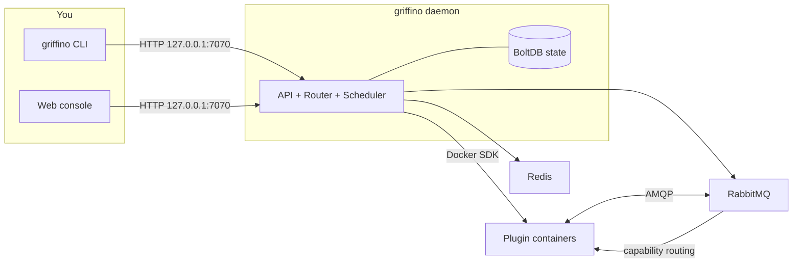

<div align="center">


<h1>Griffino</h1>

<p><strong>Next-Gen Open Plugin Routing Standard</strong></p>

<p>
Griffino is an <strong>open standard</strong> for plugin routing: it defines how plugins use
a manifest to declare the capabilities they provide and consume, and how they are discovered
and routed by capability instead of by a hard-coded plugin dependency. It is also a
<strong>batteries-included implementation</strong> of that standard, running compliant
plugins as containers on your own machine and managing them from a single CLI and web
console.
</p>

[](https://goreportcard.com/report/github.com/GriffinGuard/Griffino)


[](LICENSE)

[](docs/CLA.md)

**English** ·
[简体中文](docs/readme/README.zh-CN.md) ·
[繁體中文](docs/readme/README.zh-TW.md) ·
[日本語](docs/readme/README.ja.md) ·
[한국어](docs/readme/README.ko.md) ·
[Русский](docs/readme/README.ru.md) ·
[Français](docs/readme/README.fr.md) ·
[Deutsch](docs/readme/README.de.md) ·
[العربية](docs/readme/README.ar.md)

</div>

## Table of contents

- [What is Griffino?](#what-is-griffino)
- [Features](#features)
- [Architecture](#architecture)
- [Requirements](#requirements)
- [Installation](#installation)
- [Quick start](#quick-start)
- [CLI commands](#cli-commands)
- [Web console & API](#web-console--api)
- [Plugins](#plugins)
- [Related repositories](#related-repositories)
- [Configuration](#configuration)
- [Observability](#observability)
- [Contributing](#contributing)
- [License](#license)

## What is Griffino?

Griffino is an **open standard for user-side plugins**. It specifies that each plugin uses a
standard **manifest** to declare the **capabilities** it **provides** and **consumes**.
Plugins do not depend on one another directly; instead, they are discovered and connected by
capability. As long as they follow the standard, plugins written by different authors and in
different languages can discover, replace, and compose with one another without knowing in
advance that the others exist.

*("User-side" refers to plugins that run on the user's own machine and serve the user's own
needs, as distinct from backend services hosted in the cloud.)*

At the same time, Griffino is a **batteries-included reference implementation and runtime**
of this standard. It launches plugins packaged to the standard as one or more Docker
containers, assigns each plugin an isolated RabbitMQ namespace, and routes messages between
capability providers and consumers; when a single capability has multiple providers, it
also performs health-based failover and load balancing. Container orchestration is handed to
Docker, inter-plugin communication to the built-in message bus, and state and configuration
are managed centrally by the daemon.

Through this standard, the plugin ecosystem becomes **portable, composable, and independent
of any single implementation**, while the platform makes the full workflow available out of
the box on your own machine.

## Features

- **Plugin lifecycle** — install, configure, start, stop, and uninstall plugin containers, all uniformly through Griffino.
- **Capability routing** — implements capability-based routing between plugins, health-aware failover, and round-robin load balancing.
- **Plugin Center** — install and upgrade plugins from the official plugin center; all official plugins are required to provide source code for manual review.
- **Task scheduling** — a built-in scheduler supporting recurring plugin tasks and Blueprint workflows.
- **Secure by default** — multi-user authentication, credentials encrypted at rest, and the API bound to localhost only.
- **Observability** — out-of-the-box Prometheus `/metrics` and OpenTelemetry tracing.
- **Self-documenting API** — an OpenAPI spec, with Swagger UI embedded at `/swagger/`.
- **Dev mode** — a fast local plugin-development workflow.

## Architecture



The daemon holds state, communicates with Docker through the official SDK, and runs
RabbitMQ + Redis as managed containers. Plugins never communicate directly — they
publish/consume capabilities, and the router decides where each message goes.

## Requirements

- **Docker** — required at runtime; the daemon runs RabbitMQ and Redis as containers. Docker Desktop, colima, and podman all work.
- **Go 1.25+** — only needed when building from source.

## Installation

### macOS

Homebrew is recommended:

```bash
brew install GriffinGuard/tap/griffino
```

You can also use the install script to fetch a prebuilt binary:

```bash
curl -fsSL https://raw.githubusercontent.com/GriffinGuard/Griffino/main/scripts/get.sh | bash
```

To pin a version or install directory:

```bash
curl -fsSL https://raw.githubusercontent.com/GriffinGuard/Griffino/main/scripts/get.sh | VERSION=v1.0.0 PREFIX="$HOME/.local/bin" bash
```

### Linux

The install script is recommended for prebuilt binaries:

```bash
curl -fsSL https://raw.githubusercontent.com/GriffinGuard/Griffino/main/scripts/get.sh | bash
```

To pin a version or install directory:

```bash
curl -fsSL https://raw.githubusercontent.com/GriffinGuard/Griffino/main/scripts/get.sh | VERSION=v1.0.0 PREFIX="$HOME/.local/bin" bash
```

You can also download distro packages from the [releases page](https://github.com/GriffinGuard/Griffino/releases):

```bash
sudo dpkg -i griffino_*_linux_amd64.deb   # Debian / Ubuntu
sudo rpm  -i griffino_*_linux_amd64.rpm   # Fedora / RHEL
```

### Windows

Install from the Microsoft Store, or use winget:

```powershell
winget install --source msstore Griffino
```

For offline installation, download `griffino_*_windows_amd64.msi` from the
[releases page](https://github.com/GriffinGuard/Griffino/releases).

### From source

```bash
git clone https://github.com/GriffinGuard/Griffino.git
cd Griffino
./scripts/install.sh              # build + install onto your PATH
./scripts/install.sh --build-only # just produce ./griffino
```

> Docker must be installed **and running** before `griffino daemon`.

## Quick start

```bash
# 1. Start the daemon (boots RabbitMQ + Redis as containers)
griffino daemon

# 2. Install and start a plugin from a local path
griffino dev install ./path/to/plugin
griffino dev start <plugin-id>
```

Then open the web console at **http://127.0.0.1:7070** to finish setup (create the first
admin) and manage plugins.

## CLI commands

| Command | Description |
|---------|-------------|
| `griffino daemon` | Start the Griffino daemon |
| `griffino doctor` | Check the Docker environment and system dependency status |
| `griffino service install` | Run Griffino as a background service that starts on login |
| `griffino service start` / `stop` / `restart` | Control the background service |
| `griffino service status` | Show the background service status |
| `griffino service uninstall` | Remove the background service |
| `griffino dev install <path>` | Install a plugin from a local path |
| `griffino dev start <id>` | Start an installed plugin |
| `griffino dev stop <id>` | Stop a running plugin |
| `griffino dev uninstall <id>` | Uninstall a plugin |
| `griffino admin reset-password` | Reset the admin password |

Use `--lang` to override the language (e.g. `--lang zh_CN`).

### Running as a background service

`griffino service install` registers Griffino as a per-user service that starts on login (a
launchd LaunchAgent on macOS, a `systemctl --user` unit on Linux, a logon Scheduled Task on
Windows). The daemon still needs Docker running.

Griffino runs as a user-level service: Docker Desktop only runs inside a logged-in session,
so a system-level service before login would have no container runtime to reach.

## Web console & API

- **Web console** — served by the daemon at `http://127.0.0.1:7070`.
- **REST API** — under `/api/v1`. Non-public endpoints require a bearer session token from `POST /api/v1/auth/login`.
- **Swagger UI** — interactive API docs at `http://127.0.0.1:7070/swagger/`.
- **Metrics** — Prometheus exposition at `http://127.0.0.1:7070/metrics`.
- **Dashboard widget data** — widget data is still Redis-state first; when a plugin SDK exposes the runtime `__component_data` callback, the daemon can merge that per-user result over the Redis state and falls back to Redis on unsupported callbacks, timeouts, or RPC failures.

## Plugins

### Manifest

Plugins are defined by a `plugin.manifest.json` file:

```json
{
  "griffinoPluginManifestVersion": "1",
  "id": "my-plugin",
  "pluginVersion": "0.1.0",
  "name": { "default": "My Plugin" },
  "description": { "default": "A sample plugin" },
  "capabilities": [],
  "configurationFiles": {}
}
```

A plugin package is four generated files. Their authoritative Go types are defined in
[`pkg/manifest/types.go`](pkg/manifest/types.go), and the formal JSON Schemas live in
[Griffino-Schemas](https://github.com/GriffinGuard/Griffino-Schemas):

| File | Contents |
|------|----------|
| `plugin.manifest.json` | Plugin identity, `capabilities` (typed and routed by capability), emitted-event `emits`, dashboard `components`, and `configurationFiles` |
| `config.boot.json` | Admin-set boot configuration fields |
| `config.user.json` | Per-user configuration fields |
| `plugin.boot.yml` | Runtime service spec (image, environment, ports, volumes) |

Each `capabilities[]` entry is a provider or consumer typed by capability and described by
ports; a trigger advertises the events it emits via `emits` (both detailed in the sections
below).

User configuration schemas are served from `config.user.json`. In addition to
scalar field types, the daemon accepts `group_array` fields for repeatable object
groups and stores their values as JSON arrays under the field key. Existing flat
string-valued configs remain compatible.

A `group_array` field declares its item shape via `fields` (a list of sub-field
`ConfigParam`s, each with its own `type`, `optional`, and `validation`) and may
bound the array length with `minItems`/`maxItems`:

```json
{
  "key": "MODELS",
  "type": "group_array",
  "minItems": 1,
  "maxItems": 5,
  "fields": [
    { "key": "name", "type": "string", "optional": false },
    { "key": "supportsVision", "type": "boolean", "optional": true }
  ]
}
```

On `POST /api/v1/plugins/{id}/user-config/values`, the daemon validates every
array item against this schema: unknown sub-fields are dropped, missing
non-optional sub-fields reject the request, and each sub-field value's type
(and `validation` range/length, where declared) must match. Nested
`group_array` fields are not supported.

`password`-typed fields — both top-level and `group_array` sub-fields — are
masked as `**masked**` when read back via `GET /user-config/values`. Submitting
that placeholder value on a subsequent `POST` preserves the previously stored
secret instead of overwriting it, so a UI can safely round-trip the masked
value without exposing or clobbering the real secret.

### Capabilities & interfaces

Each capability a plugin **provides** or **consumes** is typed and routed by
capability rather than by a hard-coded dependency. A capability's data contract is
described by **ports** — typed inputs and outputs; two workflow nodes can be wired
when their port types are compatible.

- **Standard interfaces** — a capability references a versioned contract from the
  [Griffino-Schemas](https://github.com/GriffinGuard/Griffino-Schemas) registry via
  `standardInterfaceRef` (e.g. `griffino.interfaces.ai.chat@1.0.0`). The daemon ships
  an embedded snapshot of the standard set, so blueprint port validation resolves
  these at design time. Providers that implement the **same** interface are
  interchangeable; the router only treats providers as substitutable when their
  interface **major** versions are compatible.
- **Inline custom interfaces** — when no standard fits, a capability declares its
  ports inline via `interfaceSpec.inputPorts` / `interfaceSpec.outputPorts`. Such a
  capability still participates in workflow port validation; it simply is not
  automatically substitutable with another vendor's capability. Port types must come
  from the canonical vocabulary: `text`, `int`, `float`, `bool`, `json`, `binary`,
  `file`, `image`, `audio`, `video`, `embedding`, `llm-ref`, `any`.

### Triggers

A plugin can act as an **event source** (trigger) by declaring the events it emits in
the manifest's `emits` array:

```json
"emits": [
  {
    "eventType": "griffino.events.rss.item",
    "schemaRef": "griffino.events.rss.item@1.0.0",
    "name": { "default": "New RSS item" }
  }
]
```

At runtime the plugin emits a dispatch event of that type; the workflow engine starts
any blueprint subscribed to it. `GET /api/v1/plugins/triggers` lists the emitted
events of all running plugins for the blueprint editor.

### Runtime user identity

Plugin-facing messages include the Griffino user context that triggered the work:

- `userId` is the stable Griffino user identifier. Use it for per-user state keys and routing.
- `displayName` is the user's profile display name. Use it only for user-facing labels; it may be empty when the user has not configured one.

Griffino does not expose the login `username`, `email`, `role`, or password data to plugins through these runtime messages.

The following envelopes include `displayName` next to `userId`:

| Message path | Where `displayName` appears |
|--------------|-----------------------------|
| Web console action trigger | Action body published to `griffino.actions` |
| User-config update notification | `user.config_updated` body sent to `plugin.{pluginId}.consumer.user_config_updated` |
| Blueprint plugin-node dispatch | Message body and `x-griffino-display-name` AMQP header |
| Blueprint task callback | `task.completed` / `task.failed` callback body |

Per-user plugin configuration remains available to the owning plugin as read-only Redis data at
`user:{userId}:plugin:{pluginId}:config`.

### Plugin Center

Besides `griffino dev install` (provided for developers to test locally), Griffino has a
built-in **plugin center** that installs and upgrades plugins from the official repository
([`GriffinGuard/Griffino-Plugins`](https://github.com/GriffinGuard/Griffino-Plugins)). For
security, the plugin-center source is fixed and custom sources are not open for now. Plugins
are downloaded to `~/.griffino/plugins/{id}/{version}/`, and all plugin-management endpoints
require a Griffino admin user.

| Method & path | Description |
|---------------|-------------|
| `GET /api/v1/registry/plugins` | List registry plugins with `installed` / `installedVersion` / `updateAvailable` status |
| `GET /api/v1/registry/plugins/{id}` | Full detail for one plugin (all versions + changelog) plus install status |
| `POST /api/v1/registry/plugins/{id}/install` | Install a plugin. Optional body `{"version":"x.y.z"}` (defaults to the latest) |
| `POST /api/v1/registry/plugins/{id}/upgrade` | Upgrade an installed plugin. A running plugin is stopped, switched, and restarted automatically; admin config is preserved |
| `DELETE /api/v1/plugins/{id}` | Uninstall a plugin (stops it, then removes its directory and images) |

**Upgrade behaviour:** the new version is downloaded and verified before the old one is
touched. Existing admin configuration is carried over; if the new version adds a required
setting with no default, the plugin lands in a *ready* state with a "needs review" flag
instead of auto-restarting. Images used only by the old version are pruned; shared images
are kept.

**Image safety:** a plugin's main-service image must be published under
`ghcr.io/griffinguard/`; any auxiliary-service images must appear in the community
[`approved-images.json`](https://github.com/GriffinGuard/Griffino-Plugins) allow-list.
Installs and upgrades that reference an unapproved image are rejected.

## Related repositories

Griffino is a standard plus a number of repositories around it. This repository is the
reference implementation; the rest each have their own role:

| Repository | Role |
|------------|------|
| [GriffinGuard/Griffino](https://github.com/GriffinGuard/Griffino) | Reference implementation + daemon (**this repo**): container orchestration, capability routing, CLI & API |
| [GriffinGuard/Griffino-WebUI](https://github.com/GriffinGuard/Griffino-WebUI) | Front-end of the built-in web console; automatically embedded when Griffino is built |
| [GriffinGuard/Griffino-Plugins](https://github.com/GriffinGuard/Griffino-Plugins) | The official plugin-center repository, plus the `approved-images.json` image allow-list |
| [GriffinGuard/Griffino-Plugins-Submit](https://github.com/GriffinGuard/Griffino-Plugins-Submit) | The entry point for plugin authors to submit plugins to the official plugin repository |
| [GriffinGuard/Griffino-Schemas](https://github.com/GriffinGuard/Griffino-Schemas) | The JSON Schemas that formally define the standard (manifest, etc.) |
| [GriffinGuard/homebrew-tap](https://github.com/GriffinGuard/homebrew-tap) | Homebrew installation source |

**Plugin SDKs** help authors implement provide/consume to the standard, wrapping message
send/receive, manifest, and config reading so there is no need to hand-write the AMQP
protocol:

| SDK | Language | Status |
|-----|----------|--------|
| [GriffinGuard/Griffino-Go](https://github.com/GriffinGuard/Griffino-Go) | Go | ✅ Available |
| [GriffinGuard/Griffino-Python](https://github.com/GriffinGuard/Griffino-Python) | Python | ✅ Available |
| [GriffinGuard/Griffino-Java](https://github.com/GriffinGuard/Griffino-Java) | Java | 🚧 In internal development |
| [GriffinGuard/Griffino-CSharp](https://github.com/GriffinGuard/Griffino-CSharp) | C# | 🚧 In internal development |

## Configuration

Configuration lives in `~/.griffino/config.yaml` (all sections optional — sensible defaults
apply):

```yaml
# HTTP API — local-only by default.
server:
  listenHost: 127.0.0.1
  listenPort: 7070

# RabbitMQ connection.
rabbitmq:
  host: localhost
  port: 5672
  managementPort: 15672
  adminUser: guest
  adminPassword: guest
```

The API binds to `127.0.0.1:7070` by default. Griffino is single-machine for now and does
not serve the LAN; change `server.listenPort` to move the port, or — at your own risk —
`server.listenHost` to expose it.

Sensitive credentials (RabbitMQ / Redis passwords) are **encrypted at rest**, with the key
stored at `~/.griffino/secret.key` (mode `0600`).

## Operations & security

Griffino is hardened for unattended single-machine operation — see
[docs/operations.md](docs/operations.md) for the full operator guide. Highlights:

- **Resilience** — the router reconnects to RabbitMQ automatically (exponential backoff) if
  the broker restarts; plugin containers use an `unless-stopped` restart policy and a task
  watchdog times out unresponsive workflow nodes.
- **Resource limits** — every plugin container is capped (default 512 MiB / 1.0 CPU / 512
  PIDs) so one plugin can't exhaust the host. Override per service in `plugin.boot.yml`:
  ```yaml
  services:
    main:
      resources: { memory_mb: 1024, cpus: 2.0, pids_limit: 1024 }
  ```
- **Trust model** — plugins install from the official center under an image allowlist by
  default; local development plugins use `griffino dev install` (allowlist-skipped, marked
  `isDevPlugin`, kept out of Web-console control).
- **At-rest encryption** — infrastructure credentials are encrypted with AES-256-GCM under a
  local `secret.key` (mode `0600`); back it up together with the database.

## Observability

- **Metrics** — `GET /metrics` exposes Prometheus metrics for the API, router, containers, and scheduler.
- **Tracing** — OpenTelemetry traces can be exported via OTLP; configure the endpoint to enable.

## Contributing

Thanks to everyone who has contributed to Griffino. The current contributor list is tracked on
[GitHub Contributors](https://github.com/GriffinGuard/Griffino/graphs/contributors).

Issues and pull requests are welcome. Before submitting a PR, please read
[CONTRIBUTING.md](docs/CONTRIBUTING.md) and sign the [CLA](docs/CLA.md) as required.

## License

[Apache License 2.0](LICENSE)
