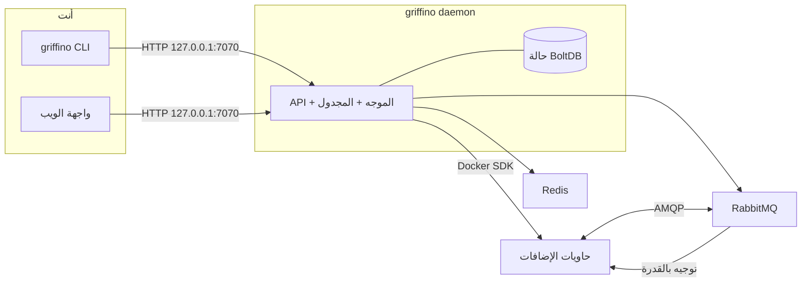

<div align="center">


<h1>Griffino</h1>

<p><strong>البروتوكول والمعيار المفتوح لتوجيه الإضافات من الجيل القادم</strong></p>

Griffino هو <strong>معيار مفتوح</strong> لتوجيه الإضافات: يحدد كيف تصرّح الإضافات عبر manifest
عن القدرات التي توفرها وتستهلكها، وكيف يتم اكتشافها وتوجيهها بناء على القدرة بدلا من الاعتماد الثابت
على إضافة بعينها. وهو أيضا <strong>تنفيذ جاهز للاستخدام</strong> لهذا المعيار: يشغّل الإضافات
المتوافقة كحاويات ويديرها على جهازك المحلي من خلال CLI وواجهة ويب موحدة.

[](https://goreportcard.com/report/github.com/GriffinGuard/Griffino)


[](../../LICENSE)

[](../CLA.md)

[English](../../README.md) ·
[简体中文](README.zh-CN.md) ·
[繁體中文](README.zh-TW.md) ·
[日本語](README.ja.md) ·
[한국어](README.ko.md) ·
[Русский](README.ru.md) ·
[Français](README.fr.md) ·
[Deutsch](README.de.md) ·
**العربية**

</div>

## الفهرس

- [ما هو Griffino؟](#ما-هو-griffino)
- [الميزات](#الميزات)
- [البنية](#البنية)
- [المتطلبات](#المتطلبات)
- [التثبيت](#التثبيت)
- [البدء السريع](#البدء-السريع)
- [أوامر CLI](#أوامر-cli)
- [واجهة الويب و API](#واجهة-الويب-و-api)
- [الإضافات](#الإضافات)
- [المستودعات ذات الصلة](#المستودعات-ذات-الصلة)
- [الإعدادات](#الإعدادات)
- [المراقبة](#المراقبة)
- [المساهمة](#المساهمة)
- [الرخصة](#الرخصة)

## ما هو Griffino؟

Griffino هو **معيار مفتوح للإضافات التي تعمل على جهة المستخدم**. تستخدم كل إضافة **manifest**
قياسيا لتعلن عن **القدرات (capability)** التي **توفرها (provide)** و**تستهلكها (consume)**.
لا تعتمد الإضافات على بعضها مباشرة، بل يتم اكتشافها وربطها بناء على القدرة. طالما اتبعت هذا المعيار،
يمكن لإضافات كتبها مؤلفون مختلفون وبلغات مختلفة أن تكتشف بعضها وتستبدل بعضها وتتركب معا دون معرفة
مسبقة بوجود الآخرين.

*("جهة المستخدم" تعني الإضافات التي تعمل على جهاز المستخدم نفسه وتخدم احتياجاته الخاصة، بخلاف خدمات
الخلفية المستضافة في السحابة.)*

في الوقت نفسه، Griffino هو **تنفيذ مرجعي وبيئة تشغيل جاهزة** لهذا المعيار. يشغّل الإضافات المعبأة
وفقا للمعيار كحاوية Docker واحدة أو أكثر، ويخصص لكل إضافة مساحة أسماء RabbitMQ معزولة، ويوجه الرسائل
بين موفري القدرات ومستهلكيها. عندما تكون للقدرة الواحدة عدة مزودين، ينفذ أيضا التحويل عند الفشل
وتوزيع الحمل round-robin بناء على الحالة الصحية. يتولى Docker تنسيق الحاويات، ويتولى ناقل الرسائل
المضمن التواصل بين الإضافات، بينما يدير daemon الحالة والإعدادات مركزيا.

يجعل هذا المعيار منظومة الإضافات **قابلة للنقل والتركيب وغير مقيدة بتنفيذ واحد**، بينما تجعل المنصة
سير العمل الكامل متاحا على جهازك المحلي مباشرة.

## الميزات

- **دورة حياة الإضافات** — تثبيت حاويات الإضافات وإعدادها وتشغيلها وإيقافها وإزالتها بشكل موحد عبر Griffino.
- **التوجيه بالقدرة** — توجيه بين الإضافات بناء على capability، مع تحويل عند الفشل حسب الصحة وتوزيع حمل round-robin.
- **مركز الإضافات** — تثبيت الإضافات وترقيتها من المركز الرسمي؛ يجب أن توفر كل إضافة رسمية كود المصدر للمراجعة اليدوية.
- **جدولة المهام** — مجدول مدمج يدعم مهام الإضافات المتكررة و workflows من نوع Blueprint.
- **أمان افتراضي** — مصادقة متعددة المستخدمين، تشفير بيانات الاعتماد عند التخزين، وربط API بالمضيف المحلي فقط.
- **مراقبة** — Prometheus `/metrics` و OpenTelemetry tracing جاهزان للاستخدام.
- **API موثق ذاتيا** — مواصفة OpenAPI و Swagger UI مدمج في `/swagger/`.
- **وضع التطوير** — سير عمل سريع لتطوير الإضافات محليا.

## البنية



يحتفظ daemon بالحالة، ويتواصل مع Docker عبر SDK الرسمي، ويشغّل RabbitMQ و Redis كحاويات مدارة.
لا تتواصل الإضافات مباشرة أبدا؛ بل تنشر وتستهلك القدرات، ويقرر الموجه وجهة كل رسالة.

## المتطلبات

- **Docker** — مطلوب وقت التشغيل؛ يشغّل daemon كلا من RabbitMQ و Redis كحاويات. يمكن استخدام Docker Desktop أو colima أو podman.
- **Go 1.25+** — مطلوب فقط عند البناء من المصدر.

## التثبيت

### macOS

يوصى باستخدام Homebrew:

```bash
brew install GriffinGuard/tap/griffino
```

يمكنك أيضا استخدام سكربت التثبيت للحصول على ملف تنفيذي مبني مسبقا:

```bash
curl -fsSL https://raw.githubusercontent.com/GriffinGuard/Griffino/main/scripts/get.sh | bash
```

لتثبيت إصدار محدد أو دليل تثبيت محدد:

```bash
curl -fsSL https://raw.githubusercontent.com/GriffinGuard/Griffino/main/scripts/get.sh | VERSION=v1.0.0 PREFIX="$HOME/.local/bin" bash
```

### Linux

يوصى بسكربت التثبيت للملفات التنفيذية المبنية مسبقا:

```bash
curl -fsSL https://raw.githubusercontent.com/GriffinGuard/Griffino/main/scripts/get.sh | bash
```

لتثبيت إصدار محدد أو دليل تثبيت محدد:

```bash
curl -fsSL https://raw.githubusercontent.com/GriffinGuard/Griffino/main/scripts/get.sh | VERSION=v1.0.0 PREFIX="$HOME/.local/bin" bash
```

يمكنك أيضا تنزيل حزمة التوزيعة المناسبة من [صفحة الإصدارات](https://github.com/GriffinGuard/Griffino/releases):

```bash
sudo dpkg -i griffino_*_linux_amd64.deb   # Debian / Ubuntu
sudo rpm  -i griffino_*_linux_amd64.rpm   # Fedora / RHEL
```

### Windows

ثبّت من Microsoft Store أو استخدم winget:

```powershell
winget install --source msstore Griffino
```

للتثبيت دون اتصال، نزّل `griffino_*_windows_amd64.msi` من
[صفحة الإصدارات](https://github.com/GriffinGuard/Griffino/releases).

### من المصدر

```bash
git clone https://github.com/GriffinGuard/Griffino.git
cd Griffino
./scripts/install.sh              # البناء والتثبيت في PATH
./scripts/install.sh --build-only # إنشاء ./griffino فقط
```

> قبل تشغيل `griffino daemon`، يجب أن يكون Docker مثبتا **وقيد التشغيل**.

## البدء السريع

```bash
# 1. تشغيل daemon (يشغّل RabbitMQ + Redis كحاويات)
griffino daemon

# 2. تثبيت إضافة من مسار محلي وتشغيلها
griffino dev install ./path/to/plugin
griffino dev start <plugin-id>
```

بعد ذلك افتح واجهة الويب **http://127.0.0.1:7070** لإكمال التهيئة (إنشاء أول مسؤول) وإدارة الإضافات.

## أوامر CLI

| الأمر | الوصف |
|------|------|
| `griffino daemon` | تشغيل daemon الخاص بـ Griffino |
| `griffino doctor` | فحص بيئة Docker وتبعيات النظام |
| `griffino service install` | تشغيل Griffino كخدمة خلفية تبدأ عند تسجيل الدخول |
| `griffino service start` / `stop` / `restart` | التحكم في الخدمة الخلفية |
| `griffino service status` | عرض حالة الخدمة الخلفية |
| `griffino service uninstall` | إزالة الخدمة الخلفية |
| `griffino dev install <path>` | تثبيت إضافة من مسار محلي |
| `griffino dev start <id>` | تشغيل إضافة مثبتة |
| `griffino dev stop <id>` | إيقاف إضافة قيد التشغيل |
| `griffino dev uninstall <id>` | إزالة إضافة |
| `griffino admin reset-password` | إعادة تعيين كلمة مرور المسؤول |

استخدم `--lang` لتغيير اللغة (مثلا `--lang zh_CN`).

### التشغيل كخدمة خلفية

يسجل `griffino service install` Griffino كخدمة **على مستوى المستخدم** تبدأ عند تسجيل الدخول
(launchd LaunchAgent على macOS، ووحدة `systemctl --user` على Linux، ومهمة مجدولة عند تسجيل الدخول
على Windows). ما زال daemon يحتاج إلى Docker قيد التشغيل.

Griffino خدمة على مستوى المستخدم: Docker Desktop يعمل فقط داخل جلسة مستخدم مسجلة الدخول، ولذلك لا تستطيع
خدمة نظام قبل تسجيل الدخول الوصول إلى runtime الحاويات.

## واجهة الويب و API

- **واجهة الويب** — يوفرها daemon على العنوان `http://127.0.0.1:7070`.
- **REST API** — موجودة تحت `/api/v1`. تحتاج نقاط النهاية غير العامة إلى bearer session token من `POST /api/v1/auth/login`.
- **Swagger UI** — وثائق API تفاعلية على `http://127.0.0.1:7070/swagger/`.
- **المقاييس** — نقطة Prometheus على `http://127.0.0.1:7070/metrics`.

## الإضافات

### Manifest

تعرف الإضافة عبر ملف `plugin.manifest.json`:

```json
{
  "griffinoPluginManifestVersion": "1",
  "id": "my-plugin",
  "pluginVersion": "0.1.0",
  "name": { "default": "My Plugin" },
  "description": { "default": "A sample plugin" },
  "capabilities": [],
  "configurationFiles": {}
}
```

حزمة الإضافة هي أربعة ملفات مُولَّدة. أنواع Go المرجعية لها مُعرَّفة في
[`pkg/manifest/types.go`](pkg/manifest/types.go)، وتوجد مخططات JSON الرسمية في
[Griffino-Schemas](https://github.com/GriffinGuard/Griffino-Schemas):

| الملف | المحتوى |
|-------|---------|
| `plugin.manifest.json` | هوية الإضافة، و`capabilities` (مُصنَّفة ومُوجَّهة حسب القدرة)، والأحداث المُصدَرة `emits`، و`components` لوحة المعلومات، و`configurationFiles` |
| `config.boot.json` | حقول إعداد boot التي يضبطها المسؤول |
| `config.user.json` | حقول الإعداد لكل مستخدم |
| `plugin.boot.yml` | مواصفات خدمة وقت التشغيل (image، environment، ports، volumes) |

كل عنصر في `capabilities[]` هو provider أو consumer مُصنَّف حسب القدرة وموصوف بالمنافذ (ports)؛
ويعلن المُشغِّل عن الأحداث التي يُصدرها عبر `emits` (كلاهما مُفصَّل في الأقسام أدناه).

تُقدَّم مخططات إعدادات المستخدم من `config.user.json`. وإضافة إلى أنواع الحقول العددية (scalar)،
يقبل الـ daemon حقول `group_array` لمجموعات الكائنات القابلة للتكرار، ويخزّن قيمها كمصفوفات JSON
تحت مفتاح الحقل. وتبقى الإعدادات المسطّحة ذات القيم النصية الحالية متوافقة.

يعلن حقل `group_array` عن شكل عناصره عبر `fields` (قائمة من `ConfigParam` للحقول الفرعية، لكلٍّ
منها `type` و`optional` و`validation` خاصة به)، ويمكنه تحديد طول المصفوفة عبر
`minItems`/`maxItems`:

```json
{
  "key": "MODELS",
  "type": "group_array",
  "minItems": 1,
  "maxItems": 5,
  "fields": [
    { "key": "name", "type": "string", "optional": false },
    { "key": "supportsVision", "type": "boolean", "optional": true }
  ]
}
```

عند `POST /api/v1/plugins/{id}/user-config/values`، يتحقق الـ daemon من كل عنصر في المصفوفة
مقابل هذا المخطط: تُسقَط الحقول الفرعية غير المعروفة، وتؤدي الحقول الفرعية غير الاختيارية المفقودة
إلى رفض الطلب، ويجب أن يتطابق نوع قيمة كل حقل فرعي (وكذلك نطاق/طول `validation` حيثما أُعلن).
والحقول `group_array` المتداخلة غير مدعومة.

حقول النوع `password` — سواء في المستوى الأعلى أو كحقول فرعية ضمن `group_array` — تُقنَّع كـ
`**masked**` عند قراءتها عبر `GET /user-config/values`. وإرسال هذه القيمة النائبة في `POST` لاحق
يحافظ على السر المخزَّن سابقًا بدلًا من الكتابة فوقه، بحيث يمكن لواجهة المستخدم أن تعيد القيمة
المقنَّعة بأمان دون كشف السر الحقيقي أو إتلافه.

### القدرات والواجهات

كل قدرة **يوفّرها** أو **يستهلكها** المكوّن الإضافي مُصنّفة بنوع، ويتم توجيهها حسب القدرة بدلاً من اعتمادية مكتوبة بشكل ثابت. يوصَف عقد بيانات القدرة عبر **منافذ** (مدخلات ومخرجات مُصنّفة بأنواع)؛ ويمكن ربط عقدتي سير عمل عندما تكون أنواع منافذهما متوافقة.

- **الواجهات القياسية** —— تشير القدرة إلى عقد مُؤرَّخ بإصدار من سجل [Griffino-Schemas](https://github.com/GriffinGuard/Griffino-Schemas) عبر `standardInterfaceRef` (مثل `griffino.interfaces.ai.chat@1.0.0`). يتضمّن الخادم لقطة مدمجة من المجموعة القياسية، لذا يُحَل التحقّق من المنافذ في المخطط وقت التصميم. المزوّدون الذين ينفّذون **الواجهة نفسها** قابلون للتبادل؛ ولا يَعتبر الموجّه المزوّدين قابلين للاستبدال إلا عندما تكون إصدارات **major** لواجهاتهم متوافقة.
- **الواجهات المخصّصة المضمّنة** —— عند عدم وجود معيار مناسب، تُعلن القدرة عن منافذها بشكل مضمّن عبر `interfaceSpec.inputPorts` / `interfaceSpec.outputPorts`. تظل هذه القدرة مشارِكة في التحقّق من منافذ سير العمل؛ لكنها ببساطة ليست قابلة للاستبدال تلقائياً بقدرة مؤلِّف آخر. يجب أن تكون أنواع المنافذ من المفردات المعيارية: `text`، `int`، `float`، `bool`، `json`، `binary`، `file`، `image`، `audio`، `video`، `embedding`، `llm-ref`، `any`.

### المُشغّلات

يمكن للمكوّن الإضافي أن يعمل **مصدراً للأحداث** (مُشغّلاً) من خلال إعلان الأحداث التي يُصدرها في مصفوفة `emits` في الملف التعريفي:

```json
"emits": [
  {
    "eventType": "griffino.events.rss.item",
    "schemaRef": "griffino.events.rss.item@1.0.0",
    "name": { "default": "New RSS item" }
  }
]
```

في وقت التشغيل يُصدر المكوّن الإضافي حدث dispatch من ذلك النوع؛ ويبدأ محرّك سير العمل أي مخطط مشترك فيه. ويسرد `GET /api/v1/plugins/triggers` الأحداث التي تُصدرها جميع المكوّنات الإضافية قيد التشغيل من أجل محرّر المخططات.

### هوية المستخدم في وقت التشغيل

تتضمّن الرسائل الموجَّهة إلى الإضافات سياق مستخدم Griffino الذي أطلق العمل:

- `userId` هو معرّف مستخدم Griffino الثابت. استخدمه لمفاتيح الحالة الخاصة بكل مستخدم وللتوجيه.
- `displayName` هو الاسم المعروض من ملف المستخدم. استخدمه فقط للملصقات الموجَّهة للمستخدم؛ وقد يكون فارغًا إذا لم يضبطه المستخدم.

لا يكشف Griffino للإضافات عبر رسائل وقت التشغيل هذه عن `username` تسجيل الدخول أو `email` أو `role` أو بيانات كلمة المرور.

تتضمّن الأظرف التالية `displayName` بجوار `userId`:

| مسار الرسالة | أين يظهر `displayName` |
|--------------|------------------------|
| إطلاق action من وحدة تحكم الويب | جسم الـ action المنشور على `griffino.actions` |
| إشعار تحديث إعدادات المستخدم | جسم `user.config_updated` المُرسَل إلى `plugin.{pluginId}.consumer.user_config_updated` |
| إرسال عقدة إضافة Blueprint | جسم الرسالة وترويسة AMQP `x-griffino-display-name` |
| استدعاء مهمة Blueprint الراجع | جسم استدعاء `task.completed` / `task.failed` |

تبقى إعدادات الإضافة الخاصة بكل مستخدم متاحة للإضافة المالكة كبيانات Redis للقراءة فقط على
`user:{userId}:plugin:{pluginId}:config`.

### مركز الإضافات

إلى جانب `griffino dev install` للاختبار المحلي، يتضمن Griffino **مركز إضافات** يثبت الإضافات
ويرقيها من المستودع الرسمي
([`GriffinGuard/Griffino-Plugins`](https://github.com/GriffinGuard/Griffino-Plugins)).
لأسباب أمنية مصدر المركز ثابت ولا يدعم حاليا مصادر مخصصة. يتم تنزيل الإضافات إلى
`~/.griffino/plugins/{id}/{version}/`، وتتطلب كل نقاط نهاية إدارة الإضافات مستخدم Griffino مسؤولا.

| الطريقة والمسار | الوصف |
|------------|------|
| `GET /api/v1/registry/plugins` | عرض إضافات registry مع حالات `installed` / `installedVersion` / `updateAvailable` |
| `GET /api/v1/registry/plugins/{id}` | التفاصيل الكاملة لإضافة واحدة (كل الإصدارات + changelog) وحالة التثبيت |
| `POST /api/v1/registry/plugins/{id}/install` | تثبيت إضافة. جسم اختياري `{"version":"x.y.z"}` (الافتراضي أحدث إصدار) |
| `POST /api/v1/registry/plugins/{id}/upgrade` | ترقية إضافة مثبتة. يتم إيقاف الإضافات العاملة والتبديل ثم إعادة التشغيل تلقائيا؛ وتحفظ إعدادات المسؤول |
| `DELETE /api/v1/plugins/{id}` | إزالة إضافة (إيقافها أولا، ثم حذف دليلها وصورها) |

**سلوك الترقية:** يتم تنزيل الإصدار الجديد والتحقق منه أولا قبل لمس الإصدار القديم. يتم استخدام إعدادات المسؤول الحالية؛
إذا أضاف الإصدار الجديد إعدادات إلزامية بلا قيم افتراضية، تدخل الإضافة حالة *ready* وتوسم بأنها "تحتاج مراجعة" بدلا من
إعادة التشغيل تلقائيا. تنظف الصور المستخدمة فقط من الإصدار القديم، وتبقى الصور المشتركة.

**أمان الصور:** يجب نشر صورة الخدمة الرئيسية للإضافة تحت `ghcr.io/griffinguard/`. يجب أن تظهر أي صور خدمات مساعدة في
قائمة السماح المجتمعية [`approved-images.json`](https://github.com/GriffinGuard/Griffino-Plugins). يتم رفض التثبيت
أو الترقية إذا أشارت إلى صور غير معتمدة.

## المستودعات ذات الصلة

Griffino معيار ومعه عدة مستودعات حوله. هذا المستودع هو التنفيذ المرجعي، ولكل مستودع آخر دوره:

| المستودع | الدور |
|------|------|
| [GriffinGuard/Griffino](https://github.com/GriffinGuard/Griffino) | التنفيذ المرجعي والdaemon للمعيار (**هذا المستودع**): تنسيق الحاويات، توجيه القدرات، CLI و API |
| [GriffinGuard/Griffino-WebUI](https://github.com/GriffinGuard/Griffino-WebUI) | واجهة الويب المضمنة افتراضيا، تدمج تلقائيا عند بناء Griffino |
| [GriffinGuard/Griffino-Plugins](https://github.com/GriffinGuard/Griffino-Plugins) | مستودع مركز الإضافات الرسمي وقائمة السماح للصور `approved-images.json` |
| [GriffinGuard/Griffino-Plugins-Submit](https://github.com/GriffinGuard/Griffino-Plugins-Submit) | مدخل مؤلفي الإضافات لتقديم إضافاتهم إلى المستودع الرسمي |
| [GriffinGuard/Griffino-Schemas](https://github.com/GriffinGuard/Griffino-Schemas) | JSON Schema التي تعرف المعيار رسميا (manifest وغيره) |
| [GriffinGuard/homebrew-tap](https://github.com/GriffinGuard/homebrew-tap) | مصدر Homebrew |

تساعد **Plugin SDKs** المؤلفين على تنفيذ provide/consume وفقا للمعيار، وتغلف إرسال الرسائل واستقبالها وقراءة manifest
والإعدادات، دون الحاجة إلى كتابة بروتوكول AMQP يدويا:

| SDK | اللغة | الحالة |
|-----|------|------|
| [GriffinGuard/Griffino-Go](https://github.com/GriffinGuard/Griffino-Go) | Go | ✅ متاح |
| [GriffinGuard/Griffino-Python](https://github.com/GriffinGuard/Griffino-Python) | Python | ✅ متاح |
| [GriffinGuard/Griffino-Java](https://github.com/GriffinGuard/Griffino-Java) | Java | 🚧 قيد التطوير داخليا |
| [GriffinGuard/Griffino-CSharp](https://github.com/GriffinGuard/Griffino-CSharp) | C# | 🚧 قيد التطوير داخليا |

## الإعدادات

توجد الإعدادات في `~/.griffino/config.yaml` (كل الأقسام اختيارية، وتستخدم قيم افتراضية مناسبة عند غيابها):

```yaml
# HTTP API — يرتبط افتراضيا بالمضيف المحلي فقط.
server:
  listenHost: 127.0.0.1
  listenPort: 7070

# اتصال RabbitMQ.
rabbitmq:
  host: localhost
  port: 5672
  managementPort: 15672
  adminUser: guest
  adminPassword: guest
```

يرتبط API افتراضيا بـ `127.0.0.1:7070`. يدعم Griffino حاليا الجهاز المحلي فقط ولا يقدم خدمة على LAN؛
يمكن تغيير `server.listenPort` لتغيير المنفذ، أو — على مسؤوليتك — تغيير `server.listenHost` لتعريضه للخارج.

تخزن بيانات الاعتماد الحساسة (كلمات مرور RabbitMQ / Redis) **مشفرة**، والمفتاح في
`~/.griffino/secret.key` (أذونات `0600`).

## التشغيل والأمان

تم تحصين Griffino للتشغيل غير المراقَب على جهاز واحد —— دليل التشغيل الكامل في [docs/operations.md](../operations.md). أبرز النقاط:

- **المرونة** —— يعيد الموجّه الاتصال تلقائياً بـ RabbitMQ (تراجع أسّي) عند إعادة تشغيل الوسيط؛ وتستخدم حاويات الإضافات سياسة إعادة التشغيل `unless-stopped`، ويُنهي task watchdog عُقد سير العمل غير المستجيبة بانتهاء المهلة.
- **حدود الموارد** —— لكل حاوية إضافة حدّ أقصى (افتراضياً 512 MiB / 1.0 CPU / 512 PIDs) كي لا تستنزف إضافة واحدة المضيف. يمكن التجاوز لكل خدمة في `plugin.boot.yml`:
  ```yaml
  services:
    main:
      resources: { memory_mb: 1024, cpus: 2.0, pids_limit: 1024 }
  ```
- **نموذج الثقة** —— تُثبَّت الإضافات افتراضياً من المركز الرسمي فقط ضمن قائمة سماح للصور؛ أما إضافات التطوير المحلية فتُثبَّت عبر `griffino dev install` (تتخطّى قائمة السماح، وتُوسَم `isDevPlugin`، وتُستبعَد من التحكّم عبر وحدة التحكّم على الويب).
- **التشفير أثناء التخزين** —— تُشفَّر بيانات اعتماد البنية التحتية بـ AES-256-GCM تحت `secret.key` محلي (الوضع `0600`)؛ انسخه احتياطياً مع قاعدة البيانات.

## المراقبة

- **المقاييس** — يعرض `GET /metrics` مقاييس Prometheus للـ API والموجه والحاويات والمجدول.
- **التتبع** — يمكن تصدير OpenTelemetry tracing عبر OTLP؛ فعّل ذلك بإعداد endpoint.

## المساهمة

شكرا لكل من ساهم في Griffino. تعتمد قائمة المساهمين الحالية على
[GitHub Contributors](https://github.com/GriffinGuard/Griffino/graphs/contributors).

نرحب بالـ issues و pull requests للكود أو الوثائق أو الملاحظات. قبل إرسال PR، يرجى قراءة
[CONTRIBUTING.md](../CONTRIBUTING.md) وتوقيع [CLA](../CLA.md) عند الحاجة.

## الرخصة

[Apache License 2.0](../../LICENSE)
