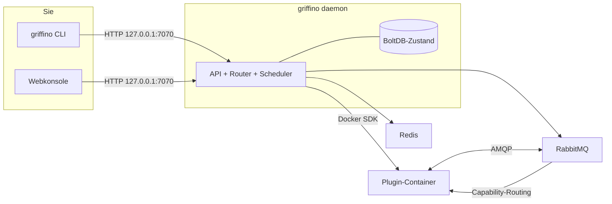

<div align="center">


<h1>Griffino</h1>

<p><strong>Das offene Plugin-Routing-Standardprotokoll der nächsten Generation</strong></p>

Griffino ist ein <strong>offener Standard</strong> für Plugin-Routing: Er definiert, wie Plugins
über ein Manifest deklarieren, welche Capabilities sie bereitstellen und konsumieren, und wie sie
über Capabilities statt über fest verdrahtete Plugin-Abhängigkeiten gefunden und geroutet werden.
Gleichzeitig ist Griffino eine <strong>sofort nutzbare Implementierung</strong> dieses Standards:
konforme Plugins werden als Container ausgeführt und lokal über eine einheitliche CLI und Webkonsole
verwaltet.

[](https://goreportcard.com/report/github.com/GriffinGuard/Griffino)


[](../../LICENSE)

[](../CLA.md)

[English](../../README.md) ·
[简体中文](README.zh-CN.md) ·
[繁體中文](README.zh-TW.md) ·
[日本語](README.ja.md) ·
[한국어](README.ko.md) ·
[Русский](README.ru.md) ·
[Français](README.fr.md) ·
**Deutsch** ·
[العربية](README.ar.md)

</div>

## Inhaltsverzeichnis

- [Was ist Griffino?](#was-ist-griffino)
- [Funktionen](#funktionen)
- [Architektur](#architektur)
- [Voraussetzungen](#voraussetzungen)
- [Installation](#installation)
- [Schnellstart](#schnellstart)
- [CLI-Befehle](#cli-befehle)
- [Webkonsole und API](#webkonsole-und-api)
- [Plugins](#plugins)
- [Verwandte Repositories](#verwandte-repositories)
- [Konfiguration](#konfiguration)
- [Observability](#observability)
- [Mitwirken](#mitwirken)
- [Lizenz](#lizenz)

## Was ist Griffino?

Griffino ist ein **offener Standard für benutzerseitige Plugins**. Jedes Plugin verwendet ein
standardisiertes **Manifest**, um die **Capabilities** zu deklarieren, die es **bereitstellt
(provide)** und **konsumiert (consume)**. Plugins hängen nicht direkt voneinander ab, sondern
werden über Capabilities gefunden und verbunden. Solange sie diesem Standard folgen, können Plugins
verschiedener Autorinnen und Autoren und aus unterschiedlichen Sprachen einander finden, ersetzen
und kombinieren, ohne vorab voneinander wissen zu müssen.

*("Benutzerseitig" bezeichnet Plugins, die auf der eigenen Maschine des Benutzers laufen und dessen
eigene Anforderungen bedienen, im Gegensatz zu in der Cloud gehosteten Backend-Diensten.)*

Gleichzeitig ist Griffino die **sofort nutzbare Referenzimplementierung und Laufzeitumgebung** dieses
Standards. Es startet standardkonform paketierte Plugins als einen oder mehrere Docker-Container,
weist jedem Plugin einen isolierten RabbitMQ-Namespace zu und routet Nachrichten zwischen
Capability-Anbietern und -Konsumenten. Wenn eine Capability mehrere Anbieter hat, führt Griffino
zustandsbasiertes Failover und Round-Robin-Load-Balancing aus. Docker übernimmt die
Container-Orchestrierung, der integrierte Message Bus die Kommunikation zwischen Plugins, und der
Daemon verwaltet Zustand und Konfiguration zentral.

Der Standard macht das Plugin-Ökosystem **portabel, kombinierbar und unabhängig von einer einzelnen
Implementierung**; die Plattform stellt den vollständigen Workflow lokal sofort bereit.

## Funktionen

- **Plugin-Lebenszyklus** — Plugin-Container über Griffino installieren, konfigurieren, starten, stoppen und entfernen.
- **Capability-Routing** — Routing zwischen Plugins anhand von Capabilities, gesundheitsbewusstes Failover und Round-Robin-Load-Balancing.
- **Plugin Center** — Plugins aus dem offiziellen Plugin Center installieren und aktualisieren; alle offiziellen Plugins müssen Quellcode für manuelle Prüfung bereitstellen.
- **Task-Scheduling** — integrierter Scheduler für wiederkehrende Plugin-Aufgaben und Blueprint-Workflows.
- **Sicher per Standard** — Mehrbenutzerauthentifizierung, verschlüsselte Zugangsdaten im Ruhezustand und API-Bindung nur an localhost.
- **Observability** — Prometheus `/metrics` und OpenTelemetry-Tracing direkt verfügbar.
- **Selbstdokumentierende API** — OpenAPI-Spezifikation mit eingebettetem Swagger UI unter `/swagger/`.
- **Entwicklungsmodus** — schneller lokaler Workflow für Plugin-Entwicklung.

## Architektur



Der Daemon hält den Zustand, kommuniziert über das offizielle SDK mit Docker und führt RabbitMQ +
Redis als verwaltete Container aus. Plugins kommunizieren nie direkt miteinander: Sie veröffentlichen
und konsumieren Capabilities, und der Router entscheidet, wohin jede Nachricht geht.

## Voraussetzungen

- **Docker** — zur Laufzeit erforderlich; der Daemon führt RabbitMQ und Redis als Container aus. Docker Desktop, colima und podman funktionieren.
- **Go 1.25+** — nur nötig, wenn aus dem Quellcode gebaut wird.

## Installation

### macOS

Homebrew wird empfohlen:

```bash
brew install GriffinGuard/tap/griffino
```

Alternativ können Sie das Installationsskript verwenden, um ein vorkompiliertes Binary zu beziehen:

```bash
curl -fsSL https://raw.githubusercontent.com/GriffinGuard/Griffino/main/scripts/get.sh | bash
```

Um Version oder Installationsverzeichnis festzulegen:

```bash
curl -fsSL https://raw.githubusercontent.com/GriffinGuard/Griffino/main/scripts/get.sh | VERSION=v1.0.0 PREFIX="$HOME/.local/bin" bash
```

### Linux

Für vorkompilierte Binaries wird das Installationsskript empfohlen:

```bash
curl -fsSL https://raw.githubusercontent.com/GriffinGuard/Griffino/main/scripts/get.sh | bash
```

Um Version oder Installationsverzeichnis festzulegen:

```bash
curl -fsSL https://raw.githubusercontent.com/GriffinGuard/Griffino/main/scripts/get.sh | VERSION=v1.0.0 PREFIX="$HOME/.local/bin" bash
```

Sie können auch passende Distributionspakete von der
[Releases-Seite](https://github.com/GriffinGuard/Griffino/releases) herunterladen:

```bash
sudo dpkg -i griffino_*_linux_amd64.deb   # Debian / Ubuntu
sudo rpm  -i griffino_*_linux_amd64.rpm   # Fedora / RHEL
```

### Windows

Installieren Sie Griffino aus dem Microsoft Store oder verwenden Sie winget:

```powershell
winget install --source msstore Griffino
```

Für Offline-Installation laden Sie `griffino_*_windows_amd64.msi` von der
[Releases-Seite](https://github.com/GriffinGuard/Griffino/releases) herunter.

### Aus dem Quellcode

```bash
git clone https://github.com/GriffinGuard/Griffino.git
cd Griffino
./scripts/install.sh              # bauen und in PATH installieren
./scripts/install.sh --build-only # nur ./griffino erzeugen
```

> Vor `griffino daemon` muss Docker installiert sein **und laufen**.

## Schnellstart

```bash
# 1. Daemon starten (RabbitMQ + Redis als Container hochfahren)
griffino daemon

# 2. Plugin aus lokalem Pfad installieren und starten
griffino dev install ./path/to/plugin
griffino dev start <plugin-id>
```

Öffnen Sie danach die Webkonsole **http://127.0.0.1:7070**, schließen Sie die Initialisierung ab
(ersten Administrator anlegen) und verwalten Sie Plugins.

## CLI-Befehle

| Befehl | Beschreibung |
|------|------|
| `griffino daemon` | Griffino-Daemon starten |
| `griffino doctor` | Docker-Umgebung und Systemabhängigkeiten prüfen |
| `griffino service install` | Griffino als beim Login startenden Hintergrunddienst registrieren |
| `griffino service start` / `stop` / `restart` | Hintergrunddienst steuern |
| `griffino service status` | Status des Hintergrunddienstes anzeigen |
| `griffino service uninstall` | Hintergrunddienst entfernen |
| `griffino dev install <path>` | Plugin aus lokalem Pfad installieren |
| `griffino dev start <id>` | Installiertes Plugin starten |
| `griffino dev stop <id>` | Laufendes Plugin stoppen |
| `griffino dev uninstall <id>` | Plugin deinstallieren |
| `griffino admin reset-password` | Administratorpasswort zurücksetzen |

Mit `--lang` kann die Sprache überschrieben werden (z. B. `--lang zh_CN`).

### Als Hintergrunddienst ausführen

`griffino service install` registriert Griffino als **benutzerbezogenen** Dienst, der beim Login
startet (macOS: launchd LaunchAgent, Linux: `systemctl --user`-Unit, Windows: geplante Aufgabe beim
Login). Der Daemon benötigt weiterhin ein laufendes Docker.

Griffino ist ein Dienst auf Benutzerebene: Docker Desktop läuft nur in einer angemeldeten Sitzung,
daher kann ein Systemdienst vor dem Login nicht auf die Container-Laufzeit zugreifen.

## Webkonsole und API

- **Webkonsole** — wird vom Daemon unter `http://127.0.0.1:7070` bereitgestellt.
- **REST API** — liegt unter `/api/v1`. Nicht öffentliche Endpunkte benötigen das Bearer-Session-Token aus `POST /api/v1/auth/login`.
- **Swagger UI** — interaktive API-Dokumentation unter `http://127.0.0.1:7070/swagger/`.
- **Metriken** — Prometheus-Endpunkt unter `http://127.0.0.1:7070/metrics`.

## Plugins

### Manifest

Ein Plugin wird durch `plugin.manifest.json` definiert:

```json
{
  "griffinoPluginManifestVersion": "1",
  "id": "my-plugin",
  "pluginVersion": "0.1.0",
  "name": { "default": "My Plugin" },
  "description": { "default": "A sample plugin" },
  "capabilities": [],
  "configurationFiles": {}
}
```

Ein Plugin-Paket besteht aus vier generierten Dateien. Ihre maßgeblichen Go-Typen sind in
[`pkg/manifest/types.go`](pkg/manifest/types.go) definiert, und die formalen JSON Schemas
liegen in [Griffino-Schemas](https://github.com/GriffinGuard/Griffino-Schemas):

| Datei | Inhalt |
|-------|--------|
| `plugin.manifest.json` | Plugin-Identität, `capabilities` (typisiert und nach Capability geroutet), ausgelöste Ereignisse `emits`, Dashboard-`components` und `configurationFiles` |
| `config.boot.json` | Vom Administrator gesetzte Boot-Konfigurationsfelder |
| `config.user.json` | Benutzerbezogene Konfigurationsfelder |
| `plugin.boot.yml` | Laufzeit-Service-Spezifikation (image, environment, ports, volumes) |

Jeder `capabilities[]`-Eintrag ist ein nach Capability typisierter Provider oder Consumer,
beschrieben durch Ports; ein Trigger kündigt die von ihm ausgelösten Ereignisse über `emits`
an (beides in den folgenden Abschnitten erläutert).

User-Konfigurationsschemas werden aus `config.user.json` bereitgestellt. Neben skalaren
Feldtypen akzeptiert der Daemon `group_array`-Felder für wiederholbare Objektgruppen und
speichert deren Werte als JSON-Arrays unter dem Feld-Key. Bestehende flache, stringwertige
Konfigurationen bleiben kompatibel.

Ein `group_array`-Feld deklariert die Form seiner Elemente über `fields` (eine Liste von
Unterfeld-`ConfigParam`s, jedes mit eigenem `type`, `optional` und `validation`) und kann die
Array-Länge mit `minItems`/`maxItems` begrenzen:

```json
{
  "key": "MODELS",
  "type": "group_array",
  "minItems": 1,
  "maxItems": 5,
  "fields": [
    { "key": "name", "type": "string", "optional": false },
    { "key": "supportsVision", "type": "boolean", "optional": true }
  ]
}
```

Bei `POST /api/v1/plugins/{id}/user-config/values` validiert der Daemon jedes Array-Element
gegen dieses Schema: unbekannte Unterfelder werden verworfen, fehlende nicht-optionale
Unterfelder lehnen die Anfrage ab, und der Typ jedes Unterfeldwerts (sowie der
`validation`-Bereich/die Länge, sofern deklariert) muss passen. Verschachtelte
`group_array`-Felder werden nicht unterstützt.

Felder vom Typ `password` — sowohl auf oberster Ebene als auch als `group_array`-Unterfelder —
werden beim Auslesen über `GET /user-config/values` als `**masked**` maskiert. Wird dieser
Platzhalterwert bei einem späteren `POST` übermittelt, bleibt das zuvor gespeicherte Geheimnis
erhalten, statt überschrieben zu werden, sodass eine UI den maskierten Wert sicher hin- und
zurückführen kann, ohne das echte Geheimnis offenzulegen oder zu zerstören.

### Fähigkeiten und Schnittstellen

Jede Fähigkeit, die ein Plugin **bereitstellt** oder **konsumiert**, ist typisiert und wird nach Fähigkeit statt über eine fest codierte Abhängigkeit geroutet. Der Datenvertrag einer Fähigkeit wird durch **Ports** beschrieben — typisierte Ein- und Ausgaben; zwei Workflow-Knoten können verbunden werden, wenn ihre Port-Typen kompatibel sind.

- **Standardschnittstellen** —— eine Fähigkeit referenziert über `standardInterfaceRef` (z. B. `griffino.interfaces.ai.chat@1.0.0`) einen versionierten Vertrag aus der [Griffino-Schemas](https://github.com/GriffinGuard/Griffino-Schemas)-Registry. Der Daemon liefert einen eingebetteten Snapshot des Standardsatzes mit, sodass die Port-Validierung des Blueprints zur Entwurfszeit aufgelöst wird. Anbieter, die **dieselbe** Schnittstelle implementieren, sind austauschbar; der Router behandelt Anbieter nur dann als ersetzbar, wenn die **Major**-Versionen ihrer Schnittstellen kompatibel sind.
- **Inline-Custom-Schnittstellen** —— wenn kein Standard passt, deklariert eine Fähigkeit ihre Ports inline über `interfaceSpec.inputPorts` / `interfaceSpec.outputPorts`. Eine solche Fähigkeit nimmt weiterhin an der Port-Validierung des Workflows teil; sie ist lediglich nicht automatisch durch die Fähigkeit eines anderen Autors ersetzbar. Port-Typen müssen aus dem kanonischen Vokabular stammen: `text`, `int`, `float`, `bool`, `json`, `binary`, `file`, `image`, `audio`, `video`, `embedding`, `llm-ref`, `any`.

### Auslöser

Ein Plugin kann als **Ereignisquelle** (Auslöser) fungieren, indem es die von ihm ausgelösten Ereignisse im `emits`-Array des Manifests deklariert:

```json
"emits": [
  {
    "eventType": "griffino.events.rss.item",
    "schemaRef": "griffino.events.rss.item@1.0.0",
    "name": { "default": "New RSS item" }
  }
]
```

Zur Laufzeit löst das Plugin ein Dispatch-Ereignis dieses Typs aus; die Workflow-Engine startet jeden Blueprint, der es abonniert hat. `GET /api/v1/plugins/triggers` listet die ausgelösten Ereignisse aller laufenden Plugins für den Blueprint-Editor auf.

### Laufzeit-Benutzeridentität

An Plugins gerichtete Laufzeitnachrichten enthalten den Griffino-Benutzerkontext, der die Arbeit ausgelöst hat:

- `userId` ist die stabile Griffino-Benutzerkennung. Verwenden Sie sie für benutzerbezogene State-Keys und Routing.
- `displayName` ist der Anzeigename aus dem Benutzerprofil. Verwenden Sie ihn nur für benutzerseitige Beschriftungen; er kann leer sein, wenn der Benutzer keinen konfiguriert hat.

Griffino stellt Plugins über diese Laufzeitnachrichten weder den Login-`username`, die `email`, die `role` noch Passwortdaten bereit.

Die folgenden Envelopes enthalten `displayName` neben `userId`:

| Nachrichtenpfad | Wo `displayName` erscheint |
|-----------------|----------------------------|
| Action-Trigger der Webkonsole | Action-Body, veröffentlicht auf `griffino.actions` |
| Benachrichtigung über Benutzerkonfig-Aktualisierung | `user.config_updated`-Body, gesendet an `plugin.{pluginId}.consumer.user_config_updated` |
| Blueprint-Plugin-Node-Dispatch | Nachrichten-Body und `x-griffino-display-name` AMQP-Header |
| Blueprint-Task-Callback | `task.completed` / `task.failed` Callback-Body |

Die benutzerbezogene Plugin-Konfiguration bleibt dem besitzenden Plugin als schreibgeschützte Redis-Daten unter
`user:{userId}:plugin:{pluginId}:config` verfügbar.

### Plugin Center

Neben `griffino dev install` für lokale Tests enthält Griffino ein **Plugin Center**, das Plugins
aus dem offiziellen Repository
([`GriffinGuard/Griffino-Plugins`](https://github.com/GriffinGuard/Griffino-Plugins)) installiert
und aktualisiert. Aus Sicherheitsgründen ist die Quelle festgelegt; benutzerdefinierte Quellen sind
derzeit nicht freigegeben. Plugins werden nach `~/.griffino/plugins/{id}/{version}/` heruntergeladen,
und alle Endpunkte zur Plugin-Verwaltung erfordern einen Griffino-Administrator.

| Methode und Pfad | Beschreibung |
|------------|------|
| `GET /api/v1/registry/plugins` | Registry-Plugins mit Status `installed` / `installedVersion` / `updateAvailable` auflisten |
| `GET /api/v1/registry/plugins/{id}` | Vollständige Details eines Plugins (alle Versionen + changelog) und Installationsstatus |
| `POST /api/v1/registry/plugins/{id}/install` | Plugin installieren. Optionaler Body `{"version":"x.y.z"}` (Standard: neueste Version) |
| `POST /api/v1/registry/plugins/{id}/upgrade` | Installiertes Plugin aktualisieren. Laufende Plugins werden automatisch gestoppt, umgeschaltet und neu gestartet; Admin-Konfiguration bleibt erhalten |
| `DELETE /api/v1/plugins/{id}` | Plugin deinstallieren (zuerst stoppen, dann Verzeichnis und Images löschen) |

**Upgrade-Verhalten:** Die neue Version wird zuerst heruntergeladen und geprüft, bevor die alte
Version berührt wird. Vorhandene Admin-Konfiguration wird weiterverwendet. Wenn eine neue Version
pflichtige Einstellungen ohne Standardwert hinzufügt, wechselt das Plugin in den Zustand *ready* und
wird als "Prüfung erforderlich" markiert, statt automatisch neu zu starten. Images, die nur die alte
Version verwendet hat, werden bereinigt; gemeinsam genutzte Images bleiben erhalten.

**Image-Sicherheit:** Das Haupt-Service-Image eines Plugins muss unter `ghcr.io/griffinguard/`
veröffentlicht sein. Hilfs-Service-Images müssen in der Community-Allowlist
[`approved-images.json`](https://github.com/GriffinGuard/Griffino-Plugins) stehen. Installationen
und Upgrades mit nicht genehmigten Images werden abgelehnt.

## Verwandte Repositories

Griffino ist ein Standard mit mehreren Repositories darum herum. Dieses Repository ist die
Referenzimplementierung; die anderen erfüllen jeweils eigene Aufgaben:

| Repository | Aufgabe |
|------|------|
| [GriffinGuard/Griffino](https://github.com/GriffinGuard/Griffino) | Referenzimplementierung und Daemon des Standards (**dieses Repository**): Container-Orchestrierung, Capability-Routing, CLI und API |
| [GriffinGuard/Griffino-WebUI](https://github.com/GriffinGuard/Griffino-WebUI) | Frontend der standardmäßig eingebetteten Webkonsole, wird beim Griffino-Build automatisch eingebettet |
| [GriffinGuard/Griffino-Plugins](https://github.com/GriffinGuard/Griffino-Plugins) | Offizielles Plugin-Center-Repository und Image-Allowlist `approved-images.json` |
| [GriffinGuard/Griffino-Plugins-Submit](https://github.com/GriffinGuard/Griffino-Plugins-Submit) | Einstiegspunkt für Plugin-Autoren zur Einreichung ins offizielle Plugin-Repository |
| [GriffinGuard/Griffino-Schemas](https://github.com/GriffinGuard/Griffino-Schemas) | JSON Schemas, die den Standard offiziell definieren (Manifest usw.) |
| [GriffinGuard/homebrew-tap](https://github.com/GriffinGuard/homebrew-tap) | Homebrew-Quelle |

**Plugin-SDKs** helfen Autoren, provide/consume standardkonform zu implementieren. Sie kapseln
Nachrichtenversand, Manifest und Konfiguration, sodass kein AMQP-Protokoll von Hand geschrieben
werden muss:

| SDK | Sprache | Status |
|-----|------|------|
| [GriffinGuard/Griffino-Go](https://github.com/GriffinGuard/Griffino-Go) | Go | ✅ verfügbar |
| [GriffinGuard/Griffino-Python](https://github.com/GriffinGuard/Griffino-Python) | Python | ✅ verfügbar |
| [GriffinGuard/Griffino-Java](https://github.com/GriffinGuard/Griffino-Java) | Java | 🚧 intern in Entwicklung |
| [GriffinGuard/Griffino-CSharp](https://github.com/GriffinGuard/Griffino-CSharp) | C# | 🚧 intern in Entwicklung |

## Konfiguration

Die Konfiguration liegt in `~/.griffino/config.yaml` (alle Abschnitte sind optional; ohne Angaben
werden sinnvolle Standardwerte verwendet):

```yaml
# HTTP API — standardmäßig nur an localhost gebunden.
server:
  listenHost: 127.0.0.1
  listenPort: 7070

# RabbitMQ-Verbindung.
rabbitmq:
  host: localhost
  port: 5672
  managementPort: 15672
  adminUser: guest
  adminPassword: guest
```

Die API bindet standardmäßig an `127.0.0.1:7070`. Griffino unterstützt derzeit nur die lokale
Maschine und stellt keinen LAN-Dienst bereit. Ändern Sie `server.listenPort`, um den Port zu
wechseln, oder — auf eigenes Risiko — `server.listenHost`, um Griffino nach außen freizugeben.

Sensible Zugangsdaten (RabbitMQ-/Redis-Passwörter) werden **verschlüsselt gespeichert**; der
Schlüssel liegt unter `~/.griffino/secret.key` (Berechtigungen `0600`).

## Betrieb und Sicherheit

Griffino ist für den unbeaufsichtigten Einzelmaschinenbetrieb gehärtet — der vollständige Betriebsleitfaden steht in [docs/operations.md](../operations.md). Highlights:

- **Resilienz** — der Router verbindet sich bei einem Broker-Neustart automatisch wieder mit RabbitMQ (exponentielles Backoff); Plugin-Container nutzen die Neustart-Richtlinie `unless-stopped`, und ein Task-Watchdog lässt nicht antwortende Workflow-Knoten ablaufen.
- **Ressourcenlimits** — jeder Plugin-Container ist begrenzt (Standard 512 MiB / 1.0 CPU / 512 PIDs), damit ein Plugin den Host nicht erschöpfen kann. Überschreibung pro Dienst in `plugin.boot.yml`:
  ```yaml
  services:
    main:
      resources: { memory_mb: 1024, cpus: 2.0, pids_limit: 1024 }
  ```
- **Vertrauensmodell** — Plugins werden standardmäßig aus dem offiziellen Center unter einer Image-Allowlist installiert; lokale Entwicklungs-Plugins nutzen `griffino dev install` (Allowlist übersprungen, als `isDevPlugin` markiert, von der Web-Konsolensteuerung ausgenommen).
- **Verschlüsselung im Ruhezustand** — Infrastruktur-Anmeldedaten werden mit AES-256-GCM unter einer lokalen `secret.key` (Modus `0600`) verschlüsselt; sichern Sie sie zusammen mit der Datenbank.

## Observability

- **Metriken** — `GET /metrics` stellt Prometheus-Metriken für API, Router, Container und Scheduler bereit.
- **Tracing** — OpenTelemetry-Tracing kann per OTLP exportiert werden; konfigurieren Sie einen Endpoint, um es zu aktivieren.

## Mitwirken

Danke an alle, die zu Griffino beitragen. Die aktuelle Liste der Mitwirkenden finden Sie unter
[GitHub Contributors](https://github.com/GriffinGuard/Griffino/graphs/contributors).

Issues und Pull Requests für Code, Dokumentation oder Feedback sind willkommen. Lesen Sie vor einem
PR bitte [CONTRIBUTING.md](../CONTRIBUTING.md) und unterschreiben Sie bei Bedarf die
[CLA](../CLA.md).

## Lizenz

[Apache License 2.0](../../LICENSE)
