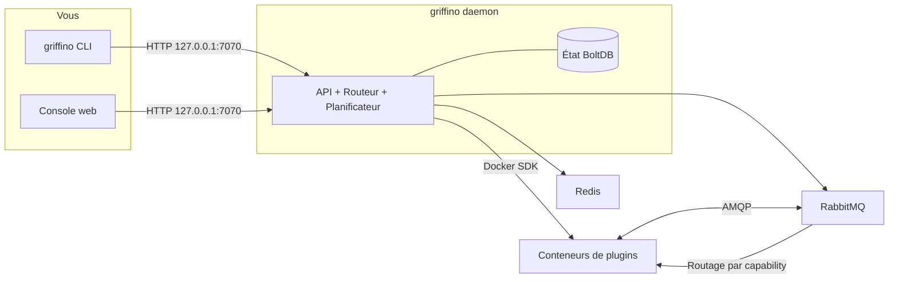

<div align="center">


<h1>Griffino</h1>

<p><strong>Protocole et standard ouvert de routage de plugins de nouvelle génération</strong></p>

Griffino est un <strong>standard ouvert</strong> pour le routage de plugins : il définit comment
les plugins déclarent, via un manifest, les capabilities qu'ils fournissent et consomment, ainsi
que la manière dont ils sont découverts et routés par capability plutôt que par dépendance fixe
à un plugin donné. C'est aussi une <strong>implémentation prête à l'emploi</strong> de ce standard :
elle exécute les plugins conformes sous forme de conteneurs et les gère sur votre machine depuis
une CLI et une console web unifiées.

[](https://goreportcard.com/report/github.com/GriffinGuard/Griffino)


[](../../LICENSE)

[](../CLA.md)

[English](../../README.md) ·
[简体中文](README.zh-CN.md) ·
[繁體中文](README.zh-TW.md) ·
[日本語](README.ja.md) ·
[한국어](README.ko.md) ·
[Русский](README.ru.md) ·
**Français** ·
[Deutsch](README.de.md) ·
[العربية](README.ar.md)

</div>

## Sommaire

- [Qu'est-ce que Griffino ?](#quest-ce-que-griffino-)
- [Fonctionnalités](#fonctionnalités)
- [Architecture](#architecture)
- [Prérequis](#prérequis)
- [Installation](#installation)
- [Démarrage rapide](#démarrage-rapide)
- [Commandes CLI](#commandes-cli)
- [Console web et API](#console-web-et-api)
- [Plugins](#plugins)
- [Dépôts liés](#dépôts-liés)
- [Configuration](#configuration)
- [Observabilité](#observabilité)
- [Contribution](#contribution)
- [Licence](#licence)

## Qu'est-ce que Griffino ?

Griffino est un **standard ouvert pour les plugins côté utilisateur**. Chaque plugin utilise un
**manifest** standard pour déclarer les **capabilities** qu'il **fournit (provide)** et
**consomme (consume)**. Les plugins ne dépendent pas directement les uns des autres : ils sont
découverts et connectés par capability. En suivant ce standard, des plugins écrits par des
auteurs différents et dans des langages différents peuvent se découvrir, se remplacer et se
composer sans connaître à l'avance l'existence des autres.

*("Côté utilisateur" désigne les plugins qui s'exécutent sur la machine de l'utilisateur et
répondent à ses besoins propres, par opposition aux services backend hébergés dans le cloud.)*

Griffino est également l'**implémentation de référence et le runtime prêts à l'emploi** de ce
standard. Il lance les plugins conformes dans un ou plusieurs conteneurs Docker, attribue à
chaque plugin un espace de noms RabbitMQ isolé et route les messages entre fournisseurs et
consommateurs de capabilities. Quand plusieurs fournisseurs existent pour une même capability,
il assure aussi le basculement et l'équilibrage round-robin selon l'état de santé. Docker gère
l'orchestration des conteneurs, le bus de messages intégré gère les communications entre
plugins, et le daemon centralise l'état et la configuration.

Ce standard rend l'écosystème de plugins **portable, composable et indépendant de toute
implémentation unique**, tandis que la plateforme rend tout le flux de travail disponible
localement dès l'installation.

## Fonctionnalités

- **Cycle de vie des plugins** — installer, configurer, démarrer, arrêter et désinstaller les conteneurs de plugins via Griffino.
- **Routage par capability** — routage entre plugins par capability, basculement sensible à la santé et équilibrage round-robin.
- **Centre de plugins** — installation et mise à niveau depuis le centre officiel ; tous les plugins officiels doivent fournir leur code source pour revue manuelle.
- **Planification de tâches** — planificateur intégré pour les tâches récurrentes de plugins et les workflows Blueprint.
- **Sécurité par défaut** — authentification multi-utilisateur, identifiants chiffrés au repos, API liée à localhost uniquement.
- **Observabilité** — endpoint Prometheus `/metrics` et tracing OpenTelemetry prêts à l'emploi.
- **API auto-documentée** — spécification OpenAPI et Swagger UI intégré à `/swagger/`.
- **Mode développement** — flux rapide de développement local de plugins.

## Architecture



Le daemon conserve l'état, communique avec Docker via le SDK officiel et exécute RabbitMQ +
Redis comme conteneurs gérés. Les plugins ne communiquent jamais directement : ils publient et
consomment des capabilities, puis le routeur décide de la destination de chaque message.

## Prérequis

- **Docker** — requis à l'exécution ; le daemon lance RabbitMQ et Redis comme conteneurs. Docker Desktop, colima et podman conviennent.
- **Go 1.25+** — uniquement nécessaire pour compiler depuis les sources.

## Installation

### macOS

Homebrew est recommandé :

```bash
brew install GriffinGuard/tap/griffino
```

Vous pouvez aussi utiliser le script d'installation pour obtenir un binaire précompilé :

```bash
curl -fsSL https://raw.githubusercontent.com/GriffinGuard/Griffino/main/scripts/get.sh | bash
```

Pour fixer une version ou un répertoire d'installation :

```bash
curl -fsSL https://raw.githubusercontent.com/GriffinGuard/Griffino/main/scripts/get.sh | VERSION=v1.0.0 PREFIX="$HOME/.local/bin" bash
```

### Linux

Le script d'installation est recommandé pour les binaires précompilés :

```bash
curl -fsSL https://raw.githubusercontent.com/GriffinGuard/Griffino/main/scripts/get.sh | bash
```

Pour fixer une version ou un répertoire d'installation :

```bash
curl -fsSL https://raw.githubusercontent.com/GriffinGuard/Griffino/main/scripts/get.sh | VERSION=v1.0.0 PREFIX="$HOME/.local/bin" bash
```

Vous pouvez aussi télécharger le paquet adapté à votre distribution depuis la
[page des releases](https://github.com/GriffinGuard/Griffino/releases) :

```bash
sudo dpkg -i griffino_*_linux_amd64.deb   # Debian / Ubuntu
sudo rpm  -i griffino_*_linux_amd64.rpm   # Fedora / RHEL
```

### Windows

Installez depuis le Microsoft Store ou utilisez winget :

```powershell
winget install --source msstore Griffino
```

Pour une installation hors ligne, téléchargez `griffino_*_windows_amd64.msi` depuis la
[page des releases](https://github.com/GriffinGuard/Griffino/releases).

### Depuis les sources

```bash
git clone https://github.com/GriffinGuard/Griffino.git
cd Griffino
./scripts/install.sh              # compiler et installer dans PATH
./scripts/install.sh --build-only # produire seulement ./griffino
```

> Avant d'exécuter `griffino daemon`, Docker doit être installé **et en cours d'exécution**.

## Démarrage rapide

```bash
# 1. Démarrer le daemon (lance RabbitMQ + Redis comme conteneurs)
griffino daemon

# 2. Installer et démarrer un plugin depuis un chemin local
griffino dev install ./path/to/plugin
griffino dev start <plugin-id>
```

Ouvrez ensuite la console web **http://127.0.0.1:7070** pour terminer l'initialisation
(création du premier administrateur) et gérer les plugins.

## Commandes CLI

| Commande | Description |
|------|------|
| `griffino daemon` | Démarrer le daemon Griffino |
| `griffino doctor` | Vérifier l'environnement Docker et les dépendances système |
| `griffino service install` | Enregistrer Griffino comme service utilisateur au démarrage |
| `griffino service start` / `stop` / `restart` | Contrôler le service en arrière-plan |
| `griffino service status` | Afficher l'état du service |
| `griffino service uninstall` | Retirer le service |
| `griffino dev install <path>` | Installer un plugin depuis un chemin local |
| `griffino dev start <id>` | Démarrer un plugin installé |
| `griffino dev stop <id>` | Arrêter un plugin en cours d'exécution |
| `griffino dev uninstall <id>` | Désinstaller un plugin |
| `griffino admin reset-password` | Réinitialiser le mot de passe administrateur |

Utilisez `--lang` pour forcer la langue (par exemple `--lang zh_CN`).

### Exécution comme service en arrière-plan

`griffino service install` enregistre Griffino comme service **utilisateur** lancé à la connexion
(launchd LaunchAgent sur macOS, unité `systemctl --user` sur Linux, tâche planifiée à la connexion
sur Windows). Le daemon a toujours besoin que Docker soit en cours d'exécution.

Griffino est un service de niveau utilisateur : Docker Desktop ne fonctionne que dans une session
connectée, donc un service système avant connexion ne peut pas accéder au runtime de conteneurs.

## Console web et API

- **Console web** — servie par le daemon à l'adresse `http://127.0.0.1:7070`.
- **REST API** — sous `/api/v1`. Les endpoints privés nécessitent le token bearer de session obtenu via `POST /api/v1/auth/login`.
- **Swagger UI** — documentation API interactive à `http://127.0.0.1:7070/swagger/`.
- **Métriques** — endpoint Prometheus à `http://127.0.0.1:7070/metrics`.

## Plugins

### Manifest

Un plugin est défini par un fichier `plugin.manifest.json` :

```json
{
  "griffinoPluginManifestVersion": "1",
  "id": "my-plugin",
  "pluginVersion": "0.1.0",
  "name": { "default": "My Plugin" },
  "description": { "default": "A sample plugin" },
  "capabilities": [],
  "configurationFiles": {}
}
```

Un paquet de plugin est constitué de quatre fichiers générés. Leurs types Go de référence sont
définis dans [`pkg/manifest/types.go`](pkg/manifest/types.go), et les JSON Schemas formels se
trouvent dans [Griffino-Schemas](https://github.com/GriffinGuard/Griffino-Schemas) :

| Fichier | Contenu |
|---------|---------|
| `plugin.manifest.json` | Identité du plugin, `capabilities` (typées et routées par capacité), événements émis `emits`, `components` de tableau de bord et `configurationFiles` |
| `config.boot.json` | Champs de configuration boot définis par l'administrateur |
| `config.user.json` | Champs de configuration par utilisateur |
| `plugin.boot.yml` | Spécification du service d'exécution (image, environment, ports, volumes) |

Chaque entrée `capabilities[]` est un provider ou un consumer typé par capacité et décrit par
des ports ; un déclencheur annonce les événements qu'il émet via `emits` (les deux sont
détaillés dans les sections suivantes).

Les schémas de configuration utilisateur sont servis depuis `config.user.json`. Outre les
types de champs scalaires, le daemon accepte des champs `group_array` pour des groupes
d'objets répétables et stocke leurs valeurs sous forme de tableaux JSON sous la clé du champ.
Les configurations plates à valeurs de chaîne existantes restent compatibles.

Un champ `group_array` déclare la forme de ses éléments via `fields` (une liste de
`ConfigParam` de sous-champs, chacun avec son propre `type`, `optional` et `validation`) et
peut borner la longueur du tableau avec `minItems`/`maxItems` :

```json
{
  "key": "MODELS",
  "type": "group_array",
  "minItems": 1,
  "maxItems": 5,
  "fields": [
    { "key": "name", "type": "string", "optional": false },
    { "key": "supportsVision", "type": "boolean", "optional": true }
  ]
}
```

Lors d'un `POST /api/v1/plugins/{id}/user-config/values`, le daemon valide chaque élément du
tableau par rapport à ce schéma : les sous-champs inconnus sont supprimés, les sous-champs non
optionnels manquants rejettent la requête, et le type de chaque valeur de sous-champ (ainsi que
la plage/longueur de `validation`, lorsqu'elle est déclarée) doit correspondre. Les champs
`group_array` imbriqués ne sont pas pris en charge.

Les champs de type `password` — qu'ils soient de premier niveau ou des sous-champs de
`group_array` — sont masqués en `**masked**` lors de la relecture via
`GET /user-config/values`. Soumettre cette valeur d'espace réservé lors d'un `POST` ultérieur
préserve le secret précédemment stocké au lieu de l'écraser, de sorte qu'une UI peut faire
transiter en toute sécurité la valeur masquée sans exposer ni écraser le vrai secret.

### Capacités et interfaces

Chaque capacité qu'un plugin **fournit** ou **consomme** est typée et routée par capacité plutôt que par une dépendance codée en dur. Le contrat de données d'une capacité est décrit par des **ports** — entrées et sorties typées ; deux nœuds de workflow peuvent être reliés lorsque leurs types de ports sont compatibles.

- **Interfaces standard** —— une capacité référence un contrat versionné du registre [Griffino-Schemas](https://github.com/GriffinGuard/Griffino-Schemas) via `standardInterfaceRef` (par ex. `griffino.interfaces.ai.chat@1.0.0`). Le démon embarque un instantané de l'ensemble standard, de sorte que la validation des ports du blueprint est résolue au moment de la conception. Les fournisseurs qui implémentent la **même** interface sont interchangeables ; le routeur ne considère les fournisseurs comme substituables que lorsque les versions **majeures** de leurs interfaces sont compatibles.
- **Interfaces personnalisées en ligne** —— lorsqu'aucun standard ne convient, une capacité déclare ses ports en ligne via `interfaceSpec.inputPorts` / `interfaceSpec.outputPorts`. Une telle capacité participe toujours à la validation des ports du workflow ; elle n'est simplement pas automatiquement substituable à la capacité d'un autre auteur. Les types de ports doivent provenir du vocabulaire canonique : `text`, `int`, `float`, `bool`, `json`, `binary`, `file`, `image`, `audio`, `video`, `embedding`, `llm-ref`, `any`.

### Déclencheurs

Un plugin peut agir comme **source d'événements** (déclencheur) en déclarant les événements qu'il émet dans le tableau `emits` du manifeste :

```json
"emits": [
  {
    "eventType": "griffino.events.rss.item",
    "schemaRef": "griffino.events.rss.item@1.0.0",
    "name": { "default": "New RSS item" }
  }
]
```

À l'exécution, le plugin émet un événement dispatch de ce type ; le moteur de workflow démarre tout blueprint qui y est abonné. `GET /api/v1/plugins/triggers` liste les événements émis par tous les plugins en cours d'exécution pour l'éditeur de blueprint.

### Identité utilisateur à l'exécution

Les messages destinés aux plugins incluent le contexte utilisateur Griffino qui a déclenché le travail :

- `userId` est l'identifiant utilisateur Griffino stable. Utilisez-le pour les clés d'état par utilisateur et le routage.
- `displayName` est le nom d'affichage du profil de l'utilisateur. Utilisez-le uniquement pour les libellés destinés à l'utilisateur ; il peut être vide si l'utilisateur n'en a pas configuré.

Griffino n'expose pas aux plugins le `username` de connexion, l'`email`, le `role` ni les données de mot de passe via ces messages d'exécution.

Les enveloppes suivantes incluent `displayName` à côté de `userId` :

| Chemin du message | Où apparaît `displayName` |
|-------------------|---------------------------|
| Déclenchement d'action depuis la console web | Corps de l'action publié sur `griffino.actions` |
| Notification de mise à jour de la config utilisateur | Corps `user.config_updated` envoyé à `plugin.{pluginId}.consumer.user_config_updated` |
| Dispatch de nœud de plugin Blueprint | Corps du message et en-tête AMQP `x-griffino-display-name` |
| Rappel de tâche Blueprint | Corps du rappel `task.completed` / `task.failed` |

La configuration de plugin par utilisateur reste disponible pour le plugin propriétaire sous forme de données Redis en lecture seule à
`user:{userId}:plugin:{pluginId}:config`.

### Centre de plugins

En plus de `griffino dev install` pour les tests locaux, Griffino intègre un **centre de plugins**
permettant d'installer et de mettre à niveau les plugins depuis le dépôt officiel
([`GriffinGuard/Griffino-Plugins`](https://github.com/GriffinGuard/Griffino-Plugins)).
Pour des raisons de sécurité, la source du centre est fixe et les sources personnalisées ne sont
pas encore prises en charge. Les plugins sont téléchargés dans `~/.griffino/plugins/{id}/{version}/`,
et tous les endpoints de gestion de plugins exigent un utilisateur administrateur Griffino.

| Méthode et chemin | Description |
|------------|------|
| `GET /api/v1/registry/plugins` | Liste les plugins du registry avec les états `installed` / `installedVersion` / `updateAvailable` |
| `GET /api/v1/registry/plugins/{id}` | Détails complets d'un plugin (toutes les versions + changelog) et état d'installation |
| `POST /api/v1/registry/plugins/{id}/install` | Installer un plugin. Corps facultatif `{"version":"x.y.z"}` (dernière version par défaut) |
| `POST /api/v1/registry/plugins/{id}/upgrade` | Mettre à niveau un plugin installé. Les plugins en cours sont arrêtés, basculés puis redémarrés ; la configuration administrateur est conservée |
| `DELETE /api/v1/plugins/{id}` | Désinstaller un plugin (arrêt puis suppression du répertoire et des images) |

**Comportement de mise à niveau :** la nouvelle version est téléchargée et vérifiée avant de toucher
l'ancienne. La configuration administrateur existante est conservée ; si la nouvelle version ajoute
des paramètres obligatoires sans valeur par défaut, le plugin passe à l'état *ready* avec l'indication
"à vérifier", au lieu de redémarrer automatiquement. Les images utilisées uniquement par l'ancienne
version sont nettoyées ; les images partagées sont conservées.

**Sécurité des images :** l'image du service principal d'un plugin doit être publiée sous
`ghcr.io/griffinguard/` ; les images de services auxiliaires doivent figurer dans la liste autorisée
communautaire [`approved-images.json`](https://github.com/GriffinGuard/Griffino-Plugins). Les
installations et mises à niveau qui référencent une image non approuvée sont refusées.

## Dépôts liés

Griffino est un standard accompagné de plusieurs dépôts. Ce dépôt est l'implémentation de référence ;
les autres ont chacun un rôle précis :

| Dépôt | Rôle |
|------|------|
| [GriffinGuard/Griffino](https://github.com/GriffinGuard/Griffino) | Implémentation de référence et daemon du standard (**ce dépôt**) : orchestration de conteneurs, routage par capability, CLI et API |
| [GriffinGuard/Griffino-WebUI](https://github.com/GriffinGuard/Griffino-WebUI) | Frontend de la console web intégrée par défaut, embarqué automatiquement lors du build de Griffino |
| [GriffinGuard/Griffino-Plugins](https://github.com/GriffinGuard/Griffino-Plugins) | Dépôt officiel du centre de plugins et liste autorisée d'images `approved-images.json` |
| [GriffinGuard/Griffino-Plugins-Submit](https://github.com/GriffinGuard/Griffino-Plugins-Submit) | Point d'entrée des auteurs de plugins pour soumettre au dépôt officiel |
| [GriffinGuard/Griffino-Schemas](https://github.com/GriffinGuard/Griffino-Schemas) | JSON Schema définissant officiellement le standard (manifest, etc.) |
| [GriffinGuard/homebrew-tap](https://github.com/GriffinGuard/homebrew-tap) | Source Homebrew |

Les **SDK de plugins** aident les auteurs à implémenter provide/consume selon le standard, en
encapsulant l'envoi/réception de messages, le manifest et la lecture de configuration, sans écrire
le protocole AMQP à la main :

| SDK | Langage | État |
|-----|------|------|
| [GriffinGuard/Griffino-Go](https://github.com/GriffinGuard/Griffino-Go) | Go | ✅ Disponible |
| [GriffinGuard/Griffino-Python](https://github.com/GriffinGuard/Griffino-Python) | Python | ✅ Disponible |
| [GriffinGuard/Griffino-Java](https://github.com/GriffinGuard/Griffino-Java) | Java | 🚧 Développement interne |
| [GriffinGuard/Griffino-CSharp](https://github.com/GriffinGuard/Griffino-CSharp) | C# | 🚧 Développement interne |

## Configuration

La configuration se trouve dans `~/.griffino/config.yaml` (toutes les sections sont facultatives ;
des valeurs par défaut raisonnables sont utilisées en leur absence) :

```yaml
# HTTP API — liée à localhost par défaut.
server:
  listenHost: 127.0.0.1
  listenPort: 7070

# Connexion RabbitMQ.
rabbitmq:
  host: localhost
  port: 5672
  managementPort: 15672
  adminUser: guest
  adminPassword: guest
```

L'API est liée par défaut à `127.0.0.1:7070`. Griffino ne prend actuellement en charge que la
machine locale et ne fournit pas de service LAN ; modifiez `server.listenPort` pour changer de port
ou, à vos risques, `server.listenHost` pour l'exposer à l'extérieur.

Les identifiants sensibles (mots de passe RabbitMQ / Redis) sont **chiffrés au repos** ; la clé se
trouve dans `~/.griffino/secret.key` (permissions `0600`).

## Exploitation et sécurité

Griffino est durci pour un fonctionnement autonome sur une seule machine — voir le guide complet [docs/operations.md](../operations.md). Points clés :

- **Résilience** — le routeur se reconnecte automatiquement à RabbitMQ (backoff exponentiel) si le broker redémarre ; les conteneurs de plugins utilisent la politique de redémarrage `unless-stopped` et un watchdog de tâches met en délai d'expiration les nœuds de workflow qui ne répondent pas.
- **Limites de ressources** — chaque conteneur de plugin est plafonné (par défaut 512 Mio / 1.0 CPU / 512 PIDs) afin qu'un plugin ne puisse pas épuiser l'hôte. Surcharge par service dans `plugin.boot.yml` :
  ```yaml
  services:
    main:
      resources: { memory_mb: 1024, cpus: 2.0, pids_limit: 1024 }
  ```
- **Modèle de confiance** — les plugins s'installent par défaut depuis le centre officiel sous une liste blanche d'images ; les plugins de développement locaux utilisent `griffino dev install` (liste blanche ignorée, marqués `isDevPlugin`, exclus du contrôle via la console web).
- **Chiffrement au repos** — les identifiants d'infrastructure sont chiffrés en AES-256-GCM sous une `secret.key` locale (mode `0600`) ; sauvegardez-la avec la base de données.

## Observabilité

- **Métriques** — `GET /metrics` expose les métriques Prometheus de l'API, du routeur, des conteneurs et du planificateur.
- **Tracing** — le tracing OpenTelemetry peut être exporté via OTLP ; configurez un endpoint pour l'activer.

## Contribution

Merci à toutes les personnes qui contribuent à Griffino. La liste actuelle des contributeurs est
disponible sur [GitHub Contributors](https://github.com/GriffinGuard/Griffino/graphs/contributors).

Les issues et pull requests pour le code, la documentation ou les retours sont bienvenues. Avant
d'envoyer une PR, veuillez lire [CONTRIBUTING.md](../CONTRIBUTING.md) et signer le
[CLA](../CLA.md) si nécessaire.

## Licence

[Apache License 2.0](../../LICENSE)
