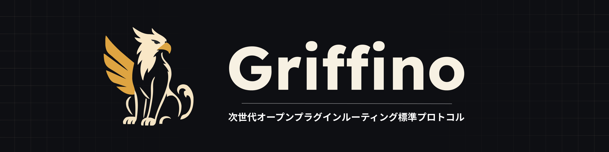
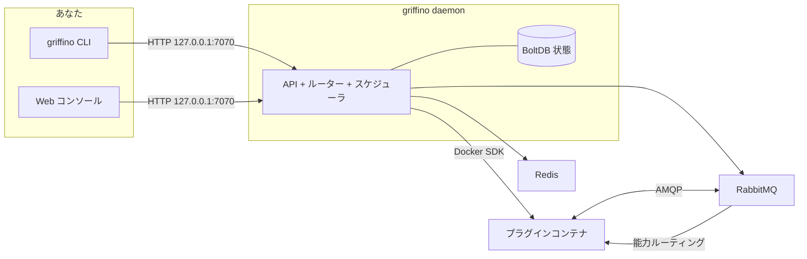

<div align="center">



<h1>Griffino</h1>

<p><strong>次世代オープンプラグインルーティング標準プロトコル</strong></p>

<p>
Griffino はプラグインルーティングのための<strong>オープン標準</strong>です。プラグインが manifest を通じて
自身が提供・消費する capability を宣言する方法、そして固定されたプラグイン依存ではなく capability に
基づいて発見・ルーティングされる方法を定めます。同時に、この標準の<strong>すぐ使える実装</strong>でもあり、
標準に準拠したプラグインをコンテナとして実行し、本機で統一された CLI と Web コンソールから管理します。
</p>

[](https://goreportcard.com/report/github.com/GriffinGuard/Griffino)


[](../../LICENSE)

[](../CLA.md)

[English](../../README.md) ·
[简体中文](README.zh-CN.md) ·
[繁體中文](README.zh-TW.md) ·
**日本語** ·
[한국어](README.ko.md) ·
[Русский](README.ru.md) ·
[Français](README.fr.md) ·
[Deutsch](README.de.md) ·
[العربية](README.ar.md)

</div>

## 目次

- [Griffino とは？](#griffino-とは)
- [特徴](#特徴)
- [アーキテクチャ](#アーキテクチャ)
- [要件](#要件)
- [インストール](#インストール)
- [クイックスタート](#クイックスタート)
- [CLI コマンド](#cli-コマンド)
- [Web コンソールと API](#web-コンソールと-api)
- [プラグイン](#プラグイン)
- [関連リポジトリ](#関連リポジトリ)
- [設定](#設定)
- [可観測性](#可観測性)
- [コントリビュート](#コントリビュート)
- [ライセンス](#ライセンス)

## Griffino とは？

Griffino は**ユーザーサイドのプラグインのためのオープン標準**です。各プラグインは標準の
**manifest** を使って、自身が**提供（provide）**および**消費（consume）**する**能力（capability）**を
宣言します。プラグインどうしは直接依存せず、capability に基づいて発見・接続されます。この標準に従えば、
異なる作者が異なる言語で書いたプラグインでも、互いの存在を事前に知らずに発見・置換・組み合わせができます。

*（「ユーザーサイド」とは、ユーザー自身のマシン上で動作し、ユーザー自身のニーズに応えるプラグインを
指し、クラウドにホストされるバックエンドサービスとは区別されます。）*

同時に、Griffino はこの標準の**すぐ使えるリファレンス実装兼ランタイム**でもあります。標準に従って
パッケージ化されたプラグインを 1 つ以上の Docker コンテナとして起動し、各プラグインに分離された
RabbitMQ 名前空間を割り当て、能力の提供側と消費側の間でメッセージをルーティングします。同一の能力に
複数の提供者がいる場合は、ヘルス状態に基づくフェイルオーバーと負荷分散も行います。コンテナ
オーケストレーションは Docker に、プラグイン間通信は組み込みメッセージバスに任せ、状態と設定は
デーモンが一元管理します。

この標準により、プラグインのエコシステムは**ポータブルで、組み合わせ可能で、特定の実装に縛られない**
ものになります。プラットフォームは、その完全なワークフローを本機ですぐ使える形で提供します。

## 特徴

- **プラグインのライフサイクル** —— プラグインコンテナのインストール・設定・起動・停止・アンインストールを、すべて Griffino から統一的に。
- **能力ルーティング** —— プラグイン間の能力ベースのルーティング、ヘルス対応フェイルオーバー、ラウンドロビン負荷分散を実装。
- **プラグインセンター** —— 公式プラグインセンターからのインストールとアップグレード。すべての公式プラグインは人手によるレビューのためにソースコードの提供が必須です。
- **タスクスケジューリング** —— プラグインの定期タスクと Blueprint ワークフローに対応する組み込みスケジューラ。
- **デフォルトで安全** —— マルチユーザー認証、認証情報の保存時暗号化、API はローカルのみにバインド。
- **可観測性** —— すぐ使える Prometheus `/metrics` と OpenTelemetry トレーシング。
- **自己文書化 API** —— OpenAPI 仕様、`/swagger/` に Swagger UI 組み込み。
- **開発モード** —— 高速なローカルプラグイン開発フロー。

## アーキテクチャ



デーモンが状態を保持し、公式 SDK を通じて Docker と通信し、RabbitMQ + Redis を管理対象コンテナとして
実行します。プラグインどうしは決して直接通信しません——能力を発行/消費し、各メッセージの行き先は
ルーターが決定します。

## 要件

- **Docker** —— 実行時に必須。デーモンが RabbitMQ と Redis をコンテナとして実行します。Docker Desktop、colima、podman いずれも動作します。
- **Go 1.25+** —— ソースからビルドする場合のみ必要。

## インストール

### macOS

Homebrew の利用を推奨します：

```bash
brew install GriffinGuard/tap/griffino
```

インストールスクリプトでビルド済みバイナリを取得することもできます：

```bash
curl -fsSL https://raw.githubusercontent.com/GriffinGuard/Griffino/main/scripts/get.sh | bash
```

バージョンまたはインストール先を固定する場合：

```bash
curl -fsSL https://raw.githubusercontent.com/GriffinGuard/Griffino/main/scripts/get.sh | VERSION=v1.0.0 PREFIX="$HOME/.local/bin" bash
```

### Linux

ビルド済みバイナリにはインストールスクリプトの利用を推奨します：

```bash
curl -fsSL https://raw.githubusercontent.com/GriffinGuard/Griffino/main/scripts/get.sh | bash
```

バージョンまたはインストール先を固定する場合：

```bash
curl -fsSL https://raw.githubusercontent.com/GriffinGuard/Griffino/main/scripts/get.sh | VERSION=v1.0.0 PREFIX="$HOME/.local/bin" bash
```

[releases ページ](https://github.com/GriffinGuard/Griffino/releases) から各ディストリビューション向けパッケージを取得することもできます：

```bash
sudo dpkg -i griffino_*_linux_amd64.deb   # Debian / Ubuntu
sudo rpm  -i griffino_*_linux_amd64.rpm   # Fedora / RHEL
```

### Windows

Microsoft Store からインストールするか、winget を使用します：

```powershell
winget install --source msstore Griffino
```

オフラインインストールが必要な場合は、[releases ページ](https://github.com/GriffinGuard/Griffino/releases)
から `griffino_*_windows_amd64.msi` をダウンロードしてください。

### ソースから

```bash
git clone https://github.com/GriffinGuard/Griffino.git
cd Griffino
./scripts/install.sh              # ビルドして PATH にインストール
./scripts/install.sh --build-only # ./griffino を生成するだけ
```

> `griffino daemon` の前に、Docker がインストール済みで**かつ起動している**必要があります。

## クイックスタート

```bash
# 1. デーモンを起動（RabbitMQ + Redis をコンテナとして起動）
griffino daemon

# 2. ローカルパスからプラグインをインストールして起動
griffino dev install ./path/to/plugin
griffino dev start <plugin-id>
```

その後、Web コンソール **http://127.0.0.1:7070** を開いてセットアップを完了し（最初の管理者を作成）、
プラグインを管理します。

## CLI コマンド

| コマンド | 説明 |
|----------|------|
| `griffino daemon` | Griffino デーモンを起動 |
| `griffino doctor` | Docker 環境とシステム依存関係の状態をチェック |
| `griffino service install` | ログイン時に起動するバックグラウンドサービスとして Griffino を実行 |
| `griffino service start` / `stop` / `restart` | バックグラウンドサービスを制御 |
| `griffino service status` | バックグラウンドサービスの状態を表示 |
| `griffino service uninstall` | バックグラウンドサービスを削除 |
| `griffino dev install <path>` | ローカルパスからプラグインをインストール |
| `griffino dev start <id>` | インストール済みプラグインを起動 |
| `griffino dev stop <id>` | 実行中のプラグインを停止 |
| `griffino dev uninstall <id>` | プラグインをアンインストール |
| `griffino admin reset-password` | 管理者パスワードをリセット |

`--lang` で言語を上書きできます（例：`--lang zh_CN`）。

### バックグラウンドサービスとして実行

`griffino service install` は、ログイン時に自動起動する**ユーザー単位**のサービスとして Griffino を
登録します（macOS では launchd LaunchAgent、Linux では `systemctl --user` ユニット、Windows では
ログオン時のスケジュールタスク）。デーモンには引き続き Docker の起動が必要です。

Griffino はユーザーレベルのサービスです：Docker Desktop はログイン済みセッション内でのみ動作するため、
ログイン前のシステムレベルのサービスでは到達できるコンテナランタイムが存在しません。

## Web コンソールと API

- **Web コンソール** —— デーモンが `http://127.0.0.1:7070` で提供。
- **REST API** —— `/api/v1` 配下。非公開エンドポイントには `POST /api/v1/auth/login` で得られる bearer セッショントークンが必要です。
- **Swagger UI** —— インタラクティブな API ドキュメント、`http://127.0.0.1:7070/swagger/`。
- **メトリクス** —— Prometheus エンドポイント、`http://127.0.0.1:7070/metrics`。

## プラグイン

### Manifest

プラグインは `plugin.manifest.json` ファイルで定義します：

```json
{
  "griffinoPluginManifestVersion": "1",
  "id": "my-plugin",
  "pluginVersion": "0.1.0",
  "name": { "default": "My Plugin" },
  "description": { "default": "A sample plugin" },
  "capabilities": [],
  "configurationFiles": {}
}
```

プラグインパッケージは生成される 4 つのファイルで構成されます。その権威ある Go 型は
[`pkg/manifest/types.go`](pkg/manifest/types.go) に定義され、正式な JSON Schemas は
[Griffino-Schemas](https://github.com/GriffinGuard/Griffino-Schemas) にあります：

| ファイル | 内容 |
|----------|------|
| `plugin.manifest.json` | プラグイン識別情報、`capabilities`（能力で型付け・ルーティング）、発行イベント `emits`、ダッシュボード `components`、および `configurationFiles` |
| `config.boot.json` | 管理者が設定する boot 設定フィールド |
| `config.user.json` | ユーザーごとの設定フィールド |
| `plugin.boot.yml` | 実行時のサービス仕様（image、environment、ports、volumes） |

各 `capabilities[]` エントリは能力で型付けされた provider または consumer であり、ポートで記述され
ます。トリガーは発行するイベントを `emits` で宣言します（いずれも以下のセクションで詳述）。

ユーザー設定スキーマは `config.user.json` から提供されます。スカラーのフィールド型に加えて、
デーモンは繰り返し可能なオブジェクトグループのための `group_array` フィールドを受け付け、その値を
フィールド key の下に JSON 配列として保存します。既存のフラットな文字列値の設定は引き続き互換です。

`group_array` フィールドは、`fields`（サブフィールド `ConfigParam` のリスト。各サブフィールドは
独自の `type`、`optional`、`validation` を持つ）によって配列要素の構造を宣言し、
`minItems`/`maxItems` で配列長を制限できます：

```json
{
  "key": "MODELS",
  "type": "group_array",
  "minItems": 1,
  "maxItems": 5,
  "fields": [
    { "key": "name", "type": "string", "optional": false },
    { "key": "supportsVision", "type": "boolean", "optional": true }
  ]
}
```

`POST /api/v1/plugins/{id}/user-config/values` の際、デーモンはこのスキーマに対して配列の各要素を
検証します：未知のサブフィールドは破棄され、欠落している非オプションのサブフィールドはリクエストを
拒否し、各サブフィールド値の型（および宣言されている場合は `validation` の範囲/長さ）が一致しな
ければなりません。ネストした `group_array` はサポートされません。

`password` 型のフィールドは——トップレベルでも `group_array` のサブフィールドでも——
`GET /user-config/values` で読み出す際に `**masked**` としてマスクされます。後続の `POST` で
このプレースホルダー値を送信すると、以前に保存された秘密が上書きされずに保持されるため、UI は
マスクされた値を安全にそのまま往復させることができ、実際の秘密を露出させたり破壊したりすることは
ありません。

### 能力とインターフェース

プラグインが**提供**または**消費**する各能力は型付けされ、ハードコードされた依存ではなく能力によってルーティングされます。能力のデータ契約は**ポート**（型付きの入力と出力）で記述され、2 つのワークフローノードはポート型が互換であれば接続できます。

- **標準インターフェース** —— 能力は `standardInterfaceRef`（例: `griffino.interfaces.ai.chat@1.0.0`）で [Griffino-Schemas](https://github.com/GriffinGuard/Griffino-Schemas) レジストリのバージョン管理された契約を参照します。デーモンは標準セットのスナップショットを同梱するため、ブループリントのポート検証は設計時に解決されます。**同じ**インターフェースを実装するプロバイダーは交換可能で、ルーターはインターフェースの**メジャー**バージョンが互換な場合にのみプロバイダーを置換可能とみなします。
- **インラインカスタムインターフェース** —— 適切な標準がない場合、能力は `interfaceSpec.inputPorts` / `interfaceSpec.outputPorts` でポートをインライン宣言します。この能力もワークフローのポート検証に参加しますが、他の作者の能力と自動的に交換されることはありません。ポート型は正規の語彙から選びます: `text`、`int`、`float`、`bool`、`json`、`binary`、`file`、`image`、`audio`、`video`、`embedding`、`llm-ref`、`any`。

### トリガー

プラグインは manifest の `emits` 配列に発行するイベントを宣言することで、**イベントソース**（トリガー）として動作できます:

```json
"emits": [
  {
    "eventType": "griffino.events.rss.item",
    "schemaRef": "griffino.events.rss.item@1.0.0",
    "name": { "default": "New RSS item" }
  }
]
```

実行時にプラグインはその型の dispatch イベントを発行し、ワークフローエンジンはそれを購読するブループリントを起動します。`GET /api/v1/plugins/triggers` は、ブループリントエディター向けにすべての実行中プラグインが発行するイベントを一覧表示します。

### 実行時のユーザー識別情報

プラグイン向けの実行時メッセージには、その処理を引き起こした Griffino のユーザーコンテキストが含まれます：

- `userId` は安定した Griffino のユーザー識別子です。ユーザーごとの状態キーやルーティングに使用してください。
- `displayName` はユーザープロフィールの表示名です。ユーザー向けのラベルにのみ使用してください。ユーザーが設定していない場合は空になることがあります。

Griffino はこれらの実行時メッセージを通じて、ログインの `username`、`email`、`role`、パスワードデータをプラグインに公開しません。

以下のエンベロープは `userId` の隣に `displayName` を含みます：

| メッセージ経路 | `displayName` が現れる場所 |
|----------------|----------------------------|
| Web コンソールの action トリガー | `griffino.actions` に発行される action 本文 |
| ユーザー設定更新の通知 | `plugin.{pluginId}.consumer.user_config_updated` に送信される `user.config_updated` 本文 |
| Blueprint プラグインノードのディスパッチ | メッセージ本文および `x-griffino-display-name` AMQP ヘッダー |
| Blueprint タスクのコールバック | `task.completed` / `task.failed` コールバック本文 |

ユーザーごとのプラグイン設定は、所有プラグインに対して読み取り専用の Redis データとして
`user:{userId}:plugin:{pluginId}:config` で引き続き利用できます。

### プラグインセンター

開発者がローカルでテストするために提供される `griffino dev install` に加えて、Griffino は公式リポジトリ
（[`GriffinGuard/Griffino-Plugins`](https://github.com/GriffinGuard/Griffino-Plugins)）から
プラグインをインストール・アップグレードできる**プラグインセンター**を内蔵しています。セキュリティ上の
理由から、プラグインセンターのソースは固定されており、当面はカスタムソースを公開しません。プラグインは
`~/.griffino/plugins/{id}/{version}/` にダウンロードされ、すべてのプラグイン管理関連エンドポイントは
Griffino の管理者ユーザーを必要とします。

| メソッドとパス | 説明 |
|----------------|------|
| `GET /api/v1/registry/plugins` | `installed` / `installedVersion` / `updateAvailable` の状態つきでレジストリのプラグインを一覧 |
| `GET /api/v1/registry/plugins/{id}` | 1 つのプラグインの完全な詳細（全バージョン + changelog）とインストール状態 |
| `POST /api/v1/registry/plugins/{id}/install` | プラグインをインストール。任意のボディ `{"version":"x.y.z"}`（既定は最新） |
| `POST /api/v1/registry/plugins/{id}/upgrade` | インストール済みプラグインをアップグレード。実行中のプラグインは自動的に停止・切り替え・再起動され、管理者設定は保持されます |
| `DELETE /api/v1/plugins/{id}` | プラグインをアンインストール（停止してからディレクトリとイメージを削除） |

**アップグレードの挙動：** 新バージョンは旧バージョンに手を付ける前にダウンロードと検証が行われます。
既存の管理者設定は引き継がれます。新バージョンが既定値のない必須設定を追加した場合、プラグインは
自動再起動せず *ready* 状態となり「要確認」フラグが付きます。旧バージョンのみが使用するイメージは
削除され、共有イメージは保持されます。

**イメージの安全性：** プラグインのメインサービスのイメージは `ghcr.io/griffinguard/` 配下で公開されて
いる必要があります。補助サービスのイメージは、コミュニティの
[`approved-images.json`](https://github.com/GriffinGuard/Griffino-Plugins) 許可リストに含まれている必要が
あります。未承認のイメージを参照するインストールやアップグレードは拒否されます。

## 関連リポジトリ

Griffino は 1 つの標準と、その周りの複数のリポジトリです。本リポジトリはリファレンス実装で、
残りはそれぞれ役割を持ちます：

| リポジトリ | 役割 |
|------------|------|
| [GriffinGuard/Griffino](https://github.com/GriffinGuard/Griffino) | 標準のリファレンス実装 + デーモン（**本リポジトリ**）：コンテナオーケストレーション、能力ルーティング、CLI と API |
| [GriffinGuard/Griffino-WebUI](https://github.com/GriffinGuard/Griffino-WebUI) | 既定で内蔵される Web コンソールのフロントエンド。Griffino のビルド時に自動で埋め込まれます |
| [GriffinGuard/Griffino-Plugins](https://github.com/GriffinGuard/Griffino-Plugins) | 公式プラグインセンターのリポジトリと、イメージ許可リスト `approved-images.json` |
| [GriffinGuard/Griffino-Plugins-Submit](https://github.com/GriffinGuard/Griffino-Plugins-Submit) | プラグイン作者が公式プラグインリポジトリにプラグインを提出する入口 |
| [GriffinGuard/Griffino-Schemas](https://github.com/GriffinGuard/Griffino-Schemas) | 標準を正式に定義する JSON Schema（manifest など） |
| [GriffinGuard/homebrew-tap](https://github.com/GriffinGuard/homebrew-tap) | Homebrew インストールソース |

**プラグイン SDK** は、作者が標準に沿って provide/consume を実装するのを助けます——メッセージ送受信、
manifest、設定の読み取りをラップし、AMQP プロトコルを手書きする必要をなくします：

| SDK | 言語 | 状態 |
|-----|------|------|
| [GriffinGuard/Griffino-Go](https://github.com/GriffinGuard/Griffino-Go) | Go | ✅ 利用可能 |
| [GriffinGuard/Griffino-Python](https://github.com/GriffinGuard/Griffino-Python) | Python | ✅ 利用可能 |
| [GriffinGuard/Griffino-Java](https://github.com/GriffinGuard/Griffino-Java) | Java | 🚧 社内開発中 |
| [GriffinGuard/Griffino-CSharp](https://github.com/GriffinGuard/Griffino-CSharp) | C# | 🚧 社内開発中 |

## 設定

設定は `~/.griffino/config.yaml` にあります（各セクションは任意。省略時は妥当な既定値が適用されます）：

```yaml
# HTTP API —— 既定ではローカルのみにバインド。
server:
  listenHost: 127.0.0.1
  listenPort: 7070

# RabbitMQ 接続。
rabbitmq:
  host: localhost
  port: 5672
  managementPort: 15672
  adminUser: guest
  adminPassword: guest
```

API は既定で `127.0.0.1:7070` にバインドします。Griffino は当面は本機のみをサポートし、LAN には公開
しません。ポートを変えるには `server.listenPort` を、——自己責任で——公開するには `server.listenHost` を
変更します。

機微な認証情報（RabbitMQ / Redis のパスワード）は**保存時に暗号化**され、鍵は `~/.griffino/secret.key`
（パーミッション `0600`）に保存されます。

## 運用とセキュリティ

Griffino は無人運用の単一マシン向けに堅牢化されています —— 完全な運用ガイドは [docs/operations.md](../operations.md) を参照。要点：

- **回復性** —— broker 再起動時、router は RabbitMQ へ自動再接続（指数バックオフ）。プラグインコンテナは `unless-stopped` 再起動ポリシーを使い、task watchdog が応答しないワークフローノードをタイムアウトさせます。
- **リソース制限** —— 各プラグインコンテナには上限（既定 512 MiB / 1.0 CPU / 512 PIDs）があり、単一プラグインがホストを枯渇させません。`plugin.boot.yml` でサービスごとに上書き可能：
  ```yaml
  services:
    main:
      resources: { memory_mb: 1024, cpus: 2.0, pids_limit: 1024 }
  ```
- **信頼モデル** —— 既定では公式センターからのみインストールし、イメージ allowlist を適用。ローカル開発プラグインは `griffino dev install`（allowlist スキップ、`isDevPlugin` とマーク、Web コンソール制御外）。
- **保存時暗号化** —— インフラ資格情報を AES-256-GCM で暗号化し、マスターキーをローカルの `secret.key`（権限 `0600`）に保存。データベースと一緒にバックアップしてください。

## 可観測性

- **メトリクス** —— `GET /metrics` が API・ルーター・コンテナ・スケジューラの Prometheus メトリクスを公開します。
- **トレーシング** —— OpenTelemetry トレースは OTLP 経由でエクスポートできます。エンドポイントを設定すると有効になります。

## コントリビュート

Griffino に関わってくださったすべてのコントリビューターに感謝します。現在のコントリビューター一覧は
[GitHub Contributors](https://github.com/GriffinGuard/Griffino/graphs/contributors) で確認できます。

コード、ドキュメント、フィードバックの issue や pull request を歓迎します。PR を送る前に
[CONTRIBUTING.md](../CONTRIBUTING.md) を読み、必要に応じて [CLA](../CLA.md) に同意してください。

## ライセンス

[Apache License 2.0](../../LICENSE)
