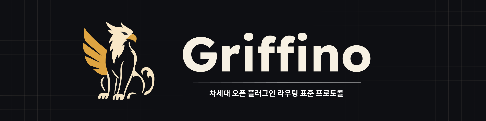
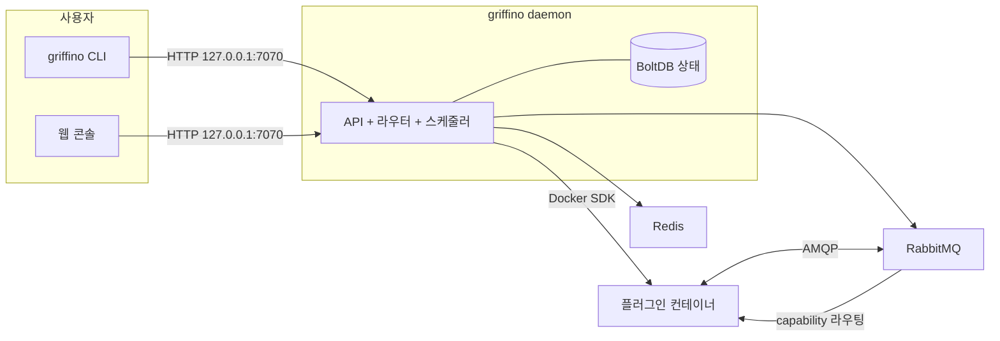

<div align="center">



<h1>Griffino</h1>

<p><strong>차세대 오픈 플러그인 라우팅 표준 프로토콜</strong></p>

Griffino는 플러그인 라우팅을 위한 <strong>오픈 표준</strong>입니다. 플러그인이 manifest로 자신이
제공하고 소비하는 capability를 선언하는 방식, 그리고 특정 플러그인에 고정된 의존성이 아니라 capability를
기준으로 발견되고 라우팅되는 방식을 정의합니다. 동시에 Griffino는 이 표준의
<strong>바로 사용할 수 있는 구현체</strong>로, 표준을 따르는 플러그인을 컨테이너로 실행하고 로컬 머신에서
하나의 CLI와 웹 콘솔로 관리합니다.

[](https://goreportcard.com/report/github.com/GriffinGuard/Griffino)


[](../../LICENSE)

[](../CLA.md)

[English](../../README.md) ·
[简体中文](README.zh-CN.md) ·
[繁體中文](README.zh-TW.md) ·
[日本語](README.ja.md) ·
**한국어** ·
[Русский](README.ru.md) ·
[Français](README.fr.md) ·
[Deutsch](README.de.md) ·
[العربية](README.ar.md)

</div>

## 목차

- [Griffino란?](#griffino란)
- [기능](#기능)
- [아키텍처](#아키텍처)
- [요구 사항](#요구-사항)
- [설치](#설치)
- [빠른 시작](#빠른-시작)
- [CLI 명령](#cli-명령)
- [웹 콘솔 및 API](#웹-콘솔-및-api)
- [플러그인](#플러그인)
- [관련 저장소](#관련-저장소)
- [설정](#설정)
- [관측성](#관측성)
- [기여](#기여)
- [라이선스](#라이선스)

## Griffino란?

Griffino는 **사용자 측 플러그인을 위한 오픈 표준**입니다. 각 플러그인은 표준 **manifest**를 사용해
자신이 **제공(provide)** 하고 **소비(consume)** 하는 **capability**를 선언합니다. 플러그인은 서로 직접
의존하지 않으며, capability를 기준으로 발견되고 연결됩니다. 이 표준을 따르면 서로 다른 작성자와 언어로
만든 플러그인도 서로의 존재를 미리 알 필요 없이 발견, 교체, 조합될 수 있습니다.

*("사용자 측"은 클라우드에 호스팅되는 백엔드 서비스와 달리 사용자의 로컬 머신에서 실행되어 사용자의
필요를 직접 처리하는 플러그인을 뜻합니다.)*

동시에 Griffino는 이 표준의 **바로 사용할 수 있는 참조 구현 및 런타임**입니다. 표준에 맞게 패키징된
플러그인을 하나 이상의 Docker 컨테이너로 실행하고, 각 플러그인에 격리된 RabbitMQ 네임스페이스를 할당하며,
capability 제공자와 소비자 사이의 메시지를 라우팅합니다. 하나의 capability에 여러 제공자가 있으면 상태를
기준으로 장애 조치와 라운드 로빈 로드 밸런싱도 수행합니다. 컨테이너 오케스트레이션은 Docker에 맡기고,
플러그인 간 통신은 내장 메시지 버스가 담당하며, 상태와 설정은 데몬이 중앙에서 관리합니다.

이 표준은 플러그인 생태계를 **이식 가능하고 조합 가능하며 특정 구현에 종속되지 않게** 만들고, Griffino
플랫폼은 전체 워크플로를 로컬 머신에서 바로 사용할 수 있게 합니다.

## 기능

- **플러그인 라이프사이클** — Griffino를 통해 플러그인 컨테이너 설치, 설정, 시작, 중지, 제거를 통합 관리합니다.
- **Capability 라우팅** — 플러그인 간 capability 기반 라우팅, 상태 기반 장애 조치, 라운드 로빈 로드 밸런싱을 제공합니다.
- **플러그인 센터** — 공식 플러그인 센터에서 플러그인을 설치하고 업그레이드합니다. 모든 공식 플러그인은 수동 검토를 위해 소스 코드를 제공해야 합니다.
- **작업 스케줄링** — 반복 플러그인 작업과 Blueprint 워크플로를 지원하는 내장 스케줄러를 제공합니다.
- **기본 보안** — 다중 사용자 인증, 저장 시 자격 증명 암호화, localhost 전용 API 바인딩을 제공합니다.
- **관측성** — Prometheus `/metrics`와 OpenTelemetry tracing을 기본 제공합니다.
- **자체 문서화 API** — OpenAPI 사양과 `/swagger/`에 내장된 Swagger UI를 제공합니다.
- **개발 모드** — 빠른 로컬 플러그인 개발 흐름을 제공합니다.

## 아키텍처



데몬은 상태를 보관하고 공식 SDK로 Docker와 통신하며 RabbitMQ와 Redis를 관리형 컨테이너로 실행합니다.
플러그인은 서로 직접 통신하지 않습니다. capability를 publish/consume하고, 라우터가 각 메시지의 목적지를
결정합니다.

## 요구 사항

- **Docker** — 런타임에 필요합니다. 데몬은 RabbitMQ와 Redis를 컨테이너로 실행합니다. Docker Desktop, colima, podman을 사용할 수 있습니다.
- **Go 1.25+** — 소스에서 빌드할 때만 필요합니다.

## 설치

### macOS

Homebrew 사용을 권장합니다:

```bash
brew install GriffinGuard/tap/griffino
```

설치 스크립트로 미리 빌드된 바이너리를 받을 수도 있습니다:

```bash
curl -fsSL https://raw.githubusercontent.com/GriffinGuard/Griffino/main/scripts/get.sh | bash
```

버전이나 설치 디렉터리를 고정하려면:

```bash
curl -fsSL https://raw.githubusercontent.com/GriffinGuard/Griffino/main/scripts/get.sh | VERSION=v1.0.0 PREFIX="$HOME/.local/bin" bash
```

### Linux

미리 빌드된 바이너리는 설치 스크립트 사용을 권장합니다:

```bash
curl -fsSL https://raw.githubusercontent.com/GriffinGuard/Griffino/main/scripts/get.sh | bash
```

버전이나 설치 디렉터리를 고정하려면:

```bash
curl -fsSL https://raw.githubusercontent.com/GriffinGuard/Griffino/main/scripts/get.sh | VERSION=v1.0.0 PREFIX="$HOME/.local/bin" bash
```

[releases 페이지](https://github.com/GriffinGuard/Griffino/releases)에서 배포판별 패키지를 받을 수도 있습니다:

```bash
sudo dpkg -i griffino_*_linux_amd64.deb   # Debian / Ubuntu
sudo rpm  -i griffino_*_linux_amd64.rpm   # Fedora / RHEL
```

### Windows

Microsoft Store에서 설치하거나 winget을 사용합니다:

```powershell
winget install --source msstore Griffino
```

오프라인 설치가 필요하면 [releases 페이지](https://github.com/GriffinGuard/Griffino/releases)에서
`griffino_*_windows_amd64.msi`를 다운로드하세요.

### 소스에서 빌드

```bash
git clone https://github.com/GriffinGuard/Griffino.git
cd Griffino
./scripts/install.sh              # 빌드하고 PATH에 설치
./scripts/install.sh --build-only # ./griffino만 생성
```

> `griffino daemon`을 실행하기 전에 Docker가 설치되어 있고 실행 중이어야 합니다.

## 빠른 시작

```bash
# 1. 데몬 시작(RabbitMQ + Redis를 컨테이너로 시작)
griffino daemon

# 2. 로컬 경로에서 플러그인 설치 및 시작
griffino dev install ./path/to/plugin
griffino dev start <plugin-id>
```

그런 다음 웹 콘솔 **http://127.0.0.1:7070** 을 열어 초기 설정(첫 관리자 생성)을 완료하고 플러그인을 관리합니다.

## CLI 명령

| 명령 | 설명 |
|------|------|
| `griffino daemon` | Griffino 데몬 시작 |
| `griffino doctor` | Docker 환경과 시스템 의존성 상태 확인 |
| `griffino service install` | Griffino를 로그인 시 자동 시작되는 백그라운드 서비스로 등록 |
| `griffino service start` / `stop` / `restart` | 백그라운드 서비스 제어 |
| `griffino service status` | 백그라운드 서비스 상태 확인 |
| `griffino service uninstall` | 백그라운드 서비스 제거 |
| `griffino dev install <path>` | 로컬 경로에서 플러그인 설치 |
| `griffino dev start <id>` | 설치된 플러그인 시작 |
| `griffino dev stop <id>` | 실행 중인 플러그인 중지 |
| `griffino dev uninstall <id>` | 플러그인 제거 |
| `griffino admin reset-password` | 관리자 비밀번호 재설정 |

언어를 바꾸려면 `--lang`을 사용합니다(예: `--lang zh_CN`).

### 백그라운드 서비스로 실행

`griffino service install`은 Griffino를 로그인 시 자동 시작되는 **사용자 단위** 서비스로 등록합니다(macOS는
launchd LaunchAgent, Linux는 `systemctl --user` 유닛, Windows는 로그인 예약 작업). 데몬을 실행하려면 여전히
Docker가 실행 중이어야 합니다.

Griffino는 사용자 수준 서비스입니다. Docker Desktop은 로그인된 세션에서만 실행되므로 로그인 전 시스템 서비스는
컨테이너 런타임에 접근할 수 없습니다.

## 웹 콘솔 및 API

- **웹 콘솔** — 데몬이 제공하며 주소는 `http://127.0.0.1:7070`입니다.
- **REST API** — `/api/v1` 아래에 있습니다. 비공개 엔드포인트에는 `POST /api/v1/auth/login`에서 받은 bearer 세션 토큰이 필요합니다.
- **Swagger UI** — 대화형 API 문서이며 `http://127.0.0.1:7070/swagger/`에서 사용할 수 있습니다.
- **메트릭** — Prometheus 엔드포인트는 `http://127.0.0.1:7070/metrics`입니다.

## 플러그인

### Manifest

플러그인은 `plugin.manifest.json` 파일로 정의됩니다:

```json
{
  "griffinoPluginManifestVersion": "1",
  "id": "my-plugin",
  "pluginVersion": "0.1.0",
  "name": { "default": "My Plugin" },
  "description": { "default": "A sample plugin" },
  "capabilities": [],
  "configurationFiles": {}
}
```

플러그인 패키지는 생성된 4 개의 파일로 구성됩니다. 그 권위 있는 Go 타입은
[`pkg/manifest/types.go`](pkg/manifest/types.go) 에 정의되어 있으며, 공식 JSON Schemas 는
[Griffino-Schemas](https://github.com/GriffinGuard/Griffino-Schemas) 에 있습니다:

| 파일 | 내용 |
|------|------|
| `plugin.manifest.json` | 플러그인 식별 정보, `capabilities`(능력으로 타입화·라우팅), 발행 이벤트 `emits`, 대시보드 `components`, 그리고 `configurationFiles` |
| `config.boot.json` | 관리자가 설정하는 boot 설정 필드 |
| `config.user.json` | 사용자별 설정 필드 |
| `plugin.boot.yml` | 런타임 서비스 명세(image, environment, ports, volumes) |

각 `capabilities[]` 항목은 능력으로 타입화된 provider 또는 consumer 이며 포트로 설명됩니다. 트리거는
발행하는 이벤트를 `emits` 로 선언합니다(둘 다 아래 섹션에서 자세히 설명).

사용자 설정 스키마는 `config.user.json` 에서 제공됩니다. 스칼라 필드 타입 외에도 데몬은 반복 가능한
객체 그룹을 위한 `group_array` 필드를 허용하며, 그 값을 필드 key 아래에 JSON 배열로 저장합니다.
기존의 평면 문자열 값 설정은 계속 호환됩니다.

`group_array` 필드는 `fields`(하위 필드 `ConfigParam` 목록으로, 각 하위 필드는 자체 `type`,
`optional`, `validation` 을 가짐)를 통해 배열 요소의 구조를 선언하며, `minItems`/`maxItems` 로
배열 길이를 제한할 수 있습니다:

```json
{
  "key": "MODELS",
  "type": "group_array",
  "minItems": 1,
  "maxItems": 5,
  "fields": [
    { "key": "name", "type": "string", "optional": false },
    { "key": "supportsVision", "type": "boolean", "optional": true }
  ]
}
```

`POST /api/v1/plugins/{id}/user-config/values` 시 데몬은 이 스키마에 대해 배열의 각 요소를
검증합니다: 알 수 없는 하위 필드는 삭제되고, 누락된 비선택 하위 필드는 요청을 거부하며, 각 하위
필드 값의 타입(및 선언된 경우 `validation` 범위/길이)이 일치해야 합니다. 중첩된 `group_array` 는
지원되지 않습니다.

`password` 타입 필드는——최상위든 `group_array` 하위 필드든——`GET /user-config/values` 로
다시 읽을 때 `**masked**` 로 마스킹됩니다. 이후 `POST` 에서 이 자리표시자 값을 제출하면 이전에
저장된 비밀이 덮어쓰이지 않고 보존되므로, UI 는 마스킹된 값을 실제 비밀을 노출하거나 훼손하지 않고
안전하게 그대로 왕복시킬 수 있습니다.

### 기능과 인터페이스

플러그인이 **제공**하거나 **소비**하는 각 기능은 타입이 지정되며, 하드코딩된 의존성이 아니라 기능 단위로 라우팅됩니다. 기능의 데이터 계약은 **포트**(타입이 지정된 입력과 출력)로 기술되며, 두 워크플로 노드는 포트 타입이 호환되면 연결할 수 있습니다.

- **표준 인터페이스** —— 기능은 `standardInterfaceRef`(예: `griffino.interfaces.ai.chat@1.0.0`)로 [Griffino-Schemas](https://github.com/GriffinGuard/Griffino-Schemas) 레지스트리의 버전 관리된 계약을 참조합니다. 데몬은 표준 집합의 스냅샷을 내장하므로 블루프린트 포트 검증이 설계 시점에 해결됩니다. **동일한** 인터페이스를 구현하는 공급자는 상호 교환 가능하며, 라우터는 인터페이스 **메이저** 버전이 호환될 때만 공급자를 대체 가능한 것으로 간주합니다.
- **인라인 사용자 정의 인터페이스** —— 적합한 표준이 없으면 기능은 `interfaceSpec.inputPorts` / `interfaceSpec.outputPorts`로 포트를 인라인 선언합니다. 이러한 기능도 워크플로 포트 검증에 참여하지만 다른 작성자의 기능과 자동으로 교환되지는 않습니다. 포트 타입은 표준 어휘에서 선택해야 합니다: `text`, `int`, `float`, `bool`, `json`, `binary`, `file`, `image`, `audio`, `video`, `embedding`, `llm-ref`, `any`.

### 트리거

플러그인은 manifest의 `emits` 배열에 발행하는 이벤트를 선언하여 **이벤트 소스**(트리거)로 동작할 수 있습니다:

```json
"emits": [
  {
    "eventType": "griffino.events.rss.item",
    "schemaRef": "griffino.events.rss.item@1.0.0",
    "name": { "default": "New RSS item" }
  }
]
```

런타임에 플러그인은 해당 타입의 dispatch 이벤트를 발행하고, 워크플로 엔진은 이를 구독하는 모든 블루프린트를 시작합니다. `GET /api/v1/plugins/triggers`는 블루프린트 편집기를 위해 실행 중인 모든 플러그인이 발행하는 이벤트를 나열합니다.

### 런타임 사용자 신원

플러그인으로 전달되는 런타임 메시지에는 해당 작업을 트리거한 Griffino 사용자 컨텍스트가 포함됩니다:

- `userId`는 안정적인 Griffino 사용자 식별자입니다. 사용자별 상태 키와 라우팅에 사용하세요.
- `displayName`은 사용자 프로필의 표시 이름입니다. 사용자에게 보이는 레이블에만 사용하세요. 사용자가 설정하지 않은 경우 비어 있을 수 있습니다.

Griffino는 이러한 런타임 메시지를 통해 로그인 `username`, `email`, `role` 또는 비밀번호 데이터를 플러그인에 노출하지 않습니다.

다음 엔벨로프는 `userId` 옆에 `displayName`을 포함합니다:

| 메시지 경로 | `displayName`이 나타나는 위치 |
|-------------|--------------------------------|
| 웹 콘솔 action 트리거 | `griffino.actions`에 발행되는 action 본문 |
| 사용자 설정 업데이트 알림 | `plugin.{pluginId}.consumer.user_config_updated`로 전송되는 `user.config_updated` 본문 |
| Blueprint 플러그인 노드 디스패치 | 메시지 본문 및 `x-griffino-display-name` AMQP 헤더 |
| Blueprint 작업 콜백 | `task.completed` / `task.failed` 콜백 본문 |

사용자별 플러그인 설정은 소유 플러그인에 읽기 전용 Redis 데이터로 `user:{userId}:plugin:{pluginId}:config`에 계속 제공됩니다.

### 플러그인 센터

개발자가 로컬 테스트에 사용하는 `griffino dev install` 외에도, Griffino에는 공식 저장소
([`GriffinGuard/Griffino-Plugins`](https://github.com/GriffinGuard/Griffino-Plugins))에서 플러그인을
설치하고 업그레이드하는 **플러그인 센터**가 내장되어 있습니다. 보안을 위해 플러그인 센터 소스는 고정되어
있으며 현재 사용자 지정 소스는 지원하지 않습니다. 플러그인은 `~/.griffino/plugins/{id}/{version}/`에
다운로드되고, 모든 플러그인 관리 엔드포인트에는 Griffino 관리자 사용자가 필요합니다.

| 메서드 및 경로 | 설명 |
|------------|------|
| `GET /api/v1/registry/plugins` | registry 플러그인 목록과 `installed` / `installedVersion` / `updateAvailable` 상태 |
| `GET /api/v1/registry/plugins/{id}` | 단일 플러그인의 전체 상세 정보(모든 버전 + changelog)와 설치 상태 |
| `POST /api/v1/registry/plugins/{id}/install` | 플러그인 설치. 선택 요청 본문 `{"version":"x.y.z"}`(기본값은 최신) |
| `POST /api/v1/registry/plugins/{id}/upgrade` | 설치된 플러그인 업그레이드. 실행 중인 플러그인은 자동 중지, 전환, 재시작되며 관리자 설정은 유지 |
| `DELETE /api/v1/plugins/{id}` | 플러그인 제거(먼저 중지한 뒤 디렉터리와 이미지 삭제) |

**업그레이드 동작:** 새 버전은 먼저 다운로드 및 검증된 뒤에야 기존 버전에 영향을 줍니다. 기존 관리자 설정은
그대로 사용됩니다. 새 버전에 기본값 없는 필수 설정이 추가되면 플러그인은 자동 재시작되지 않고 *ready* 상태와
"검토 필요" 표시로 남습니다. 이전 버전에서만 사용한 이미지는 정리되고 공유 이미지는 유지됩니다.

**이미지 보안:** 플러그인의 주 서비스 이미지는 `ghcr.io/griffinguard/` 아래에 게시되어야 합니다. 보조 서비스
이미지는 커뮤니티 [`approved-images.json`](https://github.com/GriffinGuard/Griffino-Plugins) 허용 목록에
있어야 합니다. 승인되지 않은 이미지를 참조하는 설치와 업그레이드는 거부됩니다.

## 관련 저장소

Griffino는 하나의 표준이며, 그 주변에 여러 저장소가 있습니다. 이 저장소는 참조 구현이고 나머지는 각자의 역할을 가집니다:

| 저장소 | 역할 |
|------|------|
| [GriffinGuard/Griffino](https://github.com/GriffinGuard/Griffino) | 표준의 참조 구현과 데몬(**이 저장소**): 컨테이너 오케스트레이션, capability 라우팅, CLI와 API |
| [GriffinGuard/Griffino-WebUI](https://github.com/GriffinGuard/Griffino-WebUI) | 기본 내장 웹 콘솔 프런트엔드, Griffino 빌드 시 자동 임베드 |
| [GriffinGuard/Griffino-Plugins](https://github.com/GriffinGuard/Griffino-Plugins) | 공식 플러그인 센터 저장소 및 이미지 허용 목록 `approved-images.json` |
| [GriffinGuard/Griffino-Plugins-Submit](https://github.com/GriffinGuard/Griffino-Plugins-Submit) | 플러그인 작성자가 공식 플러그인 저장소에 제출하는 입구 |
| [GriffinGuard/Griffino-Schemas](https://github.com/GriffinGuard/Griffino-Schemas) | 표준을 공식 정의하는 JSON Schema(manifest 등) |
| [GriffinGuard/homebrew-tap](https://github.com/GriffinGuard/homebrew-tap) | Homebrew tap |

**플러그인 SDK**는 작성자가 표준에 맞춰 provide/consume을 구현할 수 있도록 돕고, 메시지 송수신, manifest, 설정
읽기를 감싸므로 AMQP 프로토콜을 직접 작성할 필요가 없습니다:

| SDK | 언어 | 상태 |
|-----|------|------|
| [GriffinGuard/Griffino-Go](https://github.com/GriffinGuard/Griffino-Go) | Go | ✅ 사용 가능 |
| [GriffinGuard/Griffino-Python](https://github.com/GriffinGuard/Griffino-Python) | Python | ✅ 사용 가능 |
| [GriffinGuard/Griffino-Java](https://github.com/GriffinGuard/Griffino-Java) | Java | 🚧 내부 개발 중 |
| [GriffinGuard/Griffino-CSharp](https://github.com/GriffinGuard/Griffino-CSharp) | C# | 🚧 내부 개발 중 |

## 설정

설정은 `~/.griffino/config.yaml`에 있습니다(각 섹션은 선택 사항이며 생략하면 합리적인 기본값을 사용합니다):

```yaml
# HTTP API — 기본적으로 localhost에만 바인딩됩니다.
server:
  listenHost: 127.0.0.1
  listenPort: 7070

# RabbitMQ 연결.
rabbitmq:
  host: localhost
  port: 5672
  managementPort: 15672
  adminUser: guest
  adminPassword: guest
```

API는 기본적으로 `127.0.0.1:7070`에 바인딩됩니다. Griffino는 현재 로컬 머신만 지원하며 LAN 서비스로 제공하지
않습니다. `server.listenPort`로 포트를 바꾸거나, 위험을 감수하고 `server.listenHost`를 변경해 외부에 노출할 수 있습니다.

민감한 자격 증명(RabbitMQ / Redis 비밀번호)은 **암호화되어 저장**되며 키는 `~/.griffino/secret.key`
(권한 `0600`)에 있습니다.

## 운영과 보안

Griffino는 무인 단일 머신 운영을 위해 강화되어 있습니다 —— 전체 운영 가이드는 [docs/operations.md](../operations.md) 참고. 핵심:

- **복원력** —— broker 재시작 시 router가 RabbitMQ에 자동 재연결(지수 백오프); 플러그인 컨테이너는 `unless-stopped` 재시작 정책을 쓰고, task watchdog이 응답 없는 워크플로 노드를 타임아웃 처리합니다.
- **리소스 제한** —— 모든 플러그인 컨테이너에 상한(기본 512 MiB / 1.0 CPU / 512 PIDs)이 있어 한 플러그인이 호스트를 고갈시킬 수 없습니다. `plugin.boot.yml`에서 서비스별로 재정의:
  ```yaml
  services:
    main:
      resources: { memory_mb: 1024, cpus: 2.0, pids_limit: 1024 }
  ```
- **신뢰 모델** —— 기본적으로 공식 센터에서만 설치하며 이미지 allowlist를 적용; 로컬 개발 플러그인은 `griffino dev install`(allowlist 건너뜀, `isDevPlugin` 표시, 웹 콘솔 제어 제외)을 사용합니다.
- **저장 시 암호화** —— 인프라 자격 증명은 AES-256-GCM으로 암호화되며 마스터 키는 로컬 `secret.key`(권한 `0600`)에 저장; 데이터베이스와 함께 백업하세요.

## 관측성

- **메트릭** — `GET /metrics`가 API, 라우터, 컨테이너, 스케줄러의 Prometheus 메트릭을 노출합니다.
- **트레이싱** — OpenTelemetry tracing은 OTLP로 내보낼 수 있으며 endpoint 설정 시 활성화됩니다.

## 기여

Griffino에 기여해 주신 모든 분께 감사드립니다. 현재 기여자 목록은
[GitHub Contributors](https://github.com/GriffinGuard/Griffino/graphs/contributors)를 기준으로 합니다.

코드, 문서, 피드백에 대한 issue와 pull request를 환영합니다. PR을 제출하기 전에
[CONTRIBUTING.md](../CONTRIBUTING.md)를 읽고 필요에 따라 [CLA](../CLA.md)에 서명해 주세요.

## 라이선스

[Apache License 2.0](../../LICENSE)
