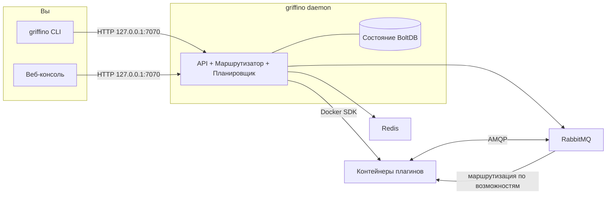

<div align="center">


<h1>Griffino</h1>

<p><strong>Открытый протокол и стандарт маршрутизации плагинов нового поколения</strong></p>

<p>
Griffino — это <strong>открытый стандарт</strong> для маршрутизации плагинов: он определяет, как
плагины с помощью manifest объявляют возможности, которые они предоставляют и потребляют, и как
они обнаруживаются и маршрутизируются по возможности, а не по жестко заданной зависимости от
конкретного плагина. Это также <strong>готовая к работе реализация</strong> стандарта: она запускает
совместимые плагины как контейнеры и управляет ими на вашей машине из единого CLI и веб-консоли.
</p>

[](https://goreportcard.com/report/github.com/GriffinGuard/Griffino)


[](../../LICENSE)

[](../CLA.md)

[English](../../README.md) ·
[简体中文](README.zh-CN.md) ·
[繁體中文](README.zh-TW.md) ·
[日本語](README.ja.md) ·
[한국어](README.ko.md) ·
**Русский** ·
[Français](README.fr.md) ·
[Deutsch](README.de.md) ·
[العربية](README.ar.md)

</div>

## Содержание

- [Что такое Griffino?](#что-такое-griffino)
- [Возможности](#возможности)
- [Архитектура](#архитектура)
- [Требования](#требования)
- [Установка](#установка)
- [Быстрый старт](#быстрый-старт)
- [Команды CLI](#команды-cli)
- [Веб-консоль и API](#веб-консоль-и-api)
- [Плагины](#плагины)
- [Связанные репозитории](#связанные-репозитории)
- [Конфигурация](#конфигурация)
- [Наблюдаемость](#наблюдаемость)
- [Участие в разработке](#участие-в-разработке)
- [Лицензия](#лицензия)

## Что такое Griffino?

Griffino — это **открытый стандарт для пользовательских плагинов**. Он предписывает, что
каждый плагин с помощью стандартного **manifest** объявляет **возможности (capability)**,
которые он **предоставляет (provide)** и **потребляет (consume)**; плагины не зависят друг
от друга напрямую, а обнаруживаются и связываются по возможности. Пока плагины следуют
этому стандарту, написанные разными авторами и на разных языках, они могут обнаруживать,
заменять и компоновать друг друга, не зная заранее о существовании остальных.

*(«Пользовательский» означает плагины, которые работают на собственной машине пользователя
и служат его собственным нуждам, в отличие от бэкенд-сервисов, размещённых в облаке.)*

В то же время Griffino — это **готовая к работе эталонная реализация и среда выполнения**
данного стандарта. Она запускает плагины, упакованные по стандарту, как один или несколько
Docker-контейнеров, выделяет каждому плагину изолированное пространство имён RabbitMQ и
маршрутизирует сообщения между поставщиками и потребителями возможностей; когда у одной
возможности несколько поставщиков, она также выполняет отказоустойчивость и балансировку
нагрузки на основе состояния здоровья. Оркестрация контейнеров отдана Docker, межплагинное
взаимодействие — встроенной шине сообщений, а состоянием и конфигурацией централизованно
управляет демон.

Благодаря этому стандарту экосистема плагинов становится **переносимой, компонуемой и не
привязанной к какой-либо одной реализации**, а платформа предоставляет полный рабочий процесс
из коробки на вашей машине.

## Возможности

- **Жизненный цикл плагинов** — установка, настройка, запуск, остановка и удаление контейнеров плагинов — всё единообразно через Griffino.
- **Маршрутизация по возможностям** — реализованы маршрутизация между плагинами по возможностям, отказоустойчивость с учётом здоровья и балансировка по кругу (round-robin).
- **Центр плагинов** — установка и обновление плагинов из официального центра плагинов; все официальные плагины обязаны предоставить исходный код для ручной проверки.
- **Планировщик задач** — встроенный планировщик с поддержкой периодических задач плагинов и workflow-схем (Blueprint).
- **Безопасность по умолчанию** — многопользовательская аутентификация, шифрование учётных данных в покое и привязка API только к localhost.
- **Наблюдаемость** — готовые к работе Prometheus `/metrics` и трассировка OpenTelemetry.
- **Самодокументируемый API** — спецификация OpenAPI со встроенным Swagger UI по адресу `/swagger/`.
- **Режим разработки** — быстрый процесс локальной разработки плагинов.

## Архитектура



Демон хранит состояние, общается с Docker через официальный SDK и запускает RabbitMQ + Redis
как управляемые контейнеры. Плагины никогда не общаются напрямую — они публикуют/потребляют
возможности, а маршрутизатор решает, куда направить каждое сообщение.

## Требования

- **Docker** — необходим во время выполнения; демон запускает RabbitMQ и Redis как контейнеры. Подходят Docker Desktop, colima и podman.
- **Go 1.25+** — нужен только при сборке из исходного кода.

## Установка

### macOS

Рекомендуемый способ — Homebrew:

```bash
brew install GriffinGuard/tap/griffino
```

Также можно получить готовый бинарник через установочный скрипт:

```bash
curl -fsSL https://raw.githubusercontent.com/GriffinGuard/Griffino/main/scripts/get.sh | bash
```

Чтобы зафиксировать версию или каталог установки:

```bash
curl -fsSL https://raw.githubusercontent.com/GriffinGuard/Griffino/main/scripts/get.sh | VERSION=v1.0.0 PREFIX="$HOME/.local/bin" bash
```

### Linux

Для готовых бинарников рекомендуется установочный скрипт:

```bash
curl -fsSL https://raw.githubusercontent.com/GriffinGuard/Griffino/main/scripts/get.sh | bash
```

Чтобы зафиксировать версию или каталог установки:

```bash
curl -fsSL https://raw.githubusercontent.com/GriffinGuard/Griffino/main/scripts/get.sh | VERSION=v1.0.0 PREFIX="$HOME/.local/bin" bash
```

Также можно скачать пакет для своего дистрибутива со [страницы релизов](https://github.com/GriffinGuard/Griffino/releases):

```bash
sudo dpkg -i griffino_*_linux_amd64.deb   # Debian / Ubuntu
sudo rpm  -i griffino_*_linux_amd64.rpm   # Fedora / RHEL
```

### Windows

Установите Griffino из Microsoft Store или через winget:

```powershell
winget install --source msstore Griffino
```

Для офлайн-установки скачайте `griffino_*_windows_amd64.msi` со
[страницы релизов](https://github.com/GriffinGuard/Griffino/releases).

### Из исходного кода

```bash
git clone https://github.com/GriffinGuard/Griffino.git
cd Griffino
./scripts/install.sh              # сборка + установка в PATH
./scripts/install.sh --build-only # только собрать ./griffino
```

> Перед `griffino daemon` Docker должен быть установлен **и запущен**.

## Быстрый старт

```bash
# 1. Запустить демон (поднимает RabbitMQ + Redis как контейнеры)
griffino daemon

# 2. Установить и запустить плагин из локального пути
griffino dev install ./path/to/plugin
griffino dev start <plugin-id>
```

Затем откройте веб-консоль по адресу **http://127.0.0.1:7070**, чтобы завершить настройку
(создать первого администратора) и управлять плагинами.

## Команды CLI

| Команда | Описание |
|---------|----------|
| `griffino daemon` | Запустить демон Griffino |
| `griffino doctor` | Проверить окружение Docker и состояние системных зависимостей |
| `griffino service install` | Запускать Griffino как фоновую службу при входе в систему |
| `griffino service start` / `stop` / `restart` | Управление фоновой службой |
| `griffino service status` | Показать статус фоновой службы |
| `griffino service uninstall` | Удалить фоновую службу |
| `griffino dev install <path>` | Установить плагин из локального пути |
| `griffino dev start <id>` | Запустить установленный плагин |
| `griffino dev stop <id>` | Остановить работающий плагин |
| `griffino dev uninstall <id>` | Удалить плагин |
| `griffino admin reset-password` | Сбросить пароль администратора |

Используйте `--lang`, чтобы переопределить язык (например, `--lang zh_CN`).

### Запуск как фоновой службы

`griffino service install` регистрирует Griffino как службу уровня пользователя, которая
запускается при входе (LaunchAgent launchd на macOS, юнит `systemctl --user` на Linux,
запланированную задачу при входе на Windows). Демону по-прежнему нужен запущенный Docker.

Griffino — служба уровня пользователя: Docker Desktop работает только внутри вошедшей сессии,
поэтому системная служба до входа не имела бы доступа к среде выполнения контейнеров.

## Веб-консоль и API

- **Веб-консоль** — обслуживается демоном по адресу `http://127.0.0.1:7070`.
- **REST API** — под `/api/v1`. Непубличные эндпоинты требуют bearer-токен сессии из `POST /api/v1/auth/login`.
- **Swagger UI** — интерактивная документация API по адресу `http://127.0.0.1:7070/swagger/`.
- **Метрики** — экспозиция Prometheus по адресу `http://127.0.0.1:7070/metrics`.

## Плагины

### Manifest

Плагины описываются файлом `plugin.manifest.json`:

```json
{
  "griffinoPluginManifestVersion": "1",
  "id": "my-plugin",
  "pluginVersion": "0.1.0",
  "name": { "default": "My Plugin" },
  "description": { "default": "A sample plugin" },
  "capabilities": [],
  "configurationFiles": {}
}
```

Пакет плагина — это четыре генерируемых файла. Их авторитетные Go-типы определены в
[`pkg/manifest/types.go`](pkg/manifest/types.go), а формальные JSON Schemas находятся в
[Griffino-Schemas](https://github.com/GriffinGuard/Griffino-Schemas):

| Файл | Содержимое |
|------|------------|
| `plugin.manifest.json` | Идентичность плагина, `capabilities` (типизированы и маршрутизируются по возможности), испускаемые события `emits`, `components` панели и `configurationFiles` |
| `config.boot.json` | Поля boot-конфигурации, задаваемые администратором |
| `config.user.json` | Поля конфигурации для каждого пользователя |
| `plugin.boot.yml` | Спецификация сервиса времени выполнения (image, environment, ports, volumes) |

Каждая запись `capabilities[]` — это provider или consumer, типизированный по возможности и
описанный портами; триггер объявляет испускаемые им события через `emits` (оба подробно
описаны в разделах ниже).

Схемы пользовательской конфигурации обслуживаются из `config.user.json`. Помимо скалярных
типов полей, демон принимает поля `group_array` для повторяемых групп объектов и хранит их
значения как JSON-массивы под ключом поля. Существующие плоские строковые конфигурации
остаются совместимыми.

Поле `group_array` объявляет форму своих элементов через `fields` (список `ConfigParam`
подполей, каждое со своими `type`, `optional` и `validation`) и может ограничивать длину
массива через `minItems`/`maxItems`:

```json
{
  "key": "MODELS",
  "type": "group_array",
  "minItems": 1,
  "maxItems": 5,
  "fields": [
    { "key": "name", "type": "string", "optional": false },
    { "key": "supportsVision", "type": "boolean", "optional": true }
  ]
}
```

При `POST /api/v1/plugins/{id}/user-config/values` демон проверяет каждый элемент массива по
этой схеме: неизвестные подполя отбрасываются, отсутствующие обязательные подполя отклоняют
запрос, и тип значения каждого подполя (а также диапазон/длина `validation`, если объявлены)
должен совпадать. Вложенные поля `group_array` не поддерживаются.

Поля типа `password` — как верхнего уровня, так и подполя `group_array` — маскируются как
`**masked**` при чтении через `GET /user-config/values`. Отправка этого значения-заполнителя
при последующем `POST` сохраняет ранее сохранённый секрет вместо его перезаписи, поэтому UI
может безопасно возвращать маскированное значение, не раскрывая и не затирая настоящий секрет.

### Возможности и интерфейсы

Каждая возможность, которую плагин **предоставляет** или **потребляет**, типизирована и маршрутизируется по возможности, а не по жёстко заданной зависимости. Контракт данных возможности описывается **портами** — типизированными входами и выходами; два узла рабочего процесса можно соединить, когда их типы портов совместимы.

- **Стандартные интерфейсы** —— возможность ссылается на версионированный контракт из реестра [Griffino-Schemas](https://github.com/GriffinGuard/Griffino-Schemas) через `standardInterfaceRef` (например, `griffino.interfaces.ai.chat@1.0.0`). Демон поставляется со встроенным снимком стандартного набора, поэтому проверка портов в blueprint разрешается на этапе проектирования. Провайдеры, реализующие **один и тот же** интерфейс, взаимозаменяемы; маршрутизатор считает провайдеров заменяемыми только когда **мажорные** версии их интерфейсов совместимы.
- **Встроенные пользовательские интерфейсы** —— когда подходящего стандарта нет, возможность объявляет свои порты встроенно через `interfaceSpec.inputPorts` / `interfaceSpec.outputPorts`. Такая возможность по-прежнему участвует в проверке портов рабочего процесса, просто она не заменяется автоматически возможностью другого автора. Типы портов должны быть из канонического словаря: `text`, `int`, `float`, `bool`, `json`, `binary`, `file`, `image`, `audio`, `video`, `embedding`, `llm-ref`, `any`.

### Триггеры

Плагин может выступать **источником событий** (триггером), объявляя события, которые он испускает, в массиве `emits` манифеста:

```json
"emits": [
  {
    "eventType": "griffino.events.rss.item",
    "schemaRef": "griffino.events.rss.item@1.0.0",
    "name": { "default": "New RSS item" }
  }
]
```

Во время выполнения плагин испускает dispatch-событие этого типа; движок рабочих процессов запускает любой blueprint, подписанный на него. `GET /api/v1/plugins/triggers` перечисляет события, испускаемые всеми запущенными плагинами, для редактора blueprint.

### Идентичность пользователя во время выполнения

Сообщения, направляемые плагинам, содержат контекст пользователя Griffino, инициировавшего работу:

- `userId` — это стабильный идентификатор пользователя Griffino. Используйте его для пользовательских ключей состояния и маршрутизации.
- `displayName` — отображаемое имя из профиля пользователя. Используйте его только для отображаемых пользователю меток; оно может быть пустым, если пользователь его не настроил.

Griffino не передаёт плагинам через эти сообщения времени выполнения логин `username`, `email`, `role` или данные пароля.

Следующие конверты содержат `displayName` рядом с `userId`:

| Путь сообщения | Где появляется `displayName` |
|----------------|------------------------------|
| Триггер действия из веб-консоли | Тело действия, публикуемое в `griffino.actions` |
| Уведомление об обновлении пользовательской конфигурации | Тело `user.config_updated`, отправляемое в `plugin.{pluginId}.consumer.user_config_updated` |
| Диспетчеризация узла плагина Blueprint | Тело сообщения и AMQP-заголовок `x-griffino-display-name` |
| Обратный вызов задачи Blueprint | Тело обратного вызова `task.completed` / `task.failed` |

Пользовательская конфигурация плагина остаётся доступной владеющему плагину в виде доступных только для чтения данных Redis по адресу
`user:{userId}:plugin:{pluginId}:config`.

### Центр плагинов

Помимо `griffino dev install` (предоставляемого разработчикам для локального тестирования),
в Griffino встроен **центр плагинов**, который устанавливает и обновляет плагины из
официального репозитория
([`GriffinGuard/Griffino-Plugins`](https://github.com/GriffinGuard/Griffino-Plugins)). Из
соображений безопасности источник центра плагинов фиксирован, и пользовательские источники
пока не открыты. Плагины загружаются в `~/.griffino/plugins/{id}/{version}/`, и все эндпоинты
управления плагинами требуют администратора Griffino.

| Метод и путь | Описание |
|--------------|----------|
| `GET /api/v1/registry/plugins` | Список плагинов реестра со статусом `installed` / `installedVersion` / `updateAvailable` |
| `GET /api/v1/registry/plugins/{id}` | Полные сведения об одном плагине (все версии + changelog) и статус установки |
| `POST /api/v1/registry/plugins/{id}/install` | Установить плагин. Необязательное тело `{"version":"x.y.z"}` (по умолчанию — последняя) |
| `POST /api/v1/registry/plugins/{id}/upgrade` | Обновить установленный плагин. Работающий плагин автоматически останавливается, переключается и перезапускается; конфигурация администратора сохраняется |
| `DELETE /api/v1/plugins/{id}` | Удалить плагин (останавливает его, затем удаляет каталог и образы) |

**Поведение при обновлении:** новая версия скачивается и проверяется до того, как
затрагивается старая. Существующая конфигурация администратора переносится; если новая
версия добавляет обязательную настройку без значения по умолчанию, плагин переходит в
состояние *ready* с пометкой «требует проверки» вместо автоматического перезапуска.
Образы, используемые только старой версией, удаляются; общие образы сохраняются.

**Безопасность образов:** образ основной службы плагина должен публиковаться под
`ghcr.io/griffinguard/`; любые образы вспомогательных служб должны присутствовать в
белом списке сообщества [`approved-images.json`](https://github.com/GriffinGuard/Griffino-Plugins).
Установки и обновления, ссылающиеся на неодобренный образ, отклоняются.

## Связанные репозитории

Griffino — это стандарт плюс несколько репозиториев вокруг него. Этот репозиторий —
эталонная реализация; у остальных свои роли:

| Репозиторий | Роль |
|-------------|------|
| [GriffinGuard/Griffino](https://github.com/GriffinGuard/Griffino) | Эталонная реализация + демон (**этот репозиторий**): оркестрация контейнеров, маршрутизация по возможностям, CLI и API |
| [GriffinGuard/Griffino-WebUI](https://github.com/GriffinGuard/Griffino-WebUI) | Фронтенд встроенной веб-консоли; автоматически встраивается при сборке Griffino |
| [GriffinGuard/Griffino-Plugins](https://github.com/GriffinGuard/Griffino-Plugins) | Репозиторий официального центра плагинов и белый список образов `approved-images.json` |
| [GriffinGuard/Griffino-Plugins-Submit](https://github.com/GriffinGuard/Griffino-Plugins-Submit) | Вход для авторов плагинов, чтобы отправлять плагины в официальный репозиторий плагинов |
| [GriffinGuard/Griffino-Schemas](https://github.com/GriffinGuard/Griffino-Schemas) | JSON-схемы, формально определяющие стандарт (manifest и т. п.) |
| [GriffinGuard/homebrew-tap](https://github.com/GriffinGuard/homebrew-tap) | Источник установки Homebrew |

**SDK для плагинов** помогают авторам реализовать provide/consume по стандарту, оборачивая
приём/отправку сообщений, manifest и чтение конфигурации, так что писать протокол AMQP вручную
не нужно:

| SDK | Язык | Статус |
|-----|------|--------|
| [GriffinGuard/Griffino-Go](https://github.com/GriffinGuard/Griffino-Go) | Go | ✅ Доступен |
| [GriffinGuard/Griffino-Python](https://github.com/GriffinGuard/Griffino-Python) | Python | ✅ Доступен |
| [GriffinGuard/Griffino-Java](https://github.com/GriffinGuard/Griffino-Java) | Java | 🚧 Во внутренней разработке |
| [GriffinGuard/Griffino-CSharp](https://github.com/GriffinGuard/Griffino-CSharp) | C# | 🚧 Во внутренней разработке |

## Конфигурация

Конфигурация находится в `~/.griffino/config.yaml` (все секции необязательны — применяются
разумные значения по умолчанию):

```yaml
# HTTP API — по умолчанию только локально.
server:
  listenHost: 127.0.0.1
  listenPort: 7070

# Подключение к RabbitMQ.
rabbitmq:
  host: localhost
  port: 5672
  managementPort: 15672
  adminUser: guest
  adminPassword: guest
```

API по умолчанию слушает `127.0.0.1:7070`. Griffino пока поддерживает только локальную машину
и не обслуживает локальную сеть; смените `server.listenPort`, чтобы изменить порт, или — на
свой страх и риск — `server.listenHost`, чтобы открыть доступ.

Чувствительные учётные данные (пароли RabbitMQ / Redis) **шифруются в покое**, ключ хранится
в `~/.griffino/secret.key` (режим `0600`).

## Эксплуатация и безопасность

Griffino укреплён для автономной работы на одной машине — полное руководство см. в [docs/operations.md](../operations.md). Кратко:

- **Устойчивость** — при перезапуске брокера router автоматически переподключается к RabbitMQ (экспоненциальная задержка); контейнеры плагинов используют политику перезапуска `unless-stopped`, а task watchdog снимает по таймауту неотвечающие узлы рабочих процессов.
- **Лимиты ресурсов** — каждый контейнер плагина ограничен (по умолчанию 512 MiB / 1.0 CPU / 512 PIDs), так что один плагин не исчерпает хост. Переопределение по сервису в `plugin.boot.yml`:
  ```yaml
  services:
    main:
      resources: { memory_mb: 1024, cpus: 2.0, pids_limit: 1024 }
  ```
- **Модель доверия** — по умолчанию установка только из официального центра с allowlist образов; локальные плагины разработки ставятся через `griffino dev install` (allowlist пропускается, помечаются `isDevPlugin`, исключены из управления через веб-консоль).
- **Шифрование при хранении** — учётные данные инфраструктуры шифруются AES-256-GCM под локальным `secret.key` (режим `0600`); делайте его резервную копию вместе с базой данных.

## Наблюдаемость

- **Метрики** — `GET /metrics` отдаёт метрики Prometheus для API, маршрутизатора, контейнеров и планировщика.
- **Трассировка** — трассы OpenTelemetry можно экспортировать через OTLP; задайте endpoint, чтобы включить.

## Участие в разработке

Спасибо всем, кто участвует в развитии Griffino. Актуальный список участников доступен на
[GitHub Contributors](https://github.com/GriffinGuard/Griffino/graphs/contributors).

Мы рады issue и pull request с кодом, документацией или обратной связью. Перед отправкой PR
прочитайте [CONTRIBUTING.md](../CONTRIBUTING.md) и при необходимости подпишите [CLA](../CLA.md).

## Лицензия

[Apache License 2.0](../../LICENSE)
