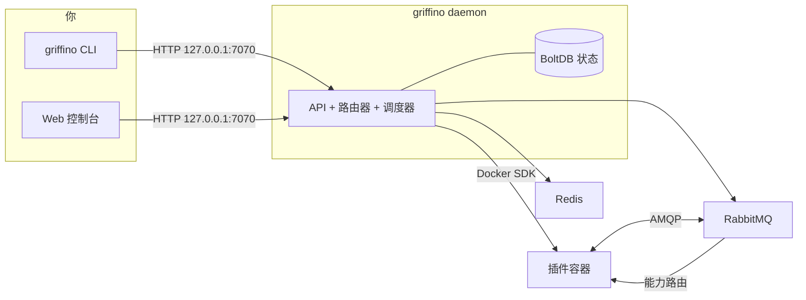

<div align="center">


<h1>Griffino</h1>

<p><strong>下一代插件路由开放标准协议</strong></p>

Griffino 是一套面向插件路由的<strong>开放标准</strong>：它约定插件如何通过 manifest 声明自己
「提供」与「消费」的能力，以及如何基于能力（而不是某个固定插件依赖）被发现和路由。同时，它也是这套标准
<strong>开箱即用的实现</strong>：把符合标准的插件作为容器运行，并在本机通过统一的 CLI 和 Web 控制台管理。

[](https://goreportcard.com/report/github.com/GriffinGuard/Griffino)


[](../../LICENSE)

[](../CLA.md)

[English](../../README.md) ·
**简体中文** ·
[繁體中文](README.zh-TW.md) ·
[日本語](README.ja.md) ·
[한국어](README.ko.md) ·
[Русский](README.ru.md) ·
[Français](README.fr.md) ·
[Deutsch](README.de.md) ·
[العربية](README.ar.md)

</div>

## 目录

- [Griffino 是什么？](#griffino-是什么)
- [特性](#特性)
- [架构](#架构)
- [环境要求](#环境要求)
- [安装](#安装)
- [快速开始](#快速开始)
- [CLI 命令](#cli-命令)
- [Web 控制台与 API](#web-控制台与-api)
- [插件](#插件)
- [相关仓库](#相关仓库)
- [配置](#配置)
- [可观测性](#可观测性)
- [贡献](#贡献)
- [许可证](#许可证)

## Griffino 是什么？

Griffino 是一套**面向用户侧插件的开放标准**。它约定：每个插件用标准 **manifest** 声明自己
**提供（provide）** 与 **消费（consume）** 的 **能力（capability）**；插件之间不直接相互依赖，而是基于
「能力」被发现与连接。只要遵循这套标准，不同作者、不同语言写出的插件就能相互发现、替换和组合，
无需预先知道对方的存在。

*（「用户侧」指运行在用户自己机器、服务于用户自身需求的插件，区别于托管在云端的后端服务。）*

同时，Griffino 也是这套标准**开箱即用的参考实现与运行时**。它把按标准打包的插件作为一个或多个
Docker 容器启动，为每个插件分配隔离的 RabbitMQ 命名空间，并在能力的提供方与消费方之间路由消息；
当同一能力有多个提供者时，还会基于健康状态做故障转移与负载均衡。容器编排交给 Docker，插件间通信
交给内置消息总线，状态与配置由守护进程统一管理。

这套标准让插件生态**可移植、可组合，并且不锁定任何具体实现**；
平台则让完整工作流在本机开箱即用。

## 特性

- **插件生命周期** —— 通过 Griffino 统一安装、配置、启动、停止和卸载插件容器。
- **能力路由** —— 实现了插件间基于能力的路由、健康感知的故障转移与轮询负载均衡。
- **插件中心** —— 从官方插件中心安装与升级插件，所有官方插件均需要提供源代码进行人工审阅。
- **任务调度** —— 内置调度器，支持插件的周期任务与 Blueprint 工作流。
- **默认安全** —— 多用户认证、凭据加密存储、API 仅绑定本机。
- **可观测性** —— 开箱即用的 Prometheus `/metrics` 与 OpenTelemetry 追踪。
- **自文档化 API** —— OpenAPI 规格，内嵌 Swagger UI 于 `/swagger/`。
- **开发模式** —— 快速的本地插件开发流程。

## 架构



守护进程持有状态，通过官方 SDK 与 Docker 通信，并将 RabbitMQ + Redis 作为受管容器
运行。插件之间从不直接通信——它们发布/消费能力，由路由器决定每条消息的去向。

## 环境要求

- **Docker** —— 运行时必需；守护进程将 RabbitMQ 与 Redis 作为容器运行。Docker Desktop、colima、podman 均可。
- **Go 1.25+** —— 仅在从源码构建时需要。

## 安装

### macOS

推荐使用 Homebrew：

```bash
brew install GriffinGuard/tap/griffino
```

也可以使用安装脚本获取预编译二进制：

```bash
curl -fsSL https://raw.githubusercontent.com/GriffinGuard/Griffino/main/scripts/get.sh | bash
```

需要固定版本或安装目录时：

```bash
curl -fsSL https://raw.githubusercontent.com/GriffinGuard/Griffino/main/scripts/get.sh | VERSION=v1.0.0 PREFIX="$HOME/.local/bin" bash
```

### Linux

推荐使用安装脚本获取预编译二进制：

```bash
curl -fsSL https://raw.githubusercontent.com/GriffinGuard/Griffino/main/scripts/get.sh | bash
```

需要固定版本或安装目录时：

```bash
curl -fsSL https://raw.githubusercontent.com/GriffinGuard/Griffino/main/scripts/get.sh | VERSION=v1.0.0 PREFIX="$HOME/.local/bin" bash
```

也可以从 [releases 页面](https://github.com/GriffinGuard/Griffino/releases) 下载对应发行版的软件包：

```bash
sudo dpkg -i griffino_*_linux_amd64.deb   # Debian / Ubuntu
sudo rpm  -i griffino_*_linux_amd64.rpm   # Fedora / RHEL
```

### Windows

推荐从 Microsoft Store 安装，或使用 winget：

```powershell
winget install --source msstore Griffino
```

如果需要离线安装，可以从 [releases 页面](https://github.com/GriffinGuard/Griffino/releases)
下载 `griffino_*_windows_amd64.msi`。

### 从源码

```bash
git clone https://github.com/GriffinGuard/Griffino.git
cd Griffino
./scripts/install.sh              # 构建并安装到 PATH
./scripts/install.sh --build-only # 仅生成 ./griffino
```

> 运行 `griffino daemon` 前，Docker 必须已安装**且正在运行**。

## 快速开始

```bash
# 1. 启动守护进程（将 RabbitMQ + Redis 作为容器拉起）
griffino daemon

# 2. 从本地路径安装并启动一个插件
griffino dev install ./path/to/plugin
griffino dev start <plugin-id>
```

然后打开 Web 控制台 **http://127.0.0.1:7070** 完成初始化（创建首个管理员）并管理插件。

## CLI 命令

| 命令 | 说明 |
|------|------|
| `griffino daemon` | 启动 Griffino 守护进程 |
| `griffino doctor` | 检查 Docker 环境与系统依赖状态 |
| `griffino service install` | 将 Griffino 作为开机自启的后台服务运行 |
| `griffino service start` / `stop` / `restart` | 控制后台服务 |
| `griffino service status` | 查看后台服务状态 |
| `griffino service uninstall` | 移除后台服务 |
| `griffino dev install <path>` | 从本地路径安装插件 |
| `griffino dev start <id>` | 启动已安装的插件 |
| `griffino dev stop <id>` | 停止运行中的插件 |
| `griffino dev uninstall <id>` | 卸载插件 |
| `griffino admin reset-password` | 重置管理员密码 |

用 `--lang` 覆盖语言（例如 `--lang zh_CN`）。

### 作为后台服务运行

`griffino service install` 会把 Griffino 注册为开机自启的**按用户**服务（macOS 上为 launchd
LaunchAgent，Linux 上为 `systemctl --user` 单元，Windows 上为登录计划任务）。守护进程仍需 Docker
在运行。

Griffino为用户级服务：Docker Desktop 只在已登录会话中运行，因此登录前的系统级服务
无法访问到容器运行时。

## Web 控制台与 API

- **Web 控制台** —— 由守护进程提供，地址 `http://127.0.0.1:7070`。
- **REST API** —— 位于 `/api/v1` 下。非公开端点需要来自 `POST /api/v1/auth/login` 的 bearer 会话令牌。
- **Swagger UI** —— 交互式 API 文档，`http://127.0.0.1:7070/swagger/`。
- **指标** —— Prometheus 暴露端点，`http://127.0.0.1:7070/metrics`。
- **Dashboard 组件数据** —— widget data 仍以 Redis state 为基础；当插件 SDK 暴露运行时 `__component_data` 回调时，守护进程会把该 per-user 结果合并覆盖到 Redis state 之上，并在回调不支持、超时或 RPC 失败时降级回 Redis。

## 插件

### Manifest

插件由 `plugin.manifest.json` 文件定义：

```json
{
  "griffinoPluginManifestVersion": "1",
  "id": "my-plugin",
  "pluginVersion": "0.1.0",
  "name": { "default": "My Plugin" },
  "description": { "default": "A sample plugin" },
  "capabilities": [],
  "configurationFiles": {}
}
```

插件包由四个生成的文件组成。它们的权威 Go 类型定义在
[`pkg/manifest/types.go`](pkg/manifest/types.go)，正式的 JSON Schemas 位于
[Griffino-Schemas](https://github.com/GriffinGuard/Griffino-Schemas)：

| 文件 | 内容 |
|------|------|
| `plugin.manifest.json` | 插件标识、`capabilities`（按能力定型与路由）、可发事件 `emits`、仪表盘 `components` 与 `configurationFiles` |
| `config.boot.json` | 管理员设定的 boot 配置字段 |
| `config.user.json` | 按用户的配置字段 |
| `plugin.boot.yml` | 运行时服务规格（image、environment、ports、volumes） |

每个 `capabilities[]` 条目都是按能力定型的 provider 或 consumer，并由端口描述；触发器通过
`emits` 声明其发出的事件（两者均在下文详述）。

用户配置 schema 由 `config.user.json` 提供。除了标量字段类型外，守护进程也接受
`group_array` 字段来表示可重复对象组，并以该字段 key 下的 JSON 数组存储其值。已有扁平字符串配置保持兼容。

`group_array` 字段通过 `fields`（子字段 `ConfigParam` 列表，每个子字段拥有自己的
`type`、`optional`、`validation`）声明数组元素的结构，并可用 `minItems`/`maxItems`
限制数组长度：

```json
{
  "key": "MODELS",
  "type": "group_array",
  "minItems": 1,
  "maxItems": 5,
  "fields": [
    { "key": "name", "type": "string", "optional": false },
    { "key": "supportsVision", "type": "boolean", "optional": true }
  ]
}
```

调用 `POST /api/v1/plugins/{id}/user-config/values` 时，守护进程会按该 schema
校验数组中的每个元素：未知子字段会被丢弃，缺失的必填子字段会导致请求被拒绝，
每个子字段值的类型（以及声明的 `validation` 范围/长度约束）必须匹配。不支持
嵌套 `group_array`。

`password` 类型字段——无论是顶层字段还是 `group_array` 的子字段——在
`GET /user-config/values` 回显时都会被脱敏为占位符 `**masked**`。后续
`POST` 提交该占位符时，会保留此前已存储的真实密码而不会被覆盖，因此前端
可以安全地把脱敏值原样提交回去，既不会泄露也不会误覆盖真实密码。

### 能力与接口

插件**提供**或**消费**的每个能力都是带类型的，按能力路由而非硬编码依赖。能力的数据契约由**端口**（带类型的输入与输出）描述；两个工作流节点的端口类型兼容时即可连线。

- **标准接口** —— 能力通过 `standardInterfaceRef`（如 `griffino.interfaces.ai.chat@1.0.0`）引用 [Griffino-Schemas](https://github.com/GriffinGuard/Griffino-Schemas) 注册表中的带版本契约。守护进程内置标准集的快照，因此蓝图端口校验在设计时即可解析。实现**同一**接口的 provider 可互换；router 仅在接口**主版本**兼容时才将 provider 视为可替换。
- **内联自定义接口** —— 没有合适标准时，能力通过 `interfaceSpec.inputPorts` / `interfaceSpec.outputPorts` 内联声明端口。此类能力照样参与工作流端口校验，只是不会与其它作者的能力自动互换。端口类型必须取自权威词汇：`text`、`int`、`float`、`bool`、`json`、`binary`、`file`、`image`、`audio`、`video`、`embedding`、`llm-ref`、`any`。

### 触发器

插件可作为**事件源**（触发器），在 manifest 的 `emits` 数组中声明其发出的事件：

```json
"emits": [
  {
    "eventType": "griffino.events.rss.item",
    "schemaRef": "griffino.events.rss.item@1.0.0",
    "name": { "default": "New RSS item" }
  }
]
```

运行时插件发出该类型的 dispatch 事件；工作流引擎会启动任何订阅了它的蓝图。`GET /api/v1/plugins/triggers` 为蓝图编辑器列出所有运行中插件发出的事件。

### 运行时用户身份

面向插件的运行时消息会携带触发本次工作的 Griffino 用户上下文：

- `userId` 是稳定的 Griffino 用户标识，适合用于按用户隔离状态、配置和路由。
- `displayName` 是用户资料里的显示名，只建议用于展示标签；如果用户未设置显示名，该字段可能为空。

Griffino 不会通过这些运行时消息向插件暴露登录 `username`、`email`、`role` 或密码相关数据。

以下消息会在 `userId` 旁边附带 `displayName`：

| 消息路径 | `displayName` 出现位置 |
|----------|------------------------|
| Web 控制台触发 action | 发布到 `griffino.actions` 的 action 消息体 |
| 用户配置更新通知 | 发送到 `plugin.{pluginId}.consumer.user_config_updated` 的 `user.config_updated` 消息体 |
| Blueprint 插件节点调度 | 消息体，以及 `x-griffino-display-name` AMQP header |
| Blueprint 任务回调 | `task.completed` / `task.failed` 回调消息体 |

插件自己的用户配置仍以只读 Redis 数据形式提供给该插件，key 为
`user:{userId}:plugin:{pluginId}:config`。

### 插件中心

除了提供给开发者进行本地测试的 `griffino dev install`，Griffino 内置**插件中心**，可从官方仓库
（[`GriffinGuard/Griffino-Plugins`](https://github.com/GriffinGuard/Griffino-Plugins)）
安装与升级插件。出于安全考虑插件中心源是固定的，暂不开放自定义来源。插件会被下载到
`~/.griffino/plugins/{id}/{version}/`，所有插件管理相关端点都需要Griffino管理用户。

| 方法与路径 | 说明 |
|------------|------|
| `GET /api/v1/registry/plugins` | 列出 registry 插件，含 `installed` / `installedVersion` / `updateAvailable` 状态 |
| `GET /api/v1/registry/plugins/{id}` | 单个插件的完整详情（所有版本 + changelog）及安装状态 |
| `POST /api/v1/registry/plugins/{id}/install` | 安装插件。可选请求体 `{"version":"x.y.z"}`（默认最新） |
| `POST /api/v1/registry/plugins/{id}/upgrade` | 升级已安装插件。运行中的插件会被自动停止、切换并重启；管理员配置予以保留 |
| `DELETE /api/v1/plugins/{id}` | 卸载插件（先停止，再删除其目录与镜像） |

**升级行为：** 新版本会先下载并校验，之后才触碰旧版本。已有的管理员配置会被沿用；如果新版本新增了
没有默认值的必填设置，插件会进入 *ready* 状态并标记「需复核」，而非自动重启。仅被旧版本使用的镜像
会被清理，共享镜像保留。

**镜像安全：** 插件的主服务镜像必须发布在 `ghcr.io/griffinguard/` 下；任何辅助服务镜像必须出现在社区
[`approved-images.json`](https://github.com/GriffinGuard/Griffino-Plugins) 白名单中。引用未批准镜像的
安装与升级会被拒绝。

## 相关仓库

Griffino 是一套标准，外加围绕它的若干仓库。本仓库是参考实现，其余各司其职：

| 仓库 | 作用 |
|------|------|
| [GriffinGuard/Griffino](https://github.com/GriffinGuard/Griffino) | 标准的参考实现与守护进程（**本仓库**）：容器编排、能力路由、CLI 与 API |
| [GriffinGuard/Griffino-WebUI](https://github.com/GriffinGuard/Griffino-WebUI) | 默认内置 Web 控制台的前端，Griffino构建时自动嵌入 |
| [GriffinGuard/Griffino-Plugins](https://github.com/GriffinGuard/Griffino-Plugins) | 官方插件中心仓库，以及镜像白名单 `approved-images.json` |
| [GriffinGuard/Griffino-Plugins-Submit](https://github.com/GriffinGuard/Griffino-Plugins-Submit) | 插件作者向官方插件仓库提交插件的入口 |
| [GriffinGuard/Griffino-Schemas](https://github.com/GriffinGuard/Griffino-Schemas) | 正式定义该标准的 JSON Schema（manifest 等） |
| [GriffinGuard/homebrew-tap](https://github.com/GriffinGuard/homebrew-tap) | Homebrew 安装源 |

**插件 SDK** 帮助作者按标准实现 provide/consume，封装消息收发、manifest 与配置读取，无需手写 AMQP 协议：

| SDK | 语言 | 状态 |
|-----|------|------|
| [GriffinGuard/Griffino-Go](https://github.com/GriffinGuard/Griffino-Go) | Go | ✅ 可用 |
| [GriffinGuard/Griffino-Python](https://github.com/GriffinGuard/Griffino-Python) | Python | ✅ 可用 |
| [GriffinGuard/Griffino-Java](https://github.com/GriffinGuard/Griffino-Java) | Java | 🚧 内部开发中 |
| [GriffinGuard/Griffino-CSharp](https://github.com/GriffinGuard/Griffino-CSharp) | C# | 🚧 内部开发中 |

## 配置

配置位于 `~/.griffino/config.yaml`（各部分均可选，缺省时使用合理默认值）：

```yaml
# HTTP API —— 默认仅绑定本机。
server:
  listenHost: 127.0.0.1
  listenPort: 7070

# RabbitMQ 连接。
rabbitmq:
  host: localhost
  port: 5672
  managementPort: 15672
  adminUser: guest
  adminPassword: guest
```

API 默认绑定 `127.0.0.1:7070`。Griffino 目前只支持本机，不对局域网提供服务；改 `server.listenPort`
可更换端口，或——自负风险地——改 `server.listenHost` 将其对外暴露。

敏感凭据（RabbitMQ / Redis 密码）**加密存储**，密钥位于 `~/.griffino/secret.key`（权限 `0600`）。

## 运维与安全

Griffino 面向无人值守的单机运行做了加固 —— 完整运维指南见 [docs/operations.md](../operations.md)。要点：

- **韧性** —— broker 重启时 router 自动重连 RabbitMQ（指数退避）；插件容器用 `unless-stopped` 重启策略，task watchdog 会让无响应的工作流节点超时。
- **资源限制** —— 每个插件容器都有上限（默认 512 MiB / 1.0 CPU / 512 PIDs），单个插件无法拖垮整机。可在 `plugin.boot.yml` 按服务覆盖：
  ```yaml
  services:
    main:
      resources: { memory_mb: 1024, cpus: 2.0, pids_limit: 1024 }
  ```
- **信任模型** —— 默认仅从官方中心安装、且受镜像 allowlist 约束；本地开发插件用 `griffino dev install`（跳过 allowlist、标记 `isDevPlugin`、不受 Web 控制台管控）。
- **静态加密** —— 基础设施凭据用 AES-256-GCM 加密，主密钥存于本地 `secret.key`（权限 `0600`）；请与数据库一起备份。

## 可观测性

- **指标** —— `GET /metrics` 暴露 API、路由器、容器与调度器的 Prometheus 指标。
- **追踪** —— OpenTelemetry 追踪可经 OTLP 导出；配置 endpoint 即可启用。

## 贡献

感谢每一位参与 Griffino 的贡献者。当前贡献者名单以
[GitHub Contributors](https://github.com/GriffinGuard/Griffino/graphs/contributors) 为准。

如果你想提交代码、文档或问题反馈，欢迎直接发起 issue 或 pull request。提交 PR 前请确认已阅读
[CONTRIBUTING.md](../CONTRIBUTING.md)，并按要求签署 [CLA](../CLA.md)。

## 许可证

[Apache License 2.0](../../LICENSE)
