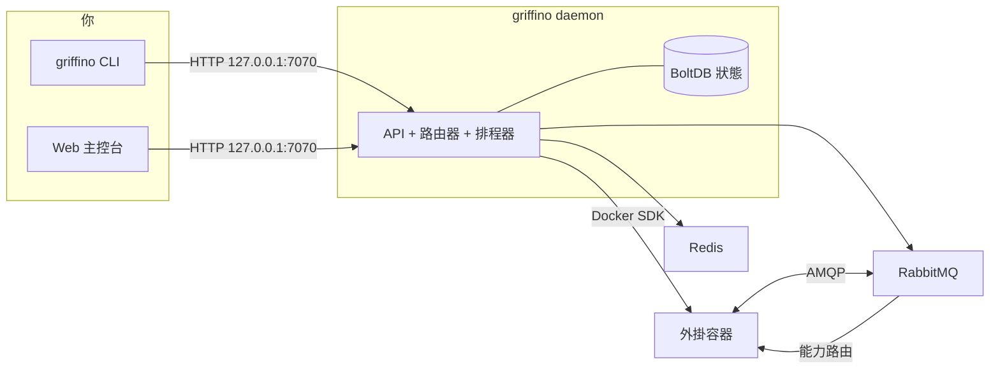

<div align="center">


<h1>Griffino</h1>

<p><strong>下一代插件路由開放標準協議</strong></p>

<p>
Griffino 是一套面向插件路由的<strong>開放標準</strong>：它約定插件如何透過 manifest 宣告自己
「提供」與「消費」的能力，以及如何基於能力（而不是某個固定插件依賴）被發現和路由。同時，它也是這套標準
<strong>開箱即用的實作</strong>：把符合標準的插件作為容器執行，並在本機透過統一的 CLI 和 Web 主控台管理。
</p>

[](https://goreportcard.com/report/github.com/GriffinGuard/Griffino)


[](../../LICENSE)

[](../CLA.md)

[English](../../README.md) ·
[简体中文](README.zh-CN.md) ·
**繁體中文** ·
[日本語](README.ja.md) ·
[한국어](README.ko.md) ·
[Русский](README.ru.md) ·
[Français](README.fr.md) ·
[Deutsch](README.de.md) ·
[العربية](README.ar.md)

</div>

## 目錄

- [Griffino 是什麼？](#griffino-是什麼)
- [特性](#特性)
- [架構](#架構)
- [環境需求](#環境需求)
- [安裝](#安裝)
- [快速開始](#快速開始)
- [CLI 指令](#cli-指令)
- [Web 主控台與 API](#web-主控台與-api)
- [外掛](#外掛)
- [相關倉庫](#相關倉庫)
- [設定](#設定)
- [可觀測性](#可觀測性)
- [貢獻](#貢獻)
- [授權](#授權)

## Griffino 是什麼？

Griffino 是一套**面向使用者端插件的開放標準**。它約定：每個插件用標準 **manifest** 宣告自己
**提供（provide）** 與 **消費（consume）** 的 **能力（capability）**；插件之間不直接相互依賴，而是基於
「能力」被發現與連接。只要遵循這套標準，不同作者、不同語言寫出的插件就能相互發現、替換與組合，
無需預先知道對方的存在。

*（「使用者端」指執行在使用者自己機器、服務於使用者自身需求的插件，有別於託管在雲端的後端服務。）*

同時，Griffino 也是這套標準**開箱即用的參考實作與執行環境**。它把按標準打包的插件作為一個或多個
Docker 容器啟動，為每個插件配置隔離的 RabbitMQ 命名空間，並在能力的提供方與消費方之間路由訊息；
當同一能力有多個提供者時，還會基於健康狀態做容錯移轉與負載平衡。容器編排交給 Docker，插件間通訊
交給內建訊息匯流排，狀態與設定由守護行程統一管理。

這套標準讓插件生態**可移植、可組合，並且不鎖定任何具體實作**；
平台則讓完整工作流程在本機開箱即用。

## 特性

- **外掛生命週期** —— 透過 Griffino 統一安裝、設定、啟動、停止與解除安裝外掛容器。
- **能力路由** —— 實作了外掛間以能力為基礎的路由、健康感知的容錯移轉與輪詢負載平衡。
- **外掛中心** —— 從官方外掛中心安裝與升級外掛，所有官方外掛皆須提供原始碼以進行人工審閱。
- **任務排程** —— 內建排程器，支援外掛的週期任務與 Blueprint 工作流程。
- **預設安全** —— 多使用者驗證、憑證加密儲存、API 僅繫結本機。
- **可觀測性** —— 開箱即用的 Prometheus `/metrics` 與 OpenTelemetry 追蹤。
- **自我文件化 API** —— OpenAPI 規格，內嵌 Swagger UI 於 `/swagger/`。
- **開發模式** —— 快速的本機外掛開發流程。

## 架構



守護行程持有狀態，透過官方 SDK 與 Docker 通訊，並將 RabbitMQ + Redis 作為受管容器
執行。外掛之間從不直接通訊——它們發布/消費能力，由路由器決定每則訊息的去向。

## 環境需求

- **Docker** —— 執行時必需；守護行程將 RabbitMQ 與 Redis 作為容器執行。Docker Desktop、colima、podman 皆可。
- **Go 1.25+** —— 僅在從原始碼建置時需要。

## 安裝

### macOS

推薦使用 Homebrew：

```bash
brew install GriffinGuard/tap/griffino
```

也可以使用安裝指令稿取得預先建置的二進位檔：

```bash
curl -fsSL https://raw.githubusercontent.com/GriffinGuard/Griffino/main/scripts/get.sh | bash
```

需要固定版本或安裝目錄時：

```bash
curl -fsSL https://raw.githubusercontent.com/GriffinGuard/Griffino/main/scripts/get.sh | VERSION=v1.0.0 PREFIX="$HOME/.local/bin" bash
```

### Linux

推薦使用安裝指令稿取得預先建置的二進位檔：

```bash
curl -fsSL https://raw.githubusercontent.com/GriffinGuard/Griffino/main/scripts/get.sh | bash
```

需要固定版本或安裝目錄時：

```bash
curl -fsSL https://raw.githubusercontent.com/GriffinGuard/Griffino/main/scripts/get.sh | VERSION=v1.0.0 PREFIX="$HOME/.local/bin" bash
```

也可以從 [releases 頁面](https://github.com/GriffinGuard/Griffino/releases) 下載對應發行版的套件：

```bash
sudo dpkg -i griffino_*_linux_amd64.deb   # Debian / Ubuntu
sudo rpm  -i griffino_*_linux_amd64.rpm   # Fedora / RHEL
```

### Windows

推薦從 Microsoft Store 安裝，或使用 winget：

```powershell
winget install --source msstore Griffino
```

如果需要離線安裝，可以從 [releases 頁面](https://github.com/GriffinGuard/Griffino/releases)
下載 `griffino_*_windows_amd64.msi`。

### 從原始碼

```bash
git clone https://github.com/GriffinGuard/Griffino.git
cd Griffino
./scripts/install.sh              # 建置並安裝到 PATH
./scripts/install.sh --build-only # 僅產生 ./griffino
```

> 執行 `griffino daemon` 前，Docker 必須已安裝**且正在執行**。

## 快速開始

```bash
# 1. 啟動守護行程（將 RabbitMQ + Redis 作為容器啟動）
griffino daemon

# 2. 從本機路徑安裝並啟動一個外掛
griffino dev install ./path/to/plugin
griffino dev start <plugin-id>
```

接著開啟 Web 主控台 **http://127.0.0.1:7070** 完成初始化（建立第一個管理員）並管理外掛。

## CLI 指令

| 指令 | 說明 |
|------|------|
| `griffino daemon` | 啟動 Griffino 守護行程 |
| `griffino doctor` | 檢查 Docker 環境與系統相依狀態 |
| `griffino service install` | 將 Griffino 作為開機自動啟動的背景服務執行 |
| `griffino service start` / `stop` / `restart` | 控制背景服務 |
| `griffino service status` | 顯示背景服務狀態 |
| `griffino service uninstall` | 移除背景服務 |
| `griffino dev install <path>` | 從本機路徑安裝外掛 |
| `griffino dev start <id>` | 啟動已安裝的外掛 |
| `griffino dev stop <id>` | 停止執行中的外掛 |
| `griffino dev uninstall <id>` | 解除安裝外掛 |
| `griffino admin reset-password` | 重設管理員密碼 |

使用 `--lang` 覆寫語言（例如 `--lang zh_CN`）。

### 作為背景服務執行

`griffino service install` 會將 Griffino 註冊為開機自動啟動的**個別使用者**服務（macOS 上為 launchd
LaunchAgent，Linux 上為 `systemctl --user` 單元，Windows 上為登入排程工作）。守護行程仍需 Docker
正在執行。

Griffino 為使用者層級服務：Docker Desktop 只在已登入的工作階段中執行，因此登入前的系統層級服務
無法存取容器執行環境。

## Web 主控台與 API

- **Web 主控台** —— 由守護行程提供，位址 `http://127.0.0.1:7070`。
- **REST API** —— 位於 `/api/v1` 之下。非公開端點需要來自 `POST /api/v1/auth/login` 的 bearer 工作階段權杖。
- **Swagger UI** —— 互動式 API 文件，`http://127.0.0.1:7070/swagger/`。
- **指標** —— Prometheus 公開端點，`http://127.0.0.1:7070/metrics`。

## 外掛

### Manifest

外掛由 `plugin.manifest.json` 檔案定義：

```json
{
  "griffinoPluginManifestVersion": "1",
  "id": "my-plugin",
  "pluginVersion": "0.1.0",
  "name": { "default": "My Plugin" },
  "description": { "default": "A sample plugin" },
  "capabilities": [],
  "configurationFiles": {}
}
```

外掛套件由四個產生的檔案組成。其權威 Go 型別定義於
[`pkg/manifest/types.go`](pkg/manifest/types.go)，正式的 JSON Schemas 位於
[Griffino-Schemas](https://github.com/GriffinGuard/Griffino-Schemas)：

| 檔案 | 內容 |
|------|------|
| `plugin.manifest.json` | 外掛識別、`capabilities`（依能力定型與路由）、可發事件 `emits`、儀表板 `components` 與 `configurationFiles` |
| `config.boot.json` | 管理員設定的 boot 設定欄位 |
| `config.user.json` | 各使用者的設定欄位 |
| `plugin.boot.yml` | 執行期服務規格（image、environment、ports、volumes） |

每個 `capabilities[]` 條目都是依能力定型的 provider 或 consumer，並以連接埠（port）描述；觸發器透過
`emits` 宣告其發出的事件（兩者皆於下文詳述）。

使用者設定 schema 由 `config.user.json` 提供。除了純量欄位型別外，守護行程也接受
`group_array` 欄位來表示可重複的物件群組，並以該欄位 key 下的 JSON 陣列儲存其值。既有的扁平字串設定保持相容。

`group_array` 欄位透過 `fields`（子欄位 `ConfigParam` 清單，每個子欄位擁有自己的
`type`、`optional`、`validation`）宣告陣列元素的結構，並可用 `minItems`/`maxItems`
限制陣列長度：

```json
{
  "key": "MODELS",
  "type": "group_array",
  "minItems": 1,
  "maxItems": 5,
  "fields": [
    { "key": "name", "type": "string", "optional": false },
    { "key": "supportsVision", "type": "boolean", "optional": true }
  ]
}
```

呼叫 `POST /api/v1/plugins/{id}/user-config/values` 時，守護行程會依該 schema
校驗陣列中的每個元素：未知子欄位會被丟棄，缺少的必填子欄位會導致請求被拒絕，
每個子欄位值的型別（以及宣告的 `validation` 範圍/長度約束）必須相符。不支援
巢狀 `group_array`。

`password` 型別欄位——無論是頂層欄位還是 `group_array` 的子欄位——在
`GET /user-config/values` 回顯時都會被遮蔽為占位符 `**masked**`。後續
`POST` 提交該占位符時，會保留先前已儲存的真實密碼而不會被覆寫，因此前端
可以安全地將遮蔽值原樣提交回去，既不會洩漏也不會誤覆寫真實密碼。

### 能力與介面

外掛**提供**或**消費**的每個能力都帶有型別，依能力路由而非硬編碼相依。能力的資料契約由**連接埠**（帶型別的輸入與輸出）描述；兩個工作流節點的連接埠型別相容時即可連線。

- **標準介面** —— 能力透過 `standardInterfaceRef`（如 `griffino.interfaces.ai.chat@1.0.0`）參照 [Griffino-Schemas](https://github.com/GriffinGuard/Griffino-Schemas) 註冊表中的帶版本契約。守護程式內建標準集的快照，因此藍圖連接埠驗證於設計時即可解析。實作**同一**介面的 provider 可互換；router 僅在介面**主版本**相容時才將 provider 視為可替換。
- **行內自訂介面** —— 無合適標準時，能力透過 `interfaceSpec.inputPorts` / `interfaceSpec.outputPorts` 行內宣告連接埠。此類能力照樣參與工作流連接埠驗證，只是不會與其他作者的能力自動互換。連接埠型別必須取自權威詞彙：`text`、`int`、`float`、`bool`、`json`、`binary`、`file`、`image`、`audio`、`video`、`embedding`、`llm-ref`、`any`。

### 觸發器

外掛可作為**事件來源**（觸發器），於 manifest 的 `emits` 陣列中宣告其發出的事件：

```json
"emits": [
  {
    "eventType": "griffino.events.rss.item",
    "schemaRef": "griffino.events.rss.item@1.0.0",
    "name": { "default": "New RSS item" }
  }
]
```

執行時外掛發出該型別的 dispatch 事件；工作流引擎會啟動任何訂閱了它的藍圖。`GET /api/v1/plugins/triggers` 為藍圖編輯器列出所有執行中外掛發出的事件。

### 執行時使用者身分

面向外掛的執行時訊息會攜帶觸發本次工作的 Griffino 使用者上下文：

- `userId` 是穩定的 Griffino 使用者識別碼，適合用於按使用者隔離狀態、設定和路由。
- `displayName` 是使用者資料裡的顯示名稱，只建議用於顯示標籤；若使用者未設定顯示名稱，該欄位可能為空。

Griffino 不會透過這些執行時訊息向外掛暴露登入 `username`、`email`、`role` 或密碼相關資料。

以下訊息會在 `userId` 旁邊附帶 `displayName`：

| 訊息路徑 | `displayName` 出現位置 |
|----------|------------------------|
| Web 主控台觸發 action | 發布到 `griffino.actions` 的 action 訊息主體 |
| 使用者設定更新通知 | 發送到 `plugin.{pluginId}.consumer.user_config_updated` 的 `user.config_updated` 訊息主體 |
| Blueprint 外掛節點調度 | 訊息主體，以及 `x-griffino-display-name` AMQP header |
| Blueprint 任務回呼 | `task.completed` / `task.failed` 回呼訊息主體 |

外掛自己的使用者設定仍以唯讀 Redis 資料形式提供給該外掛，key 為
`user:{userId}:plugin:{pluginId}:config`。

### 外掛中心

除了提供給開發者進行本機測試的 `griffino dev install`，Griffino 內建**外掛中心**，可從官方倉庫
（[`GriffinGuard/Griffino-Plugins`](https://github.com/GriffinGuard/Griffino-Plugins)）
安裝與升級外掛。基於安全考量外掛中心來源是固定的，暫不開放自訂來源。外掛會被下載到
`~/.griffino/plugins/{id}/{version}/`，所有外掛管理相關端點皆需要 Griffino 管理員使用者。

| 方法與路徑 | 說明 |
|------------|------|
| `GET /api/v1/registry/plugins` | 列出 registry 外掛，含 `installed` / `installedVersion` / `updateAvailable` 狀態 |
| `GET /api/v1/registry/plugins/{id}` | 單一外掛的完整詳情（所有版本 + changelog）及安裝狀態 |
| `POST /api/v1/registry/plugins/{id}/install` | 安裝外掛。可選請求主體 `{"version":"x.y.z"}`（預設為最新） |
| `POST /api/v1/registry/plugins/{id}/upgrade` | 升級已安裝外掛。執行中的外掛會被自動停止、切換並重新啟動；管理員設定會被保留 |
| `DELETE /api/v1/plugins/{id}` | 解除安裝外掛（先停止，再刪除其目錄與映像檔） |

**升級行為：** 新版本會先下載並驗證，之後才觸碰舊版本。既有的管理員設定會被沿用；若新版本新增了
沒有預設值的必填設定，外掛會進入 *ready* 狀態並標記「需複查」，而非自動重新啟動。僅被舊版本使用的
映像檔會被清除，共用映像檔則保留。

**映像檔安全：** 外掛的主服務映像檔必須發行在 `ghcr.io/griffinguard/` 之下；任何輔助服務映像檔必須
出現在社群 [`approved-images.json`](https://github.com/GriffinGuard/Griffino-Plugins) 白名單中。引用
未核准映像檔的安裝與升級會被拒絕。

## 相關倉庫

Griffino 是一套標準，外加圍繞它的若干倉庫。本倉庫是參考實作，其餘各司其職：

| 倉庫 | 作用 |
|------|------|
| [GriffinGuard/Griffino](https://github.com/GriffinGuard/Griffino) | 標準的參考實作與守護行程（**本倉庫**）：容器編排、能力路由、CLI 與 API |
| [GriffinGuard/Griffino-WebUI](https://github.com/GriffinGuard/Griffino-WebUI) | 預設內建 Web 主控台的前端，Griffino 建置時自動嵌入 |
| [GriffinGuard/Griffino-Plugins](https://github.com/GriffinGuard/Griffino-Plugins) | 官方外掛中心倉庫，以及映像檔白名單 `approved-images.json` |
| [GriffinGuard/Griffino-Plugins-Submit](https://github.com/GriffinGuard/Griffino-Plugins-Submit) | 外掛作者向官方外掛倉庫提交外掛的入口 |
| [GriffinGuard/Griffino-Schemas](https://github.com/GriffinGuard/Griffino-Schemas) | 正式定義該標準的 JSON Schema（manifest 等） |
| [GriffinGuard/homebrew-tap](https://github.com/GriffinGuard/homebrew-tap) | Homebrew 安裝來源 |

**外掛 SDK** 協助作者按標準實作 provide/consume，封裝訊息收發、manifest 與設定讀取，無需手寫 AMQP 協定：

| SDK | 語言 | 狀態 |
|-----|------|------|
| [GriffinGuard/Griffino-Go](https://github.com/GriffinGuard/Griffino-Go) | Go | ✅ 可用 |
| [GriffinGuard/Griffino-Python](https://github.com/GriffinGuard/Griffino-Python) | Python | ✅ 可用 |
| [GriffinGuard/Griffino-Java](https://github.com/GriffinGuard/Griffino-Java) | Java | 🚧 內部開發中 |
| [GriffinGuard/Griffino-CSharp](https://github.com/GriffinGuard/Griffino-CSharp) | C# | 🚧 內部開發中 |

## 設定

設定位於 `~/.griffino/config.yaml`（各區段皆可選，省略時套用合理預設值）：

```yaml
# HTTP API —— 預設僅繫結本機。
server:
  listenHost: 127.0.0.1
  listenPort: 7070

# RabbitMQ 連線。
rabbitmq:
  host: localhost
  port: 5672
  managementPort: 15672
  adminUser: guest
  adminPassword: guest
```

API 預設繫結 `127.0.0.1:7070`。Griffino 目前僅支援本機，不對區域網路提供服務；改 `server.listenPort`
可更換連接埠，或——自負風險地——改 `server.listenHost` 將其對外公開。

敏感憑證（RabbitMQ / Redis 密碼）會**加密儲存**，金鑰位於 `~/.griffino/secret.key`（權限 `0600`）。

## 維運與安全

Griffino 針對無人值守的單機運行做了強化 —— 完整維運指南見 [docs/operations.md](../operations.md)。重點：

- **韌性** —— broker 重啟時 router 自動重連 RabbitMQ（指數退避）；外掛容器採 `unless-stopped` 重啟策略，task watchdog 會讓無回應的工作流節點逾時。
- **資源限制** —— 每個外掛容器都有上限（預設 512 MiB / 1.0 CPU / 512 PIDs），單一外掛無法拖垮整機。可於 `plugin.boot.yml` 依服務覆寫：
  ```yaml
  services:
    main:
      resources: { memory_mb: 1024, cpus: 2.0, pids_limit: 1024 }
  ```
- **信任模型** —— 預設僅從官方中心安裝、且受映像 allowlist 約束；本地開發外掛用 `griffino dev install`（跳過 allowlist、標記 `isDevPlugin`、不受 Web 主控台管控）。
- **靜態加密** —— 基礎設施憑證以 AES-256-GCM 加密，主金鑰存於本地 `secret.key`（權限 `0600`）；請與資料庫一起備份。

## 可觀測性

- **指標** —— `GET /metrics` 公開 API、路由器、容器與排程器的 Prometheus 指標。
- **追蹤** —— OpenTelemetry 追蹤可經 OTLP 匯出；設定 endpoint 即可啟用。

## 貢獻

感謝每一位參與 Griffino 的貢獻者。當前貢獻者名單以
[GitHub Contributors](https://github.com/GriffinGuard/Griffino/graphs/contributors) 為準。

如果你想提交程式碼、文件或問題回報，歡迎直接發起 issue 或 pull request。提交 PR 前請確認已閱讀
[CONTRIBUTING.md](../CONTRIBUTING.md)，並按要求簽署 [CLA](../CLA.md)。

## 授權

[Apache License 2.0](../../LICENSE)
